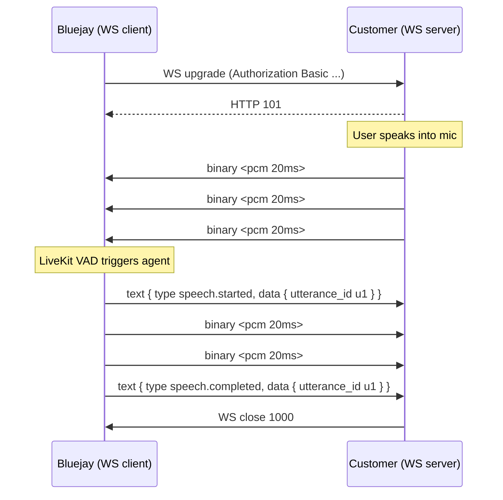
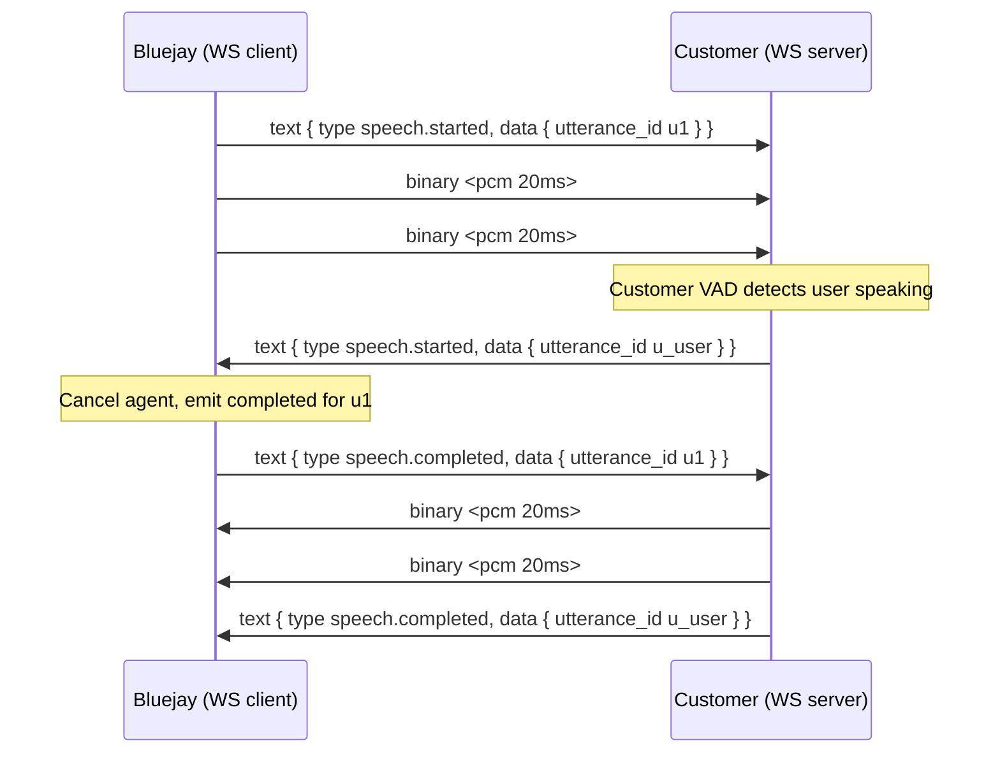
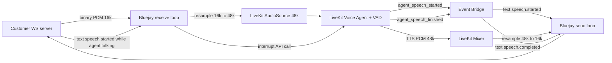

# CHIRP Rewrite: A Transport-Only Voice Protocol

## Roles


| Role             | Who           | Implements                                                                 |
| ---------------- | ------------- | -------------------------------------------------------------------------- |
| WebSocket client | Bluejay agent | `websockets.connect()`, sends `Authorization: Basic` header during upgrade |
| WebSocket server | Customer      | Accepts connections, validates auth, exchanges binary + text frames        |


The customer must stand up a WebSocket server endpoint (e.g., `wss://customer.example.com/voice`). They are responsible for:

- Accepting our `Authorization: Basic` header during the HTTP upgrade and returning HTTP 101 (or HTTP 401 to reject)
- Exchanging binary PCM frames in both directions during the session
- Optionally sending text events for finer control

In the rest of this doc, "we" / "Bluejay" = WS client, "customer" = WS server.

---

## Guiding principles

- **One wire format. No negotiation.** 16 kHz mono `pcm_s16le`. Period.
- **Right WebSocket frame type.** Binary for audio, text/JSON for events.
- **The protocol is a transport, not a brain.** VAD, turn-taking, and speech detection belong in the LiveKit voice agent. The translator just shuttles bytes.
- **All customer text messages are optional.** Minimum integration is "accept WS, stream binary, receive binary."
- **Our outbound speech events are derived from LiveKit agent events**, not from heuristics on the audio itself.
- **Hard rewrite, no compatibility shim.** Old CHIRP code is deleted. Existing customers migrate to the new spec.

---

## Wire format (locked)


| Property         | Value                                            | Why                                                                               |
| ---------------- | ------------------------------------------------ | --------------------------------------------------------------------------------- |
| Encoding         | `pcm_s16le`                                      | Universally supported, no decoding cost                                           |
| Sample rate      | **16000 Hz**                                     | Speech-AI industry standard; matches telephony wideband; matches every STT engine |
| Channels         | **1 (mono)**                                     | Voice is mono                                                                     |
| Frame size       | recommended 20 ms (640 bytes), any size accepted | 20 ms is the telephony / WebRTC standard; we don't enforce                        |
| Audio frame type | WebSocket `binary`                               | No envelope, no encoding overhead                                                 |
| Event frame type | WebSocket `text` (UTF-8 JSON)                    | Standard JSON parsing                                                             |


We resample 16k -> 48k on inbound and 48k -> 16k on outbound at the WebSocket boundary so LiveKit's pipeline (which is 48 kHz natively) is unchanged. Resampling cost is negligible.

---

## Audio direction


| Direction                             | What it carries                                        |
| ------------------------------------- | ------------------------------------------------------ |
| Customer (server) -> Bluejay (client) | User microphone audio (so the agent can hear)          |
| Bluejay (client) -> Customer (server) | Agent TTS audio (so the customer can play to the user) |


---

## Lowest-lift customer integration (the entire spec for them)

```text
1. Stand up a WebSocket server at wss://your-host/<path>
2. On incoming connection, validate Authorization: Basic <base64(user:pass)> header.
   Reject with HTTP 401 if invalid; accept with HTTP 101 if valid.
3. From then on:
     - Whenever you have user audio, send it as a WS binary frame
       (raw 16k mono int16le PCM, any size).
     - Whenever you receive a binary frame, play it as raw 16k mono int16le PCM
       (this is the agent's voice).
     - Optionally: ignore any text frames you receive (they're just for UI hints).
4. Close the WebSocket to hang up.
```

In a Python `websockets` server, this is roughly:

```python
async def handler(ws):
    if not check_basic_auth(ws.request.headers.get("Authorization")):
        await ws.close(1008)
        return
    asyncio.create_task(forward_mic_to(ws))           # send binary out
    async for msg in ws:
        if isinstance(msg, bytes):
            speaker.play(msg)                          # raw PCM in
        # else: text frame; safe to ignore
```

**Zero JSON messages required from the customer.** Zero state to maintain.

---

## Advanced integration (opt-in)

Customers with their own VAD or push-to-talk source can send speech events for tighter latency. We respect them when sent:


| Customer sends                              | Our behavior                                                                                                                                         |
| ------------------------------------------- | ---------------------------------------------------------------------------------------------------------------------------------------------------- |
| `speech.started` while we are mid-utterance | We immediately stop sending agent audio, call LiveKit's agent interrupt API, emit `speech.completed` for the canceled utterance, switch to listening |
| `speech.started` when we are idle           | Informational; logged. LiveKit's VAD will trigger the agent off the audio anyway                                                                     |
| `speech.completed`                          | Informational; can shave VAD-tail-padding latency by signaling end-of-turn explicitly                                                                |


There is no separate `interrupt` message. Sending `speech.started` while we are speaking *is* the interrupt.

---

## Protocol reference (the full wire vocabulary)

The entire protocol consists of **four message kinds** exchanged over the WebSocket. Everything else is implied.

### Summary table


| Kind               | WS frame type | Bluejay -> Customer                                       | Customer -> Bluejay                                                       |
| ------------------ | ------------- | --------------------------------------------------------- | ------------------------------------------------------------------------- |
| Audio              | `binary`      | **Required** whenever agent is speaking                   | Required to get anything done (else user can't be heard), but not policed |
| `speech.started`   | `text` JSON   | **Automatic**, sent by us when LiveKit agent starts TTS   | **Optional.** If sent, acts as interrupt if agent is mid-utterance        |
| `speech.completed` | `text` JSON   | **Automatic**, sent by us when LiveKit agent finishes TTS | **Optional.** Informational end-of-turn hint                              |
| `session.error`    | `text` JSON   | Sent by us on customer's protocol violation               | Sent by customer on our protocol violation, or server-side trouble        |


A minimum-integration customer can choose to send only `binary` frames and receive only `binary` frames. They never have to parse or emit any JSON.

---

### Text envelope (common shape for all text frames)

```json
{
  "type":  "<message type>",
  "id":    "<uuid string>",
  "ts_ms": 1729123456789,
  "data":  { /* type-specific fields */ }
}
```

- `type`: one of `speech.started`, `speech.completed`, `session.error`. Required.
- `id`: UUID. Required on the wire. Auto-filled by us on receive if missing.
- `ts_ms`: Unix milliseconds integer. Required on the wire. Auto-filled on receive.
- `data`: type-specific payload object. Required (may be `{}` if the type has no fields, though none of our types are currently field-less).

---

### Message 1 — Binary audio frame

- **WS frame type**: `binary`
- **Both directions.**
- **Required**: yes, this is the actual audio.
- **Shape**: raw bytes. Interpreted as 16 kHz mono signed 16-bit little-endian PCM samples. Any byte length accepted (just must be even, since samples are 2 bytes).
- **Semantics**:
  - Customer -> Bluejay: user microphone audio. Gets resampled to 48 kHz and pushed into LiveKit's `AudioSource`.
  - Bluejay -> Customer: agent TTS audio. Delivered as LiveKit produces it, resampled to 16 kHz.
- **No metadata.** No headers. No JSON envelope. Just samples.

---

### Message 2 — `speech.started`

- **WS frame type**: `text`
- **Both directions, different meanings.**
- **Required**: never required from customer; always emitted by us when the agent starts talking.
- **Shape**:

```json
  {
    "type": "speech.started",
    "id":   "uuid",
    "ts_ms": 1729123456789,
    "data": { "utterance_id": "u_abc123" }
  }
  

```

- **Required fields inside `data`**: `utterance_id` (string).
- **Semantics**:
  - **Bluejay -> Customer**: "The agent just started speaking. The binary frames that follow are this utterance's audio until you see `speech.completed` with the same `utterance_id`." Emitted automatically based on LiveKit's `agent_speech_started` event.
  - **Customer -> Bluejay**: "I'm about to start sending user audio for a new turn." Behavior depends on state:
    - If agent is currently mid-utterance -> we **interrupt** the agent (call LiveKit's interrupt API), emit `speech.completed` for the canceled utterance, and switch to listening.
    - If agent is idle -> informational. LiveKit's VAD will detect speech from the binary frames anyway.

---

### Message 3 — `speech.completed`

- **WS frame type**: `text`
- **Both directions, different meanings.**
- **Required**: never required from customer; always emitted by us when the agent stops talking.
- **Shape**:

```json
  {
    "type": "speech.completed",
    "id":   "uuid",
    "ts_ms": 1729123456789,
    "data": { "utterance_id": "u_abc123" }
  }
  

```

- **Required fields inside `data`**: `utterance_id` (string, must match a prior `speech.started`).
- **Semantics**:
  - **Bluejay -> Customer**: "The agent finished this utterance. No more binary frames for `utterance_id` are coming." Emitted on LiveKit's `agent_speech_finished` event (or on interrupt).
  - **Customer -> Bluejay**: "I'm done sending user audio for this turn." Informational; can let LiveKit skip the VAD tail-padding wait and respond slightly faster. Unknown `utterance_id` is logged and ignored.

---

### Message 4 — `session.error`

- **WS frame type**: `text`
- **Both directions.**
- **Required**: never required, but strongly recommended (helps the other side debug).
- **Shape**:

```json
  {
    "type": "session.error",
    "id":   "uuid",
    "ts_ms": 1729123456789,
    "data": {
      "code":    "INVALID_MESSAGE",
      "message": "Unexpected type 'foo'; expected one of: speech.started, speech.completed, session.error"
    }
  }
  

```

- **Required fields inside `data`**: `code` (one of the closed-enum values below), `message` (human-readable string).
- **Closed enum for `code`**:

  | Code                  | Meaning                                                                                                                                                   |
  | --------------------- | --------------------------------------------------------------------------------------------------------------------------------------------------------- |
  | `AUTH_FAILED`         | Customer's server rejected our handshake (actually delivered as HTTP 401 before upgrade, never as a `session.error` frame — listed here for completeness) |
  | `INVALID_MESSAGE`     | Malformed JSON or unknown `type`                                                                                                                          |
  | `MISSING_FIELD`       | Required field absent from a known message type                                                                                                           |
  | `INVALID_AUDIO_FRAME` | Binary frame is empty or has odd byte length                                                                                                              |
  | `INTERNAL_ERROR`      | Bug on the sender's side; sender will close the connection after sending                                                                                  |

- **Semantics**:
  - **Bluejay -> Customer**: we detected a protocol violation from the customer. Usually recoverable — we drop the offending message and keep the connection open. `INTERNAL_ERROR` means we're about to close.
  - **Customer -> Bluejay**: we log it at ERROR level, surface it in `test_result.metadata` for later debugging, and keep the connection open (unless customer also closes the WS).

---

### utterance_id

A free-form string (UUID, timestamp, counter — anything unique within the session). Used to match `speech.started` to its `speech.completed`. Server-minted for events we send. Customer mints their own for events they send. Customers using the minimum integration never see or generate one.

---

## Complete sample flow

Illustrates every message kind in one session, covering the minimum integration, optional customer events, barge-in, and an error.

```text
# 1. WebSocket handshake
[Bluejay -> Customer] GET /voice HTTP/1.1
                      Authorization: Basic dG9tYXM6dG9tYXM=
                      Connection: Upgrade
                      Upgrade: websocket
                      Sec-WebSocket-Version: 13
[Customer -> Bluejay] HTTP/1.1 101 Switching Protocols

# 2. User starts talking (minimum integration path — no speech.started from customer)
[Customer -> Bluejay] binary <640 bytes: 20 ms of user mic @ 16k mono int16le>
[Customer -> Bluejay] binary <640 bytes>
[Customer -> Bluejay] binary <640 bytes>
[Customer -> Bluejay] binary <640 bytes>
[Customer -> Bluejay] binary <640 bytes>   # user pauses here; LiveKit VAD fires

# 3. LiveKit voice agent responds. We emit speech events + binary.
[Bluejay -> Customer] text {
                        "type": "speech.started",
                        "id": "b1-evt-0001",
                        "ts_ms": 1729123458012,
                        "data": { "utterance_id": "agent-u1" }
                      }
[Bluejay -> Customer] binary <640 bytes: 20 ms of agent TTS>
[Bluejay -> Customer] binary <640 bytes>
[Bluejay -> Customer] binary <640 bytes>
[Bluejay -> Customer] binary <640 bytes>
[Bluejay -> Customer] text {
                        "type": "speech.completed",
                        "id": "b1-evt-0002",
                        "ts_ms": 1729123460220,
                        "data": { "utterance_id": "agent-u1" }
                      }

# 4. Agent starts talking again, but this time customer (advanced) barges in.
[Bluejay -> Customer] text { "type": "speech.started",
                             "data": { "utterance_id": "agent-u2" }, ... }
[Bluejay -> Customer] binary <640 bytes>
[Bluejay -> Customer] binary <640 bytes>

# Customer's own VAD detects user talking over the agent
[Customer -> Bluejay] text {
                        "type": "speech.started",
                        "id": "cust-evt-0010",
                        "ts_ms": 1729123461500,
                        "data": { "utterance_id": "user-u1" }
                      }

# We interrupt LiveKit agent and close out the canceled utterance
[Bluejay -> Customer] text { "type": "speech.completed",
                             "data": { "utterance_id": "agent-u2" }, ... }

# Customer streams user audio
[Customer -> Bluejay] binary <640 bytes>
[Customer -> Bluejay] binary <640 bytes>
[Customer -> Bluejay] text {
                        "type": "speech.completed",
                        "data": { "utterance_id": "user-u1" }, ...
                      }

# 5. Customer accidentally sends a bad message
[Customer -> Bluejay] text { "type": "speech.started", "data": {} }   # missing utterance_id
[Bluejay -> Customer] text {
                        "type": "session.error",
                        "id": "b1-err-0001",
                        "ts_ms": 1729123462000,
                        "data": {
                          "code": "MISSING_FIELD",
                          "message": "speech.started requires data.utterance_id"
                        }
                      }
# Connection stays open. Customer can fix and retry.

# 6. Call ends normally
[Customer -> Bluejay] WS close 1000 "call ended"
```

---

## Error handling

### Connection-establishment errors (we are connecting out)


| Scenario                                        | Behavior                                                        |
| ----------------------------------------------- | --------------------------------------------------------------- |
| HTTP 401/403 from customer's server             | Raise `WebSocketAuthError`, set `test_result.status = REJECTED` |
| Customer host unreachable / TCP refused         | Retry 3x with backoff. After exhaustion, set `INCOMPLETED`      |
| TLS handshake failure (`wss://` cert issues)    | Same retry policy, then `INCOMPLETED`                           |
| Customer accepts upgrade but immediately closes | `INCOMPLETED`, log close code/reason                            |


### Mid-session errors we detect (customer sent us something invalid)


| Scenario                                              | Severity    | Behavior                                                                                      |
| ----------------------------------------------------- | ----------- | --------------------------------------------------------------------------------------------- |
| Malformed JSON in a text frame                        | Recoverable | Send `session.error { code: INVALID_MESSAGE }`, drop the frame, keep going                    |
| Unknown `type` value                                  | Recoverable | Send `session.error { code: INVALID_MESSAGE }`, drop the frame (forward-compat for new types) |
| `speech.started` missing `data.utterance_id`          | Recoverable | Send `session.error { code: MISSING_FIELD }`, drop                                            |
| `speech.completed` for an unknown utterance_id        | Recoverable | Log warning, ignore                                                                           |
| Binary frame with odd byte length (not int16-aligned) | Recoverable | Send `session.error { code: INVALID_AUDIO_FRAME }`, drop                                      |
| Customer closes the WS gracefully                     | Normal end  | Tear down LiveKit session; status based on call completion                                    |
| Customer's WS dies (network drop, server crash)       | Fatal       | Catch `ConnectionClosed`, set `INCOMPLETED`, end LiveKit session                              |


### Mid-session errors customer sends us

If the customer sends us `session.error`, we log it at ERROR level with their code+message and surface it in `test_result.metadata` for debugging. We do not close the connection unless they also close it.

### Closed enum: error codes


| Code                  | When                                                                                  |
| --------------------- | ------------------------------------------------------------------------------------- |
| `AUTH_FAILED`         | Customer's server rejects our handshake (delivered as HTTP 401, not as session.error) |
| `INVALID_MESSAGE`     | Malformed JSON or unknown `type`                                                      |
| `MISSING_FIELD`       | Required field absent from a known message type                                       |
| `INVALID_AUDIO_FRAME` | Binary frame is empty or odd-byte-length                                              |
| `INTERNAL_ERROR`      | Bug on our side; we close the connection after sending                                |


### `session.error` shape

```json
{
  "type": "session.error",
  "id":   "uuid",
  "ts_ms": 1729123456789,
  "data": {
    "code": "INVALID_MESSAGE",
    "message": "Unexpected type 'foo'; expected one of: speech.started, speech.completed, session.error"
  }
}
```

`code` is from the closed enum (machine-readable, programmatically branched on). `message` is human-readable for debugging.

### WebSocket close codes when we close

- `1000` Normal closure (call ended)
- `1011` Internal error (LiveKit blew up, our bug)

---

## Wire flow

### Minimum-integration customer




### Advanced customer with explicit barge-in




### Error path (customer sends bad message)

```mermaid
sequenceDiagram
    participant B as Bluejay
    participant C as Customer

    C->>B: text { type speech.started, data {} }
    Note over B: missing utterance_id
    B->>C: text { type session.error, data { code MISSING_FIELD, message ... } }
    Note over C: connection stays open; customer can fix and retry
    C->>B: text { type speech.started, data { utterance_id fixed } }
    C->>B: binary <pcm>
```


---

## Architecture inside our server




The translator becomes pure plumbing. No buffers, no VAD, no thresholds, no WAV.

---

## What gets deleted

In [customer_integrations/default_translator.py](customer_integrations/default_translator.py):

- `_parse_audio_data`, `_parse_wav`, `_convert_with_ffmpeg`, `_create_wav` - all format handling
- `_send_collected_audio_to_customer`, `_process_livekit_audio` - VAD/buffering/amplitude/RMS checks
- `_buffer_audio_data`, `_continuous_audio_sender` - silence injection
- All base64 encode/decode of audio
- `_handle_audio_message` (the JSON-wrapped audio path)

In [customer_integrations/translator.py](customer_integrations/translator.py):

- `AudioMixer` integration (LiveKit agent mixes for us)
- The 1920-byte chunking / silence-injection plumbing

In [src/models/chirp_message.py](src/models/chirp_message.py):

- `MessageType.STATUS`, `MessageType.CONTROL` - replaced by named events
- `metadata` and `sender` fields on the envelope
- Audio convenience constructors (audio is binary now, not a message)

In [tests/websocket_server.py](tests/websocket_server.py):

- WAV combine/silence ratio/meaningful audio analysis (~150 lines)

In `requirements.txt`:

- `ffmpeg-python` (no longer needed)

Net delete: roughly **600 lines**. Net add: roughly **150 lines** (state machine, event bridge, resample, slim envelope, error responder).

---

## Implementation order

1. **Spec freeze.** Confirm this plan.
2. **Slim message types** in [src/models/chirp_message.py](src/models/chirp_message.py).
3. **Frame-aware receive loop** in [customer_integrations/translator.py](customer_integrations/translator.py): split text/binary handlers, drop the audio mixer.
4. **Translator rewrite** in [customer_integrations/default_translator.py](customer_integrations/default_translator.py): just resample + push to LiveKit on inbound, just resample + send binary on outbound.
5. **Subclass adaptation**: update [customer_integrations/bubba.py](customer_integrations/bubba.py) to the new translator API.
6. **LiveKit event bridge**: hook agent speech start/finish events to emit `speech.started`/`speech.completed`.
7. **Customer interrupt path**: when customer sends `speech.started` during an in-flight agent utterance, call LiveKit's agent interrupt API and emit `speech.completed`.
8. **Error policy**: implement `session.error` responder, classify recoverable vs fatal, map to test_result status.
9. **Drop dead dependencies**: remove `ffmpeg-python` from `requirements.txt` and any orphaned imports.
10. **Test server rewrite** in [tests/websocket_server.py](tests/websocket_server.py): match the new wire protocol, keep `--require-auth` and `-l/-r` features. Acts as a stand-in for what a real customer would build.
11. **Customer-facing spec doc.**

