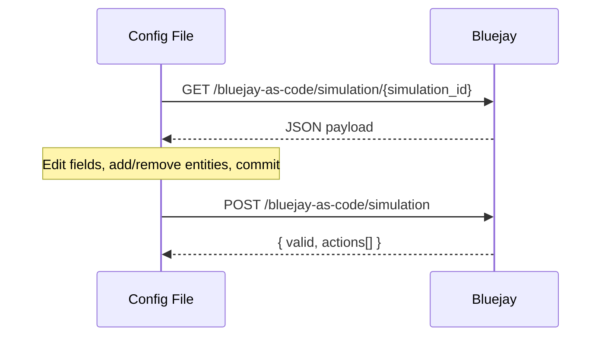
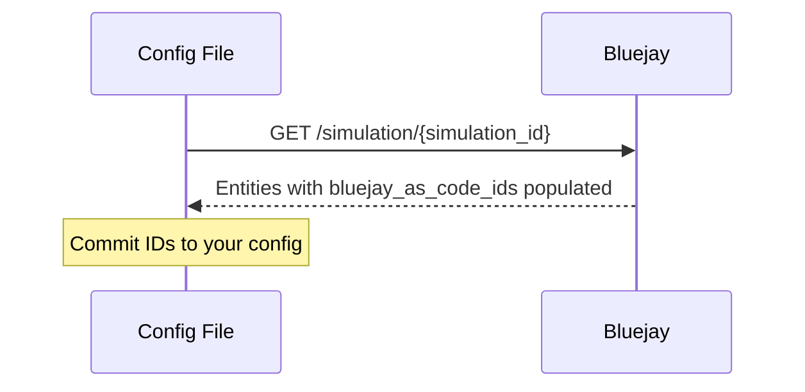
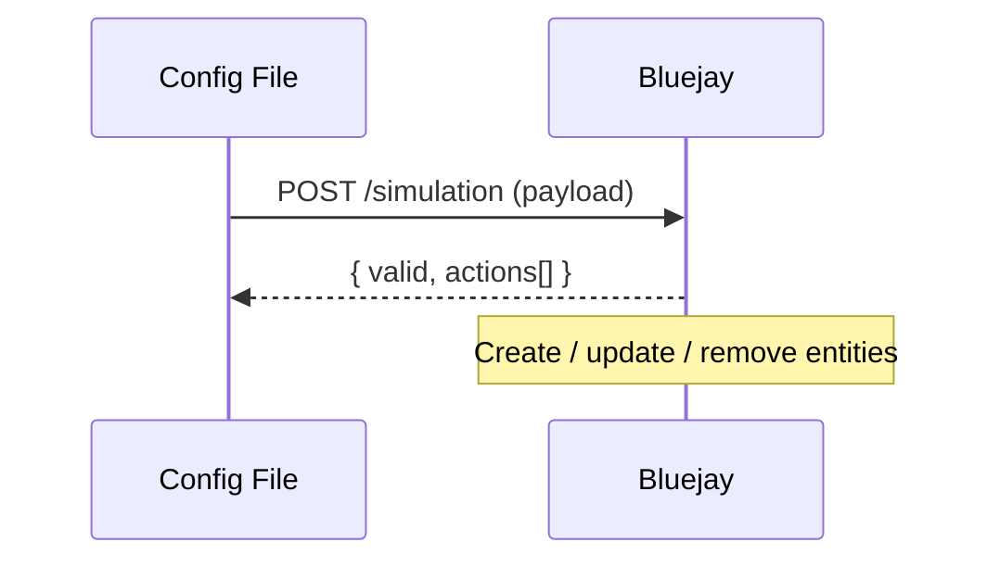

## What is Bluejay as Code?

Bluejay as Code lets you manage your agent configuration as version-controlled files. Pull your current setup to export it as a JSON payload, edit it like source code, then push to apply changes — Bluejay creates or updates each entity as needed.

<iframe
  src="https://www.loom.com/embed/a7b5aea2b9a04228abcaf3d7370a2237?speed=1.5&captions=true&hideEmbedTopBar=true"
  width="100%"
  height="450"
  frameBorder="0"
  allowFullScreen
  style={{ borderRadius: '0.5rem' }}
></iframe>




---

## The Payload

The payload describes a single simulation and all the objects that belong to it — its agent, the digital humans that participate in it, and the custom metrics used to evaluate it.

```json
{
  "agents": [ { ... } ],
  "simulations": [ { ... } ],
  "digital_humans": [ { ... }, { ... } ],
  "custom_metrics": [ { ... }  { ... } ]
}
```

The payload must contain **exactly one agent and one simulation**. Digital humans and custom metrics are arrays of any size (including empty).

<Note>
  Bluejay as Code currently operates at the simulation level, with broader scopes planned for future releases.
</Note>

### `bluejay_as_code_id`

Every entity in the payload has a `bluejay_as_code_id`. This is **not** the same as Bluejay's internal database ID — it is the stable handle used exclusively within the Bluejay as Code system to uniquely identify and track objects across operations.


<Tip>
  You own the BaC IDs — and that's intentional. Defining them yourself gives you full control over what Bluejay creates, updates, or re-links. Never let them be auto-generated at runtime.
</Tip>

#### On Pull

Pulling a simulation returns each entity with its `bluejay_as_code_id`. 



#### On Push

Pushing a Bluejay as Code payload reconciles your config file with the live simulation. Depending on the changes you commit, Bluejay will:

- Create new objects when it sees a `bluejay_as_code_id` that doesn’t already exist (generate a stable ID such as a UUID once and reuse it).
- Update existing objects based on any field edits you’ve made in the payload.
- Remove digital humans or custom metrics from the simulation when you delete them from the payload.



---

## Endpoints

<CardGroup cols={2}>
  <Card title="Pull" icon="download" href="/api-reference/endpoint/pull-bluejay-as-code">
    Export a simulation's full config as a payload.
  </Card>
  <Card title="Push" icon="upload" href="/api-reference/endpoint/push-bluejay-as-code">
    Apply a payload — create or update each entity.
  </Card>
</CardGroup>

---

## Full Example — Pull, Edit, Push

```python
import json
import uuid
import requests

BASE_URL = "https://api.getbluejay.ai/v1"
API_KEY  = "your-api-key"
SIM_ID   = "your-simulation-uuid"

headers = {"X-API-Key": API_KEY, "Content-Type": "application/json"}

# 1. Pull current config
payload = requests.get(f"{BASE_URL}/bluejay-as-code/simulation/{SIM_ID}", headers=headers).json()

# 2. Edit — update the agent system prompt
payload["agents"][0]["system_prompt"] = "You are a helpful support agent. Always greet the customer by name."

# 3. Add a new digital human — generate a UUID once and commit it to your config file
payload["digital_humans"].append({
    "bluejay_as_code_id": str(uuid.uuid4()),  # generate once, then hardcode in your config
    "human_name": "Frustrated Caller",
    "description": "A customer who has been on hold for 20 minutes and wants a quick resolution.",
    "language": "en",
    "simulations": [payload["simulations"][0]["bluejay_as_code_id"]],
})

# 4. Push
result = requests.post(f"{BASE_URL}/bluejay-as-code/simulation", headers=headers, json=payload).json()

assert result["valid"], result["errors"]
for action in result["actions"]:
    print(action)
```
