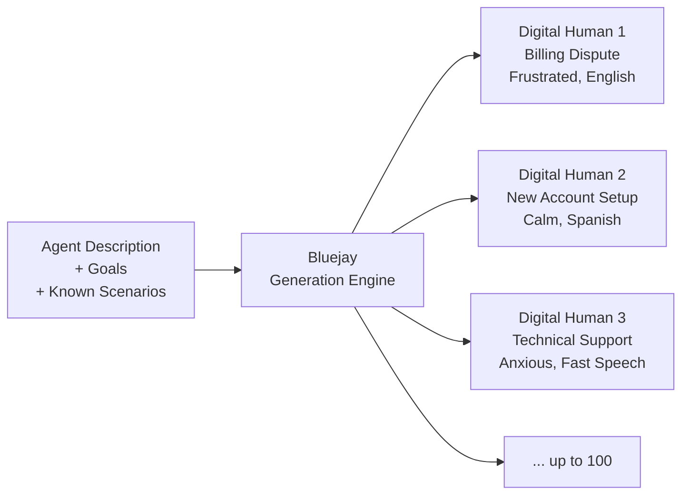

This page serves as the detailed reference for Digital Humans on Bluejay. For a conceptual overview, start with the [Digital Humans Overview](/key-concepts/digital-humans/overview).

## What Is a Digital Human?

A **Digital Human** is a synthetic replica of a customer that interacts with your agent during Bluejay simulations. Each Digital Human carries an intent, success criteria, and a set of behavioral traits that together form a single, self-contained test case.

Digital Humans are the atomic unit of testing on Bluejay. A simulation runs one or more Digital Humans against your agent, producing a transcript and evaluation result for each interaction.

## Digital Human Fields

Every **Digital Human** is defined by the following fields. Click each to expand.

<AccordionGroup>
  <Accordion title="Intent (String)" icon="bullseye">
    What the Digital Human wants to accomplish in the conversation.
  </Accordion>
  <Accordion title="Success Criteria (List)" icon="circle-check">
    Conditions that must be met for the interaction to be considered successful.
  </Accordion>
  <Accordion title="Language (String)" icon="language">
    The language the Digital Human speaks. Examples: English, Spanish, Mandarin.
  </Accordion>
  <Accordion title="Accent (String)" icon="globe">
    Regional accent applied to speech. Examples: British, Southern US, Latin American.
  </Accordion>
  <Accordion title="Emotion (String)" icon="face-smile">
    Emotional tone. Examples: Calm, Frustrated, Anxious, Angry, Cheerful.
  </Accordion>
  <Accordion title="Speaking Speed (String)" icon="gauge">
    Pace of speech. Values: Slow, Normal, Fast.
  </Accordion>
  <Accordion title="Volume (String)" icon="volume-high">
    How loud the Digital Human speaks. Values: Quiet, Normal, Loud.
  </Accordion>
  <Accordion title="Background Noise (String)" icon="waveform">
    Ambient sounds during the call. Examples: Office, Airport, Car, None.
  </Accordion>
  <Accordion title="Scripted Responses (Map)" icon="scroll">
    Trigger-response pairs for deterministic behavior.
  </Accordion>
  <Accordion title="DTMF Sequences (List)" icon="phone">
    Touch-tone codes to send during the call.
  </Accordion>
  <Accordion title="Silence Duration (Number)" icon="volume-xmark">
    Seconds the Digital Human stays silent at a specified point.
  </Accordion>
  <Accordion title="Allow silence tool (Boolean)" icon="toggle-on">
    When true, the voice runtime may use the silence tool for this Digital Human, subject to execution-layer rules.
  </Accordion>
  <Accordion title="Silence tool instructions (String)" icon="message">
    Use `"default"` for built-in silence-tool behavior. Otherwise pass custom instructions for the runtime. This field is distinct from the scripted **Silence Duration** above.
  </Accordion>
</AccordionGroup>

## How Bluejay Generates Digital Humans

When you use the generation endpoint, Bluejay creates Digital Humans based on the context you've provided about your agent. The generation process works in three stages:



<Steps>
  <Step title="Context ingestion">
    Bluejay reads your agent's description, system prompt, goals, and any existing Digital Humans to understand the problem space.
  </Step>
  <Step title="Scenario diversification">
    The generation engine creates a diverse set of intents and customer profiles, varying across languages, emotions, complexity levels, and scenario types.
  </Step>
  <Step title="Criteria assignment">
    Each generated Digital Human receives tailored success criteria aligned to its specific intent and your agent's expected behavior.
  </Step>
</Steps>

<Tip>
The more you tell Bluejay about your agent's behavior, the better the generation engine can produce diverse, relevant Digital Humans. Include edge cases, known failure modes, and multi-step workflows in your agent description.
</Tip>

## Intent Design

A well-written intent is specific, actionable, and reflects a real customer scenario. Here's how to think about writing intents:

**Weak intent:**
```
"Ask about billing"
```

**Strong intent:**
```
"I was charged $49.99 on March 3rd but I cancelled my subscription on February 28th.
I want a full refund and written confirmation that no further charges will occur."
```

Strong intents give the Digital Human a clear objective and provide enough context for the conversation to feel authentic. They also make success criteria easier to define because the expected outcome is already implied.

## Success Criteria Design

Success criteria should be **specific, observable, and binary**. Each criterion should be something Bluejay can evaluate from the transcript alone.

**Good criteria:**
- The agent acknowledged the duplicate charge within the first 3 turns
- The agent offered a refund or escalated to billing
- The agent did not share account balance before verifying identity

**Bad criteria:**
- The agent was helpful
- The conversation went well
- The agent sounded professional

## Scripted Responses vs. Natural Conversation

Digital Humans support two conversation modes:

<CardGroup cols={2}>
  <Card title="Natural conversation" icon="comments">
    The Digital Human responds dynamically based on its intent and traits. Best for exploratory testing and discovering unexpected agent behaviors.
  </Card>
  <Card title="Scripted responses" icon="scroll">
    The Digital Human follows a predetermined script, responding with specific phrases when triggered. Best for regression testing and deterministic validation.
  </Card>
</CardGroup>

You can mix both modes. A Digital Human can follow a script for the first few turns (providing account details, answering verification questions) and then switch to natural conversation for the resolution phase.

## Communities

Digital Humans can be grouped into **Communities**, which are reusable sets of personas that form a benchmark population. Communities enable:

- **Consistent benchmarks.** Run the same set of Digital Humans against different agent versions to compare performance over time.
- **Audience segmentation.** Organize Digital Humans by customer type, language, or scenario category.
- **Cross-agent testing.** Use one Community across multiple agents to see how different agents handle the same customers.

See the [Communities](/key-concepts/communities/overview) documentation for details on creating and managing Communities.

## Best Practices

<Steps>
  <Step title="Start with your real customers">
    Review your production call logs, support tickets, and customer feedback. Build Digital Humans that reflect the actual scenarios your agent encounters.
  </Step>
  <Step title="Cover the full spectrum">
    Don't only test the happy path. Create Digital Humans for edge cases, adversarial scenarios, multilingual interactions, and silence/timeout conditions.
  </Step>
  <Step title="Be specific with success criteria">
    Vague criteria produce vague results. Write criteria that are observable in a transcript and leave no room for interpretation.
  </Step>
  <Step title="Iterate and expand">
    Start with a small set of targeted Digital Humans. As you discover new failure modes in production, add corresponding Digital Humans to your simulation suite.
  </Step>
  <Step title="Use generation for breadth, manual for depth">
    Generate large populations to discover unexpected scenarios. Then create hand-crafted Digital Humans for your most critical and nuanced test cases.
  </Step>
</Steps>

## Resources

<CardGroup cols={2}>
  <Card title="Overview" icon="users" href="/key-concepts/digital-humans/overview">
    Conceptual model and the anatomy of a Digital Human.
  </Card>
  <Card title="Configuration" icon="gear" href="/key-concepts/digital-humans/configuration">
    Configure accents, DTMF, scripted responses, IVR simulation, and more.
  </Card>
  <Card title="Prompting Guide" icon="pen-fancy" href="/key-concepts/digital-humans/prompting-guide">
    Write intents and success criteria that grade cleanly and run consistently.
  </Card>
  <Card title="Use Cases" icon="lightbulb" href="/key-concepts/digital-humans/use-cases">
    Real-world patterns for building effective Digital Human test suites.
  </Card>
  <Card title="Create via API" icon="plus" href="/api-reference/endpoint/create-digital-human">
    Create a single Digital Human with full configuration.
  </Card>
  <Card title="Generate via API" icon="wand-magic-sparkles" href="/api-reference/endpoint/generate-digital-humans">
    Auto-generate up to 100 diverse Digital Humans.
  </Card>
</CardGroup>
