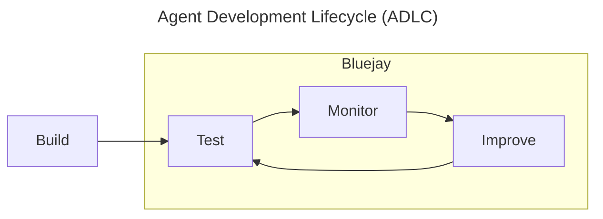

Bluejay is the testing, monitoring, and improvement layer for conversational AI agents. Enterprises, startups, and developers across the world use Bluejay to evaluate their voice agents, create custom benchmarks, and catch production failures before they reach customers.

## How Bluejay fits into your workflow

## What You'll Find Here

- How to test your agent with synthetic conversations before launch
- How to monitor production calls with custom evaluation metrics
- How to connect Bluejay with your existing voice AI stack

## Capabilities

<CardGroup cols={2}>
  <Card
    title="Simulations"
    icon="flask-vial"
    href="/test/simulations/overview"
  >
    Run synthetic conversations against your agent to validate behavior, catch regressions, and test edge cases at scale.
  </Card>
  <Card
    title="Observability"
    icon="chart-line"
    href="/monitor/observability/overview"
  >
    Evaluate production calls with custom metrics to surface quality issues, track trends, and generate actionable insights.
  </Card>
  <Card
    title="Custom Metrics"
    icon="gauge-high"
    href="/key-concepts/custom-metrics/overview"
  >
    Build evaluation criteria tailored to your use case, from task completion to tone, compliance, and beyond.
  </Card>
  <Card
    title="Real-time Alerts"
    icon="bell"
    href="/key-concepts/alerts/overview"
  >
    Get notified the moment your agent fails a metric so you can act on issues before customers pile up.
  </Card>
</CardGroup>

## Getting Started

<Steps>
  <Step title="Get access">
    [Book a 15-minute demo](https://cal.com/rohanv/15min) to get set up on Bluejay.
  </Step>
  <Step title="Create your first Simulation">
    Build a [simulation](/test/simulations/overview) to test your agent against realistic customer scenarios.
  </Step>
  <Step title="Add Custom Metrics">
    Define [custom evaluation criteria](/key-concepts/custom-metrics/overview) that matter for your use case.
  </Step>
  <Step title="Hook up Observability">
    Connect your [production calls](/monitor/observability/overview) so Bluejay can evaluate them continuously.
  </Step>
</Steps>

## Why Bluejay

Building a voice agent is easy. Trusting it will work is hard. Engineers have become supervisors, pouring time into verifying their agent's functionality. Without the proper tools, that verification happens in a tedious, manual fashion -- or it doesn't happen at all.

Bluejay gives engineers, customer success teams, and product managers the tools to verify their agent does what it's supposed to do, without being stuck on the phone all day manually testing.
