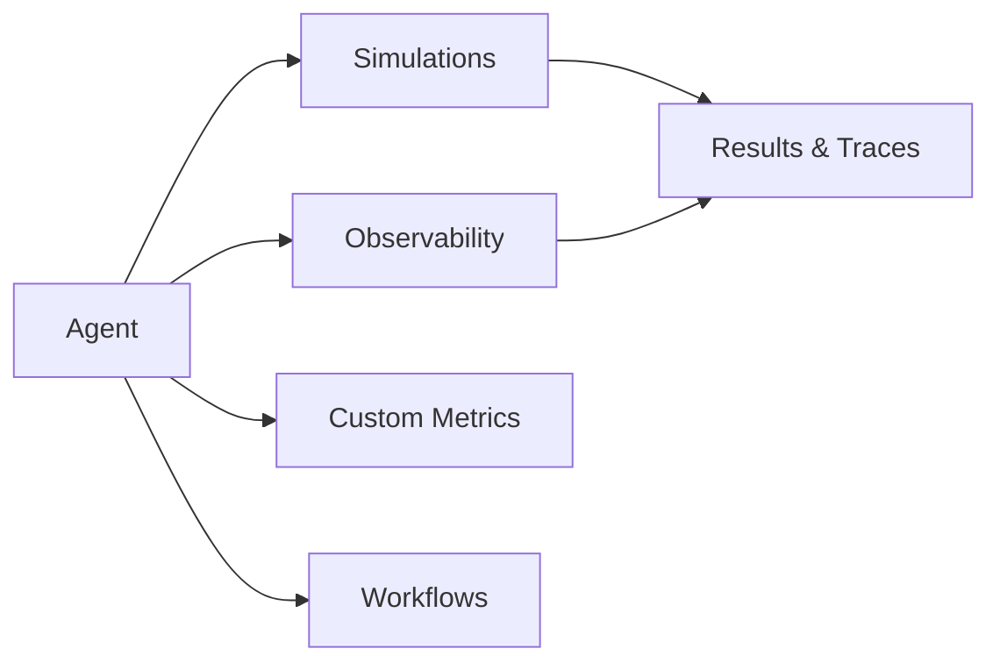

Agents are the systems you evaluate in Bluejay. They give Bluejay the context needed to simulate realistic conversations and measure performance against the behaviors you care about.

## What You'll Learn

- What an Agent represents in Bluejay
- How Agents connect to simulations, observability, and metrics
- How to create and configure an Agent

## How Agents Work

You create an Agent as the anchor for simulations, observability runs, metrics, and workflow automation. It becomes the primary object that ties together your testing and monitoring setup.

An Agent holds the name, description, goals, knowledge base, and phone number for the system you want to evaluate. Bluejay uses this information to establish a baseline for how the agent should perform, and every simulation run and observability evaluation is scoped to a specific Agent.

## Key Capabilities

- **Centralized identity** -- one Agent object anchors all testing and monitoring for a single voice or chat system
- **Knowledge base attachment** -- attach FAQs, scripts, and guidelines so simulations reflect real behavior
- **Multi-channel support** -- works across telephony, SIP, WebSocket, and HTTP integrations
- **Goal tracking** -- define objectives your agent should achieve and measure against them across runs

## Common Use Cases

- Register a new voice agent before running your first simulation batch
- Update an Agent's knowledge base and re-run regressions to verify changes
- Connect an Agent to observability to evaluate production calls continuously

## Next Steps

<CardGroup cols={2}>
  <Card title="Agents Deep Dive" icon="book" href="/core-concepts/agents">
    Field-level reference for creating and configuring Agents.
  </Card>
  <Card title="Add Agent API" icon="code" href="/api-reference/endpoint/add-agent">
    Create an Agent programmatically via the API.
  </Card>
</CardGroup>
