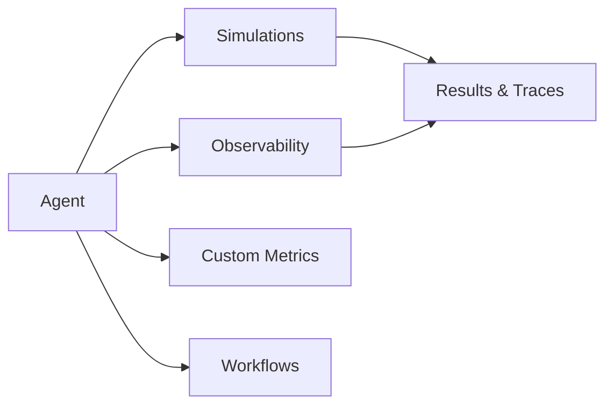

In Bluejay, an **Agent** is the voice or chat system you are evaluating. Every simulation, observability run, custom metric, and workflow attaches to a specific Agent, which gives Bluejay the context it needs to generate realistic conversations and score the agent against the behaviors you care about.

## What Is an Agent?

An **Agent** is the canonical object that represents a single voice or chat system under evaluation. Once you create an Agent, every downstream feature in Bluejay is scoped to that Agent.



You can have many **Agents** in one Bluejay account, typically one per system you want to test or monitor. Each Agent carries its own configuration, knowledge base, and evaluation history.

## Anatomy of an Agent

An **Agent** is made up of a small set of structured fields:

| Field | Description |
|-------|-------------|
| **Name** | A unique, easily identifiable name for the agent. |
| **Description** | A brief explanation of the agent's role, capabilities, and context. |
| **Goals** | Clear objectives the agent should achieve during a conversation. Bluejay scores simulations against these goals. |
| **Knowledge Base** | Structured data, scripts, FAQs, and guidelines the agent is expected to know. Used by both simulations and metrics. |
| **Phone Number** | The phone number associated with the agent for inbound or outbound calls. Production calls placed to or from this number are tied back to the right Agent. |
| **Voice AI Provider** | The provider (Retell, ElevenLabs, Vapi, Bland, and others) that runs the agent in production, plus the provider-side Agent ID. Required for simulations to dial out and for observability webhooks to be matched correctly. |

## Creating an Agent

You can create an **Agent** from the Bluejay dashboard or from the API.

- **Dashboard.** Open **Settings**, then **Agents**, click **Add Agent**, and fill in the fields above.
- **API.** Send a `POST` to the [Add Agent](/api-reference/endpoint/add-agent) endpoint with the same fields in a JSON body.

## Connecting an Agent to a Provider

To finish wiring an **Agent** up for live testing or observability, follow the provider-specific setup guide:

- [Retell Observability](/integrations/retell)
- [ElevenLabs Observability](/integrations/eleven-labs)
- [Vapi Observability](/integrations/vapi)
- [Bland Observability](/integrations/bland)

Each guide walks through configuring the provider webhook, saving credentials inside Bluejay, and binding a Bluejay Agent to the provider Agent ID.

## How Agents Connect to the Rest of Bluejay

- **Simulations** dial out (or send chat messages) to the Agent through its provider connection, then score the resulting conversation against your custom metrics and goals.
- **Observability** receives webhook events from production calls and matches them to the Agent. Each call is stored as a run you can review, score, and aggregate.
- **Custom metrics** are defined per Agent and execute against every simulation result and every observability event.
- **Workflows** (for providers that support multi-agent flows, such as ElevenLabs) sync into Bluejay and render as an editable graph on the Agent's Workflows tab.

## Typical Agent Lifecycle

1. **Create** the Agent in Bluejay (in the dashboard or through the [Add Agent API](/api-reference/endpoint/add-agent)).
2. **Configure** the Agent by setting goals, attaching a knowledge base, and selecting the voice AI provider.
3. **Connect** the Agent to its production system by entering the provider Agent ID and webhook details.
4. **Test** by running simulations against the Agent to verify behavior before changes ship.
5. **Monitor** by turning on observability so production calls flow into Bluejay for ongoing scoring and alerting.
6. **Iterate** by updating goals, knowledge base content, or provider configuration as the agent evolves.

## Best Practices

- **Be specific.** Clear, detailed descriptions and goals make simulations and analytics highly relevant and actionable. Vague goals lead to vague scoring.
- **Keep the knowledge base current.** Update FAQs, scripts, and guidelines whenever the agent's intent or content changes, so simulations continue to reflect production behavior.
- **Use distinct names.** Intuitive, descriptive names make it easier to identify the right Agent in the dashboard, in API responses, and in webhook payloads.
- **Bind the right phone number.** Ensure the phone number on the Agent matches the production number, so observability events flow to the correct Agent and metrics aggregate correctly.

## Example Agent Definition

```md
Name: "Customer Support Bot"

Description: "An AI-powered assistant handling common customer support queries."

Goals:
- Resolve common customer issues quickly
- Provide accurate product information
- Escalate complex queries to human operators

Knowledge Base:
- Product FAQs
- Troubleshooting guides
- Company policies

Phone Number: "+1 (123) 456-7890"

Voice AI Provider: "Retell"
```

## Resources

<CardGroup cols={2}>
  <Card title="Workflows" icon="diagram-project" href="/key-concepts/agents/workflow">
    Sync multi-agent flows from ElevenLabs and use them to drive simulations.
  </Card>
  <Card title="Add Agent API" icon="code" href="/api-reference/endpoint/add-agent">
    Create an Agent programmatically.
  </Card>
  <Card title="Simulations Overview" icon="flask-vial" href="/test/simulations/overview">
    How simulations work in Bluejay, from setup to scoring.
  </Card>
  <Card title="Custom Metrics" icon="gauge-high" href="/key-concepts/custom-metrics/overview">
    Define scoring rules that apply to every simulation and every production call for an Agent.
  </Card>
</CardGroup>
