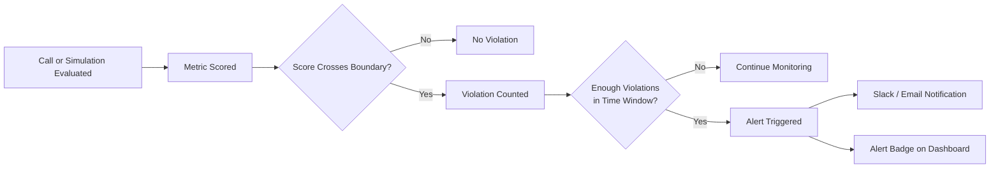

Alerts notify your team when monitored conversations or metrics cross a threshold that needs attention. They help you move from passive reporting to active operational response.

## What You'll Learn

- What Alerts are and how they fit into monitoring workflows
- How to configure threshold-based notifications
- How Alerts connect to Slack and other integrations

## How Alerts Work

Bluejay uses threshold alerts that count how many times a metric crosses a boundary within a rolling time window. The alert only fires when the violation count reaches the required number of occurrences — filtering out noise while catching sustained problems.

### Threshold Alert Configuration

When creating a threshold alert, you configure the metric to watch, the boundary condition, and the sensitivity of the trigger:

| Field | Description | Example |
|-------|-------------|---------|
| **Metric** | The Custom Metric or built-in metric to monitor | Average Agent Latency |
| **Condition** | Whether to alert when the score is _above_ or _below_ the boundary | Above |
| **Threshold** | The numeric boundary that counts as a violation | 3 seconds |
| **Occurrences** | How many violations must occur before the alert fires | 5 |
| **Time Window** | The rolling interval over which violations are counted | 10 minutes |

For example, an alert on "Average Agent Latency > 3 seconds" with 5 occurrences in a 10-minute window will only fire when 5 calls exceed 3-second latency within that window. A single slow call won't trigger a notification — but a sustained regression will.

For critical metrics like hallucination detection, set occurrences to 1 so the alert fires on the very first violation.

## Key Capabilities

- **Threshold-based triggers** -- fire alerts when a metric crosses a boundary a configured number of times within a time window
- **Configurable sensitivity** -- tune the number of occurrences and the time window to match the severity of each metric
- **Channel routing** -- send alerts to specific Slack channels so the right team gets the right signal
- **Dashboard integration** -- alert badges appear on agent dashboards for at-a-glance health monitoring
- **Works for both observability and simulations** -- monitor production calls and test runs with the same alert model

## Common Use Cases

- Alert engineering when average latency exceeds 3 seconds across 5 calls in 10 minutes
- Notify the support team the moment any production call is flagged for hallucination (occurrences set to 1)
- Alert QA when simulation goal completion drops below 85% across 3 conversations in a run
- Route compliance violations to a dedicated Slack channel with zero-tolerance thresholds

## Next Steps

<CardGroup cols={2}>
  <Card title="Observability Alerts" icon="eye" href="/monitor/observability/alerts">
    Configure threshold alerts for production monitoring.
  </Card>
  <Card title="Simulation Alerts" icon="flask-vial" href="/test/simulations/alerts">
    Configure threshold alerts for simulation testing.
  </Card>
  <Card title="Slack Integration" icon="/logo/slack-blue.svg" href="/integrations/slack">
    Connect Bluejay to Slack for real-time alert delivery.
  </Card>
  <Card title="Custom Metrics" icon="gauge-high" href="/key-concepts/custom-metrics/overview">
    Define the metrics that power your alert thresholds.
  </Card>
</CardGroup>
