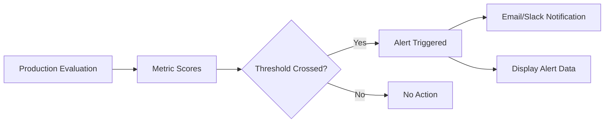

Alerts notify your team when monitored conversations or metrics cross a threshold that needs attention. They help you move from passive reporting to active operational response.

## What You'll Learn

- What Alerts are and how they fit into monitoring workflows
- How to configure threshold-based notifications
- How Alerts connect to Slack and other integrations

## How Alerts Work

You configure Alerts on top of observability signals so issues such as performance regressions, anomalous calls, or quality failures get surfaced quickly in the tools your team already watches.

Alerts move your team from passive reporting to active operational response. When a metric crosses a threshold you define, Bluejay sends a notification to the channels your team monitors so issues get caught before they compound.

## Key Capabilities

- **Threshold-based triggers** -- fire alerts when any Custom Metric score crosses a defined boundary
- **Channel routing** -- send alerts to specific Slack channels so the right team gets the right signal
- **Dashboard integration** -- alert badges appear on agent dashboards for at-a-glance health monitoring
- **Real-time delivery** -- notifications arrive within seconds of evaluation completion

## Common Use Cases

- Alert the support team when hallucination rates spike above a threshold on production calls
- Notify engineering when a simulation regression is detected after a prompt change
- Route compliance violations to a dedicated Slack channel for immediate review

## Next Steps

<CardGroup cols={2}>
  <Card title="Slack Integration" icon="bell" href="/integrations/slack">
    Connect Bluejay to Slack for real-time alert delivery.
  </Card>
  <Card title="Observability Overview" icon="chart-line" href="/monitor/observability/overview">
    Learn how production evaluations feed into alerts.
  </Card>
</CardGroup>
