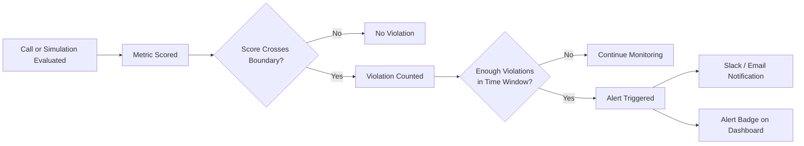

Alerts are Bluejay's way of notifying you the moment something important changes in your live production traffic. They sit alongside dashboards and logs as the third observability surface in Bluejay. Dashboards help you explore trends, logs help you inspect individual calls, and alerts tell you when you should pay attention right now.

## What You'll Learn

- What Alerts are and how they fit into monitoring workflows
- The parts that make up a Bluejay alert
- The lifecycle of an alert from monitoring through resolution
- How to configure threshold-based notifications and connect them to Slack

## What Alerts Help You Catch

Click each scenario to see what an alert is watching for.

<AccordionGroup>
  <Accordion title="Spikes in failed calls" icon="circle-xmark">
    A sudden rise in the number of calls that fail or terminate unexpectedly. Useful for catching deployment regressions, broken tool calls, or upstream provider outages.
  </Accordion>
  <Accordion title="Drops in call volume" icon="chart-line-down">
    A sharp decrease in the number of calls coming through. Often indicates an upstream routing issue, a misconfigured phone number, or an integration outage.
  </Accordion>
  <Accordion title="Latency getting worse" icon="gauge-simple-high">
    Response times trending upward across calls. Indicates degraded performance from your agent, your LLM provider, or your downstream APIs.
  </Accordion>
  <Accordion title="Quality metrics degrading" icon="circle-exclamation">
    Custom metric pass rates dropping below their expected baseline. Catches behavior regressions before customers escalate.
  </Accordion>
  <Accordion title="Unusual behavior for a specific agent" icon="user-shield">
    Anomalous activity scoped to one agent, such as hallucinations or off-script behavior. Set a tight threshold and route the alert to the team responsible for that agent.
  </Accordion>
</AccordionGroup>

## How Alerts Work

Bluejay uses threshold alerts that count how many times a metric crosses a boundary within a rolling time window. The alert only fires when the violation count reaches the required number of occurrences. This filters out noise while catching sustained problems.

## Anatomy of an Alert

A Bluejay alert is made up of five parts. Click each to expand.

<AccordionGroup>
  <Accordion title="The metric it watches" icon="gauge-high">
    The Custom Metric or built-in observability metric the alert monitors. For example, call count, latency, failure rate, or a quality metric you defined.
  </Accordion>
  <Accordion title="The threshold" icon="ruler-horizontal">
    The numeric boundary that counts as a violation. Expressed as "above X" or "below Y", for example "above 3 seconds" for a latency alert.
  </Accordion>
  <Accordion title="The time window" icon="clock">
    The rolling interval over which Bluejay counts violations. Common windows are 5 minutes, 1 hour, or a day, depending on the metric's volatility.
  </Accordion>
  <Accordion title="The scope" icon="bullseye">
    Whether the alert watches every agent in the workspace or a specific agent. Scope alerts narrowly when an agent has unusual baselines that a workspace-wide rule would not catch.
  </Accordion>
  <Accordion title="The notification behavior" icon="bell">
    What happens when the alert triggers, when it resolves, and where the notification is delivered (Slack channel, email, or dashboard badge).
  </Accordion>
</AccordionGroup>

### Threshold Alert Configuration

When creating a threshold alert, you configure the metric to watch, the boundary condition, and the sensitivity of the trigger:

| Field | Description | Example |
|-------|-------------|---------|
| **Metric** | The Custom Metric or built-in metric to monitor | Average Agent Latency |
| **Condition** | Whether to alert when the score is _above_ or _below_ the boundary | Above |
| **Threshold** | The numeric boundary that counts as a violation | 3 seconds |
| **Occurrences** | How many violations must occur before the alert fires | 5 |
| **Time Window** | The rolling interval over which violations are counted | 10 minutes |

<Tip>
**Example.** An alert on "Average Agent Latency > 3 seconds" with 5 occurrences in a 10-minute window will only fire when 5 calls exceed 3-second latency within that window. A single slow call won't trigger a notification, but a sustained regression will.

For critical metrics like hallucination detection, set occurrences to 1 so the alert fires on the very first violation.
</Tip>

## Alert Lifecycle

Every alert moves through three states. Click each to see what happens at that stage.

<AccordionGroup>
  <Accordion title="1. Monitoring" icon="eye">
    Bluejay watches the configured metric continuously. The alert is armed but silent. No notification fires until a violation crosses the threshold inside the time window.
  </Accordion>
  <Accordion title="2. Triggered / Firing" icon="bell">
    The metric crossed the threshold the required number of times within the window. The alert moves to firing, the configured notification goes out (Slack, email, or dashboard badge), and the alert badge appears on the relevant agent dashboard.
  </Accordion>
  <Accordion title="3. Resolved" icon="circle-check">
    The metric returns to normal and no longer satisfies the firing condition. Bluejay records the resolution time so you have a full timeline of the incident.
  </Accordion>
</AccordionGroup>

## How to Think About Alerts

Bluejay's observability surface has three complementary tools. Use each for what it does best.

<AccordionGroup>
  <Accordion title="Dashboards explore trends" icon="chart-line">
    Dashboards help you understand patterns over hours, days, and weeks. Useful for slow-moving questions like "is quality drifting" or "is volume growing".
  </Accordion>
  <Accordion title="Logs inspect individual calls" icon="list">
    Logs give you the per-call view. Useful for debugging a specific failure, replaying a transcript, or auditing what an agent did.
  </Accordion>
  <Accordion title="Alerts tell you to pay attention now" icon="bell">
    Alerts cut through the noise to signal when production behavior actually demands attention. Useful for keeping the on-call team focused on what changed.
  </Accordion>
</AccordionGroup>

## Key Capabilities

- **Threshold-based triggers.** Fire alerts when a metric crosses a boundary a configured number of times within a time window.
- **Configurable sensitivity.** Tune the number of occurrences and the time window to match the severity of each metric.
- **Channel routing.** Send alerts to specific Slack channels so the right team gets the right signal.
- **Dashboard integration.** Alert badges appear on agent dashboards for at-a-glance health monitoring.
- **Works for both observability and simulations.** Monitor production calls and test runs with the same alert model.

## Common Use Cases

- Alert engineering when average latency exceeds 3 seconds across 5 calls in 10 minutes.
- Notify the support team the moment any production call is flagged for hallucination (occurrences set to 1).
- Alert QA when simulation goal completion drops below 85% across 3 conversations in a run.
- Route compliance violations to a dedicated Slack channel with zero-tolerance thresholds.
- For a booking agent, alert on a sudden rise in failed-call rate, a drop in call volume, an increase in average latency, or an abnormal change in conversation quality.

## Resources

<CardGroup cols={2}>
  <Card title="Observability Alerts" icon="eye" href="/monitor/observability/alerts">
    Configure threshold alerts for production monitoring.
  </Card>
  <Card title="Simulation Alerts" icon="flask-vial" href="/test/simulations/alerts">
    Configure threshold alerts for simulation testing.
  </Card>
  <Card title="Slack Integration" icon="/logo/slack-blue.svg" href="/integrations/slack">
    Connect Bluejay to Slack for real-time alert delivery.
  </Card>
  <Card title="Custom Metrics" icon="gauge-high" href="/key-concepts/custom-metrics/overview">
    Define the metrics that power your alert thresholds.
  </Card>
  <Card title="Monitor Alerts in Bluejay" icon="up-right-from-square" href="https://app.getbluejay.ai/monitor/alerts">
    Open the live Alerts list in your Bluejay workspace.
  </Card>
  <Card title="Monitor Dashboards in Bluejay" icon="table-columns" href="https://app.getbluejay.ai/monitor/dashboards">
    Open Observability dashboards in your Bluejay workspace.
  </Card>
</CardGroup>
