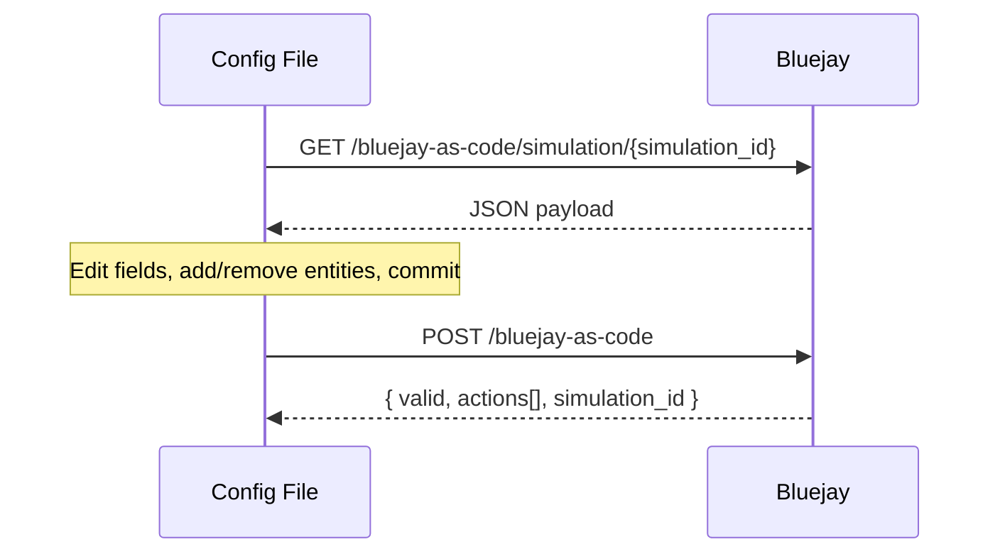

<iframe
  src="https://www.youtube.com/embed/MnFCBV9PwMA"
  width="100%"
  height="450"
  frameBorder="0"
  allowFullScreen
  style={{ borderRadius: '0.5rem' }}
></iframe>

## What is Bluejay as Code?

Bluejay as Code lets you manage your agent configuration as version-controlled files in your codebase. **This is Bluejay's equivalent of Terraform.** Pull your current setup to export it as a JSON payload, edit it like source code, then push to apply changes — Bluejay creates or updates each entity as needed.

## How to Use Bluejay as Code

The flow is **pull → edit → push**. You pull your simulation as a JSON payload, edit it locally like any other source file, and push it back to apply the changes. The example below uses a healthcare front desk scheduling agent for Cedar Park Family Medicine.



<Steps>
  <Step title="Pull your configuration">
    Send a `GET` request to the Bluejay as Code endpoint with your simulation ID. Bluejay returns a single JSON payload containing the agent, the simulation, every digital human, and every custom metric attached to it.

    ```bash
    curl https://api.getbluejay.ai/v1/bluejay-as-code/simulation/$SIM_ID \
      -H "X-API-Key: $BLUEJAY_API_KEY" \
      -o simulation.json
    ```

    <Tip>
      The pull endpoint also accepts three other root types if you'd rather anchor your bundle on something else: `GET /v1/bluejay-as-code/agent/{id}`, `/digital-human/{id}`, or `/custom-metric/{id}`. Each one walks the same graph and returns the same payload shape — pick whichever entity is most natural for your workflow. The rest of this guide uses the simulation root because it's the most common.
    </Tip>
  </Step>

  <Step title="Inspect the file you pulled">
    `simulation.json` is the full state of your simulation. The payload must contain **exactly one agent and one simulation**; digital humans and custom metrics are arrays of any size.

    Every entity carries a `bluejay_as_code_id` — a **UUID** that Bluejay populates on pull. When you add a new entity locally, generate a fresh UUID once and commit it alongside the rest of the entity's fields.

    <Tip>
      Each entity in the payload accepts the same fields as the corresponding API resource. For example, digital humans take the same arguments as [`POST /v1/create-digital-human`](/api-reference/endpoint/create-digital-human) — including `success_criteria`, `traits`, `voice`, and so on.
    </Tip>

    ```json simulation.json
    {
      "agents": [
        {
          "bluejay_as_code_id": "f3d2a87c-1e4b-4b9a-9c2d-7f1e6b5a4c33",
          "name": "Front Desk Scheduler",
          "system_prompt": "You are the front desk scheduling agent for Cedar Park Family Medicine. Verify the caller's date of birth before discussing any patient-specific information. Help patients book, reschedule, or cancel appointments. Confirm provider, date, time, and reason for visit before finalizing.",
          "voice": "en-US-Neural2-F",
          "language": "en"
        }
      ],
      "simulations": [
        {
          "bluejay_as_code_id": "b1a04e88-7c2f-4d23-9a5e-2f8c6d1b7a09",
          "name": "Scheduling Coverage",
          "description": "Booking, rescheduling, and cancellation paths for the front desk agent.",
          "agent": "f3d2a87c-1e4b-4b9a-9c2d-7f1e6b5a4c33"
        }
      ],
      "digital_humans": [
        {
          "bluejay_as_code_id": "a0e7b3d2-4c8f-4a91-b3e6-1d5f9c2e7a44",
          "human_name": "Maria Alvarez",
          "description": "New patient booking her first physical with Dr. Patel.",
          "success_criteria": "Agent books a Tuesday or Thursday morning slot with Dr. Patel.",
          "language": "en",
          "simulations": ["b1a04e88-7c2f-4d23-9a5e-2f8c6d1b7a09"]
        },
        {
          "bluejay_as_code_id": "c5d9f1a3-8e2b-4c47-9d18-6f3a2b8e0c52",
          "human_name": "James Okafor",
          "description": "Existing patient rescheduling his follow-up with Dr. Liu.",
          "success_criteria": "Agent cancels the old slot and books the next available afternoon.",
          "language": "en",
          "simulations": ["b1a04e88-7c2f-4d23-9a5e-2f8c6d1b7a09"]
        }
      ],
      "custom_metrics": [
        {
          "bluejay_as_code_id": "2b8d4c1f-9a3e-4f72-b5c0-6e1d8a7f3c44",
          "name": "DOB Verified Before PHI",
          "description": "The agent verifies the caller's date of birth before discussing any patient-specific information."
        },
        {
          "bluejay_as_code_id": "9f3a1c7e-5b2d-4e88-a4f1-0c7b3d6a9e21",
          "name": "Appointment Details Confirmed",
          "description": "Before ending the call, the agent reads back provider, date, time, and reason for visit, and the caller confirms."
        }
      ]
    }
    ```
  </Step>

  <Step title="Edit the payload">
    Edit fields in place to update existing entities, append new objects to add coverage, or remove entries from `digital_humans` or `custom_metrics` to detach them on the next push.

    <Note>
      **You generate the `bluejay_as_code_id` for new objects yourself.** Bluejay only populates UUIDs on pull — anything you add locally needs an ID you create (for example with `uuidgen` or `uuid.uuid4()`). Commit it to the file so future pushes recognize the same object.
    </Note>

    For example, add a digital human that simulates an urgent-symptom call so you can verify the agent's escalation behavior. Append the new entity to the `digital_humans` array:

    ```json simulation.json
    {
      "bluejay_as_code_id": "7e2c9a1b-3d4f-4a8e-b612-9c5f0d3a1e88",
      "human_name": "Eleanor Pham",
      "description": "Caller reports chest pain at the start of the call.",
      "success_criteria": "Agent tells the caller to hang up and call 911.",
      "language": "en",
      "simulations": ["b1a04e88-7c2f-4d23-9a5e-2f8c6d1b7a09"]
    }
    ```

    And tighten the agent's `system_prompt` to handle that path explicitly:

    ```json simulation.json
    {
      "bluejay_as_code_id": "f3d2a87c-1e4b-4b9a-9c2d-7f1e6b5a4c33",
      "name": "Front Desk Scheduler",
      "system_prompt": "You are the front desk scheduling agent for Cedar Park Family Medicine. Verify the caller's date of birth before discussing any patient-specific information. Help patients book, reschedule, or cancel appointments. Confirm provider, date, time, and reason for visit before finalizing. If the caller reports chest pain, difficulty breathing, or suicidal ideation, instruct them to hang up and call 911 immediately.",
      "voice": "en-US-Neural2-F",
      "language": "en"
    }
    ```
  </Step>

  <Step title="Push your changes">
    Send the edited file back with a `POST`. Bluejay reconciles each entity by `bluejay_as_code_id`:

    - **Create:** a UUID Bluejay has not seen before becomes a new entity.
    - **Update:** a known UUID with edited fields updates the existing entity.
    - **Release:** a digital human or custom metric whose UUID is missing from the payload is unlinked from the simulation. The object itself still exists in Bluejay and can be reused or attached to other simulations; deleting it from the file removes the association, not the entity.

    The response lists every action taken so you can confirm the reconciliation matches your diff.

    ```bash
    curl https://api.getbluejay.ai/v1/bluejay-as-code \
      -H "X-API-Key: $BLUEJAY_API_KEY" \
      -H "Content-Type: application/json" \
      --data @simulation.json
    ```

    ```json response
    {
      "valid": true,
      "errors": [],
      "actions": [
        "Updated agent 'Front Desk Scheduler'",
        "Created digital human 'Eleanor Pham'",
        "Linked 1 existing digital human(s) to simulation"
      ],
      "simulation_id": 1284
    }
    ```
  </Step>
</Steps>

<Note>
  The push endpoint is a single `POST /v1/bluejay-as-code` regardless of which root type you pulled from — the payload itself describes everything Bluejay needs to reconcile. On success, the response includes the resolved `simulation_id` for the simulation in the bundle so you can deep-link straight into the UI.
</Note>

## Endpoints

<CardGroup cols={2}>
  <Card title="Pull" icon="download" href="/api-reference/endpoint/pull-bluejay-as-code">
    Export a simulation's full config as a payload.
  </Card>
  <Card title="Push" icon="upload" href="/api-reference/endpoint/push-bluejay-as-code">
    Apply a payload — create or update each entity.
  </Card>
</CardGroup>

## Full Example

```python
import json
import uuid
import requests

BASE_URL = "https://api.getbluejay.ai/v1"
API_KEY  = "your-api-key"
SIM_ID   = "your-simulation-uuid"

headers = {"X-API-Key": API_KEY, "Content-Type": "application/json"}

# 1. Pull current config
payload = requests.get(f"{BASE_URL}/bluejay-as-code/simulation/{SIM_ID}", headers=headers).json()

# 2. Edit — update the agent system prompt
payload["agents"][0]["system_prompt"] = "You are a helpful support agent. Always greet the customer by name."

# 3. Add a new digital human — generate a UUID once and commit it to your config file
payload["digital_humans"].append({
    "bluejay_as_code_id": str(uuid.uuid4()),  # generate once, then hardcode in your config
    "human_name": "Frustrated Caller",
    "description": "A customer who has been on hold for 20 minutes and wants a quick resolution.",
    "language": "en",
    "simulations": [payload["simulations"][0]["bluejay_as_code_id"]],
})

# 4. Push
result = requests.post(f"{BASE_URL}/bluejay-as-code", headers=headers, json=payload).json()

assert result["valid"], result["errors"]
for action in result["actions"]:
    print(action)
```

## Customer Journeys

A **Customer Journey** is a single digital human that places a *sequence* of calls — the same caller, returning across steps, with context from earlier calls carried into later ones. Use it to test multi-call flows like *book → confirm → cancel*, where each call depends on the state left by the one before it.

In Bluejay as Code a journey is just a digital human with two extra fields:

| Field | Type | Meaning |
|---|---|---|
| `tag` | string | `"Customer Journey"`. Marks the digital human as a journey. Optional on push — Bluejay applies it automatically whenever `journey_steps` is present. |
| `journey_steps` | array | The ordered calls. Each step is `{ "step", "intent", "success_criteria" }`. |

Each step:

- **`step`** (int) — the call's position in the sequence. Step numbers must be **unique and contiguous starting at `0`** (`0, 1, 2, …`). Calls run strictly in this order, each gated until the previous one completes.
- **`intent`** (string, **required**) — what the simulated caller is trying to do on *this* call. A step with no intent is rejected.
- **`success_criteria`** (string, optional) — how that individual call is graded.

```json simulation.json
{
  "bluejay_as_code_id": "d4f8a2c1-6b3e-4a09-8f27-1c5e9b0d3a76",
  "human_name": "Returning Caller",
  "tag": "Customer Journey",
  "simulations": ["b1a04e88-7c2f-4d23-9a5e-2f8c6d1b7a09"],
  "journey_steps": [
    { "step": 0, "intent": "Book a Tuesday morning physical with Dr. Patel", "success_criteria": "Appointment booked and confirmation number read back" },
    { "step": 1, "intent": "Call back to confirm the appointment", "success_criteria": "Agent confirms the existing booking" },
    { "step": 2, "intent": "Cancel the appointment", "success_criteria": "Appointment cancelled and cancellation acknowledged" }
  ]
}
```

On the next run this one digital human expands into three chained calls — step 0 → 1 → 2 — each carrying the prior call's context forward so the agent sees a returning customer.

<Note>
  **`journey_steps` defines the journey.** Any digital human with a non-empty `journey_steps` array is treated as a journey and round-trips its steps on pull/push; Bluejay auto-applies the `"Customer Journey"` tag so you never have to set it by hand. Conversely, a digital human tagged `"Customer Journey"` with no steps is rejected — a journey needs at least one call.
</Note>

<Tip>
  Push validates journeys before writing anything. Non-contiguous `step` values (e.g. `[0, 2, 5]`), duplicates, or a step with an empty `intent` come back as `valid: false` with a per-entity error and **no** changes applied. Fix the payload and push again.
</Tip>
