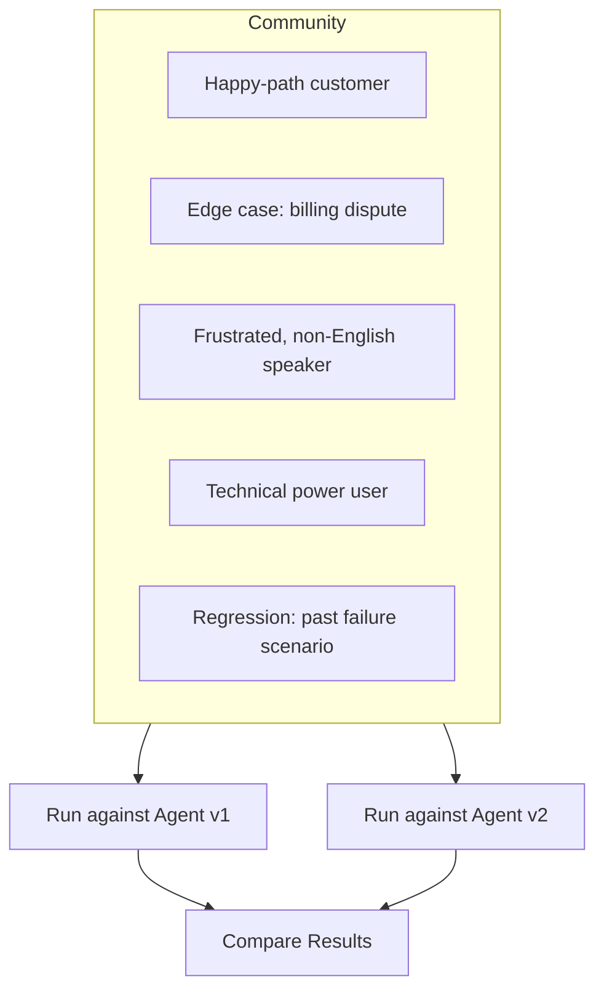

A Community in Bluejay is a **named group of Digital Humans**. Think of it as a folder for the personas that share a purpose, a customer type, or a scenario. You build a Community once and reuse it across agents, versions, and evaluation cycles.

Communities are also your **test suite for an agent**. Each Digital Human in the group is one test case. The Community as a whole is the suite that exercises your agent across the full range of situations it needs to handle.

## What You'll Learn

- What a Community is and the few fields it has
- How Communities relate to Digital Humans and the rest of Bluejay
- Why grouping personas this way makes testing easier
- What a Community is not, so you can place it correctly in your mental model

## A Community at a Glance

<AccordionGroup>
  <Accordion title="The fields a Community has" icon="rectangle-list">
    Every Community is a small object with three fields:

    - **Title.** The name people read in the dashboard.
    - **Description.** A short note about the personas in the group and what they test.
    - **Members.** The Digital Humans that belong to the Community.

    A Community does not run on its own. It exists so you can group personas, hand the group to a simulation, and reason about the results together.
  </Accordion>
  <Accordion title="How to think about it" icon="diagram-project">
    The mental model is simple:

    - A **Digital Human** is one specific simulated caller. For example, a frustrated rider who missed an appointment.
    - A **Community** is a group of related Digital Humans. For example, "Upset rider personas," which collects every persona that captures a frustrated-rider scenario.

    One persona answers "who is this caller?" One Community answers "which kind of callers are you testing as a group?"
  </Accordion>
  <Accordion title="What it is not" icon="circle-minus">
    A Community is strictly an organizational grouping. It is not:

    - an Agent
    - a Simulation
    - a Simulation Run
    - a Custom Metric

    If you find yourself reaching for a Community to do anything beyond grouping personas, the right tool is probably one of the four above.
  </Accordion>
</AccordionGroup>

## Why Communities Are Useful

Communities give you reuse and organization. Once you have one, you can hand it to any simulation against any agent without rebuilding the persona list every time.

<AccordionGroup>
  <Accordion title="Stay organized at scale" icon="folder-tree">
    Once your persona library grows past a handful of Digital Humans, you need a way to slice it. Communities let you keep personas grouped by use case so you can find what you need quickly.
  </Accordion>
  <Accordion title="Reuse across agents and versions" icon="arrows-rotate">
    Define the group once and run it against any agent, any version, and any environment. Communities are the unit that makes "rerun last week's test suite" a single click.
  </Accordion>
  <Accordion title="Benchmark agents against each other" icon="scale-balanced">
    Run the same Community against two competing agents to see how each one handles the same set of customers under identical conditions.
  </Accordion>
  <Accordion title="Lock in regressions" icon="shield-check">
    When a production failure surfaces, capture it as a Digital Human and drop it into the relevant Community. The next simulation run picks it up automatically and catches the issue if it ever reappears.
  </Accordion>
</AccordionGroup>

## How a Community Fits in Bluejay

Each Digital Human inside a Community is one test case. The Community wraps them so you can hand the whole group to a simulation and get back one result set you can read end to end.

## Building a Community Over Time

The most effective Communities grow with your agent. You add personas as you find them, the same way you add unit tests as you find bugs.

<Steps>
  <Step title="Start with the basics">
    Create Digital Humans for the core scenarios your agent must handle. These are the happy paths and most common requests.
  </Step>
  <Step title="Add edge cases">
    As production monitoring, observability, or manual testing surfaces gaps, build Digital Humans that target those specific weaknesses and drop them into the right Community.
  </Step>
  <Step title="Lock in regressions">
    When your agent fails on a real conversation, turn that failure into a Digital Human. The Community now contains a permanent test for that issue.
  </Step>
  <Step title="Expand coverage">
    Layer in Digital Humans for different languages, customer segments, and emotional states until your Community covers every capability the agent claims to support.
  </Step>
</Steps>

The goal is to reach the point where running the Community against a new agent version gives you genuine confidence that the agent is ready for production.

## Key Capabilities

- **Reusable test suites.** Define a Community once and run it against any agent or agent version.
- **Cross-agent comparison.** Use the same Community to benchmark different agents under identical conditions.
- **Incremental growth.** Add new Digital Humans to a Community at any time as your testing needs evolve.
- **Flexible organization.** Group by audience segment, language, scenario type, or any criteria you define.
- **Batch simulation runs.** Run every Digital Human in a Community in a single batch.

## Common Use Cases

- Build a "billing support" Community and run it against every new agent version before release.
- Create language-specific Communities to validate multilingual support across your agent fleet.
- Compare two competing agent architectures by running the same Community against both.
- After a production incident, add a Digital Human that reproduces the failure so it becomes a permanent part of your test suite.
- Group personas like "First-time callers" or "Missed-pickup riders" so you can hand each cluster to a different simulation cycle.

## Resources

<CardGroup cols={2}>
  <Card title="Community Deep Dive" icon="book" href="/core-concepts/communities">
    Field-level reference, best practices, and a full example.
  </Card>
  <Card title="Digital Humans" icon="users" href="/key-concepts/digital-humans/overview">
    The personas that live inside a Community.
  </Card>
  <Card title="Customer Traits" icon="id-card" href="/key-concepts/customer-traits/overview">
    The persona attributes that shape Digital Human behavior.
  </Card>
  <Card title="Create Community API" icon="code" href="/api-reference/endpoint/create-community">
    Create and manage Communities programmatically.
  </Card>
</CardGroup>
