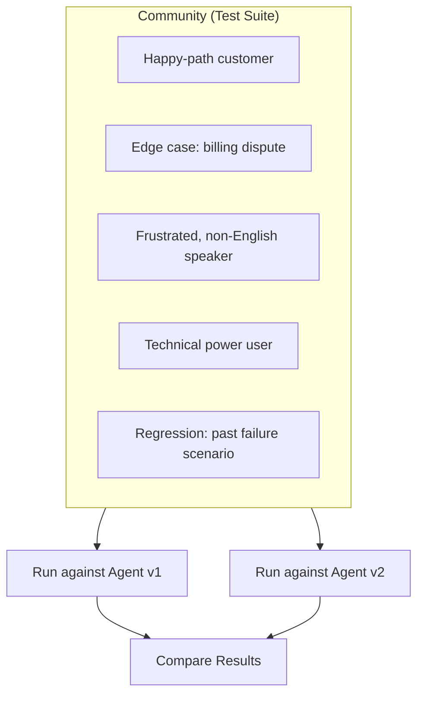

A Community is a **test suite for your agent**. Just like a software test suite bundles individual test cases to verify that your code works correctly, a Community bundles Digital Humans — each representing a distinct user scenario — to verify that your agent handles real-world conversations correctly.

## What You'll Learn

- Why Communities are the primary way to build comprehensive agent test coverage
- How to accumulate Digital Humans into a Community over time
- How to run a Community against any agent for consistent, reproducible benchmarks

## Think of Communities as Test Suites

In traditional software testing, you don't write one test and call it done. You accumulate test cases over time — covering happy paths, edge cases, regressions, and failure modes — until your test suite gives you confidence that your code is production-ready.

Communities work the same way for AI agents. Each Digital Human in a Community is like an individual test case: it carries a specific scenario, persona traits, and success criteria. The Community as a whole is the test suite that exercises your agent across the full range of situations it needs to handle.

## Building a Community Over Time

The most effective Communities are not built all at once — they grow as your agent matures:

1. **Start with the basics.** Create Digital Humans for the core scenarios your agent must handle — the happy paths and most common requests.
2. **Add edge cases.** As you discover gaps in your agent's performance (through production monitoring, observability, or manual testing), create new Digital Humans that target those specific weaknesses.
3. **Lock in regressions.** When your agent fails on a real conversation, turn that failure into a Digital Human so it never slips through again — just like adding a regression test in code.
4. **Expand coverage.** Over time, layer in Digital Humans for different languages, customer segments, emotional states, and scenario types until your Community comprehensively tests every capability your agent claims to support.

The goal is to reach the point where running your Community gives you genuine confidence that a new agent version is ready for production.

## Key Capabilities

- **Reusable test suites** -- define a Community once, run it against any agent or agent version
- **Cross-agent comparison** -- use the same Community to benchmark different agents side-by-side under identical conditions
- **Incremental growth** -- add new Digital Humans to a Community at any time as your testing needs evolve
- **Flexible organization** -- group by audience segment, language, scenario type, or any criteria you define
- **Batch simulation runs** -- run every Digital Human in a Community in a single batch operation

## Common Use Cases

- Build a comprehensive "billing support" Community and run it against every new agent version before release
- Create language-specific Communities to validate multilingual support across your agent fleet
- Compare two competing agent architectures by running the same Community against both
- After a production incident, add a Digital Human that reproduces the failure so it becomes a permanent part of your test suite

## Next Steps

<CardGroup cols={2}>
  <Card title="Communities Deep Dive" icon="book" href="/core-concepts/communities">
    Full reference for Community configuration and management.
  </Card>
  <Card title="Create Community API" icon="code" href="/api-reference/endpoint/create-community">
    Create and manage Communities programmatically.
  </Card>
</CardGroup>
