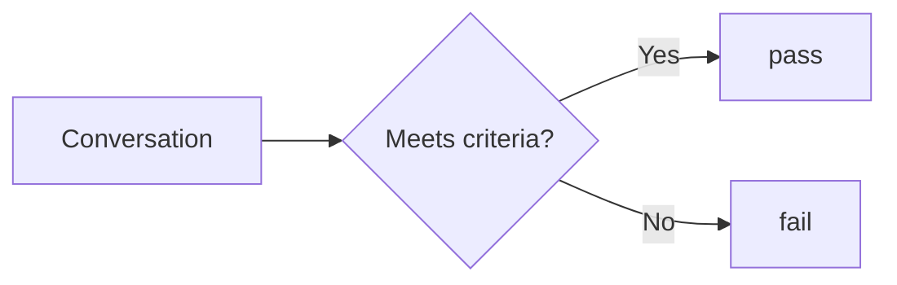
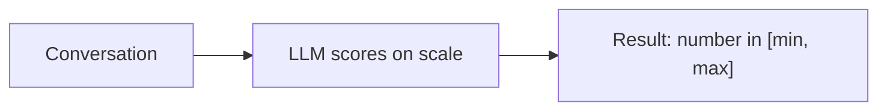
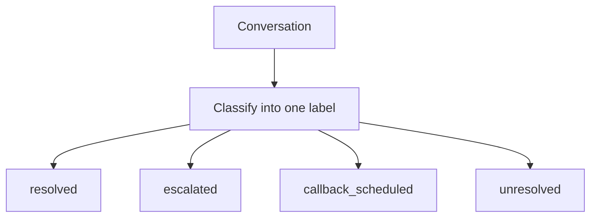
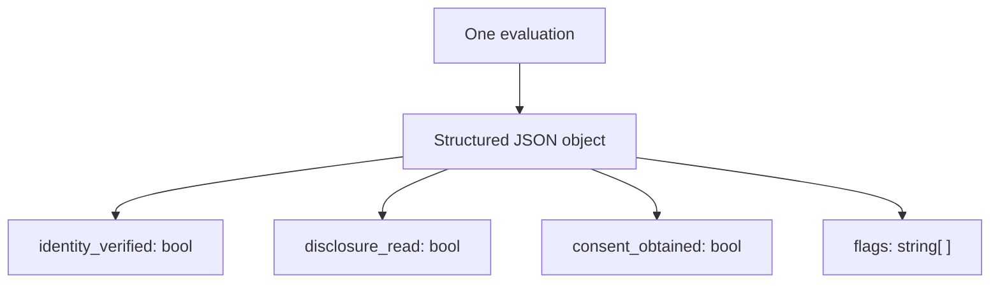
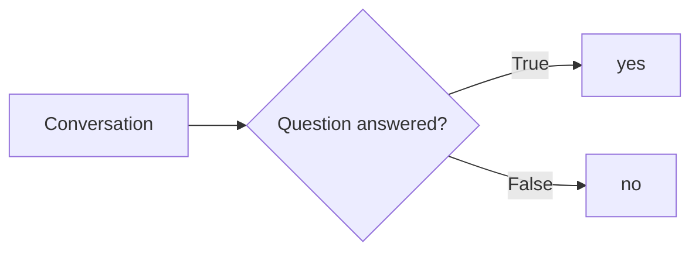

Every Custom Metric has a `response_type` that determines the shape of the score Bluejay produces. Choose the type that matches how you want to reason about the result downstream — in dashboards, alerts, and workflows.

## Pass / Fail

**`response_type: pass_fail`**

<Tip>
  Use Pass / Fail for binary compliance checks, required steps, or any criteria where the outcome is clear-cut. Results aggregate cleanly into pass rates on your dashboard.
</Tip>

The most common type. Bluejay returns either `pass` or `fail` based on whether the conversation meets your criteria.



### Example

**Input:** A metric named **Identity Verified** with the description _"Did the agent verify the customer's identity before sharing account details?"_ and `response_type: pass_fail`.

**Output:** **`pass`** — The agent asked for the customer's date of birth and last four digits of their SSN before disclosing any balance information. The verification step was completed prior to sensitive disclosure.

### Creating a Pass / Fail metric via API

Use the [Create Custom Metric](/api-reference/endpoint/create-custom-metric) endpoint with `response_type` set to `pass_fail`. The endpoint accepts optional fields such as `agent_id`, `agent_ids`, `category`, `tags`, and `allow_not_applicable` — see the full request schema on that page.

---

## Quantitative

**`response_type: quantitative`**

<Tip>
  Use Quantitative when gradations matter — tone of voice, resolution depth, or explanation clarity. Set explicit `min_value` and `max_value` so Bluejay knows the scale boundaries.
</Tip>

Bluejay returns a numeric score within the range you define using `min_value` and `max_value`. Use this for nuanced scoring on a scale.



### Example

**Input:** A metric named **Resolution Quality** with the description _"Rate the quality of the agent's resolution on a scale from 1 to 10. A 10 means the customer's issue was fully resolved with no further action needed."_, `response_type: quantitative`, `min_value: 1`, and `max_value: 10`.

**Output:** **`7`** — The agent correctly diagnosed the billing error, issued a credit, and confirmed the corrected amount — but forgot to send the follow-up email the customer requested. The core issue was resolved while a minor follow-up action was missed.

### Creating a Quantitative metric via API

Use the [Create Custom Metric](/api-reference/endpoint/create-custom-metric) endpoint with `response_type` set to `quantitative` and include **`min_value`** and **`max_value`** so Bluejay knows the allowed range.

---

## Qualitative

**`response_type: qualitative`**

<Tip>
  Use Qualitative for feedback that needs nuance and context — coaching notes, tone summaries, or structured observations. Because results are text, they don't aggregate numerically, so pair them with a quantitative or pass/fail metric if you also need trend tracking.
</Tip>

Bluejay returns a free-form text summary describing its assessment. Useful for generating narrative feedback rather than a structured score.


### Example

**Input:** A metric named **Objection Handling Summary** with the description _"Summarize how the agent handled customer objections during the call. Note specific phrases used and whether they were effective."_ and `response_type: qualitative`.

**Output:** _"The customer objected to the renewal price twice. The agent responded with 'I hear you — let me see what options I have' and offered a 15% loyalty discount. The first objection was handled smoothly; the second required a supervisor mention before the customer agreed. Overall effective, though the escalation hint could have been avoided with a stronger initial offer."_

### Creating a Qualitative metric via API

Use the [Create Custom Metric](/api-reference/endpoint/create-custom-metric) endpoint with `response_type` set to `qualitative`. No extra type-specific fields are required beyond `name` and `description`.

---

## Enum

**`response_type: enum`**

<Tip>
  Use Enum when you need consistent, controlled labels — call outcomes, escalation reasons, or issue categories. The discrete labels make it easy to group and filter results across many conversations.
</Tip>

Bluejay classifies the conversation into one of the exact labels you define in `enum_options`. This is ideal for categorization tasks.



### Example

**Input:** A metric named **Call Outcome** with the description _"Classify the outcome of this call."_, `response_type: enum`, and `enum_options: ["resolved", "escalated", "callback_scheduled", "unresolved"]`.

**Output:** **`escalated`** — The agent was unable to resolve the customer's technical issue and transferred them to a Tier 2 specialist. The conversation ended with a handoff rather than a direct resolution.

### Creating an Enum metric via API

Use the [Create Custom Metric](/api-reference/endpoint/create-custom-metric) endpoint with `response_type` set to `enum` and include **`enum_options`** as an array of allowed labels.

---

## JSON

**`response_type: json`**

<Tip>
  Use JSON when you want to extract multiple structured signals from a single evaluation. Keep the output schema well-defined in your description so Bluejay consistently produces the same shape.
</Tip>

Bluejay returns a structured JSON object, letting you extract multiple signals from a single metric evaluation in one pass.



### Example

**Input:** A metric named **Compliance Audit** with the description _"Evaluate compliance and return a JSON object with keys: 'identity_verified' (boolean), 'disclosure_read' (boolean), 'consent_obtained' (boolean), and 'flags' (array of strings describing any issues)."_ and `response_type: json`.

**Output:** The agent verified the caller's identity and read the required disclosure, but never obtained explicit verbal consent before proceeding:

```json
{
  "identity_verified": true,
  "disclosure_read": true,
  "consent_obtained": false,
  "flags": ["Verbal consent not obtained before proceeding with account changes"]
}
```

The `consent_obtained: false` flag and accompanying message surface the gap for compliance review.

### Creating a JSON metric via API

Use the [Create Custom Metric](/api-reference/endpoint/create-custom-metric) endpoint with `response_type` set to `json`. Describe the desired object shape clearly in `description` so evaluations stay consistent.

---

## Yes / No (Deprecated)

**`response_type: yes_no`**

<Warning>
  Yes / No is deprecated. Use Pass / Fail instead — it is functionally identical and is the preferred type going forward.
</Warning>

Semantically identical to Pass / Fail, but the framing uses question-style prompts. Bluejay returns `yes` or `no`.



### Example

**Input:** A metric named **Empathy Demonstrated** with the description _"Did the agent acknowledge the customer's frustration at any point in the call?"_ and `response_type: yes_no`.

**Output:** **`yes`** — Mid-call the agent said _"I completely understand how frustrating this must be — let me get this sorted for you right away."_ The agent explicitly acknowledged the customer's frustration.

### Creating a Yes / No metric via API

Use the [Create Custom Metric](/api-reference/endpoint/create-custom-metric) endpoint with `response_type` set to `yes_no`. Optional fields such as `agent_id`, `category`, and `tags` match other metric types — see the full schema on that page.

---

## Quick Reference

| Type | Returns | Best For | Status |
|---|---|---|---|
| `pass_fail` | `pass` or `fail` | Binary compliance checks, required steps | Active |
| `quantitative` | Number in `[min, max]` | Graded scoring, quality ratings | Active |
| `qualitative` | Free-form text | Narrative feedback, coaching notes | Active |
| `enum` | One of your defined labels | Classification, call outcomes | Active |
| `json` | Structured JSON object | Multi-signal extraction in one pass | Active |
| `yes_no` | `yes` or `no` | Question-style criteria | Deprecated |

---

## Not Applicable

Any metric type can be configured with `allow_not_applicable: true`. When enabled, Bluejay may return `Not Applicable` if the criteria simply doesn't apply to a given conversation — for example, a transfer metric on a call that never needed a transfer.

```json
{
  "name": "Transfer Handled Correctly",
  "description": "If the customer requested a transfer, did the agent complete it correctly?",
  "response_type": "pass_fail",
  "allow_not_applicable": true
}
```

Set `allow_not_applicable` when creating or updating the metric via the [Create Custom Metric](/api-reference/endpoint/create-custom-metric) or [Update Custom Metric](/api-reference/endpoint/update-custom-metric) endpoints.

---

## Next Steps

<CardGroup cols={2}>
  <Card title="Dynamic Variables" icon="brackets-curly" href="/key-concepts/custom-metrics/dynamic-variables">
    Inject call-specific context into your metric definitions at evaluation time.
  </Card>
  <Card title="Create Custom Metric API" icon="code" href="/api-reference/endpoint/create-custom-metric">
    Define a new Custom Metric programmatically with any response type.
  </Card>
  <Card title="Metrics Lab" icon="flask" href="/key-concepts/metrics-lab/overview">
    Prototype and refine metrics against sample transcripts before going live.
  </Card>
</CardGroup>
