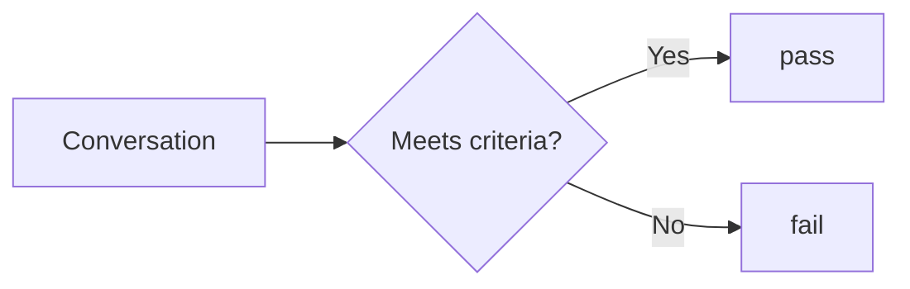
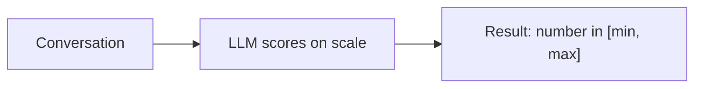
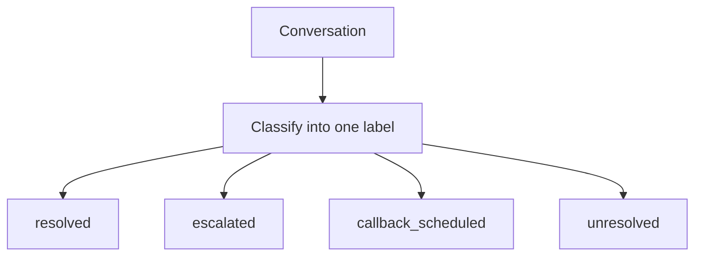
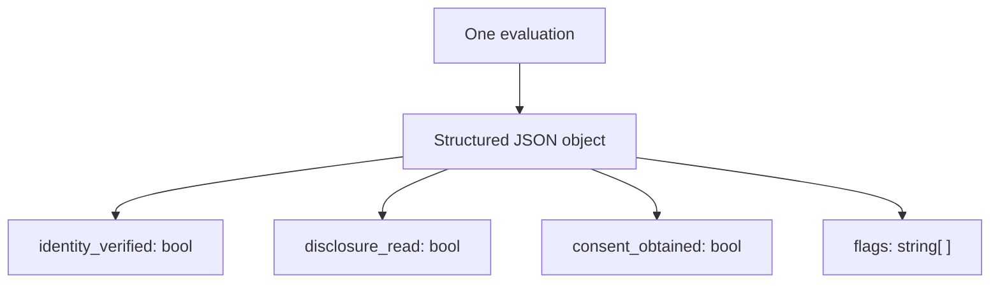
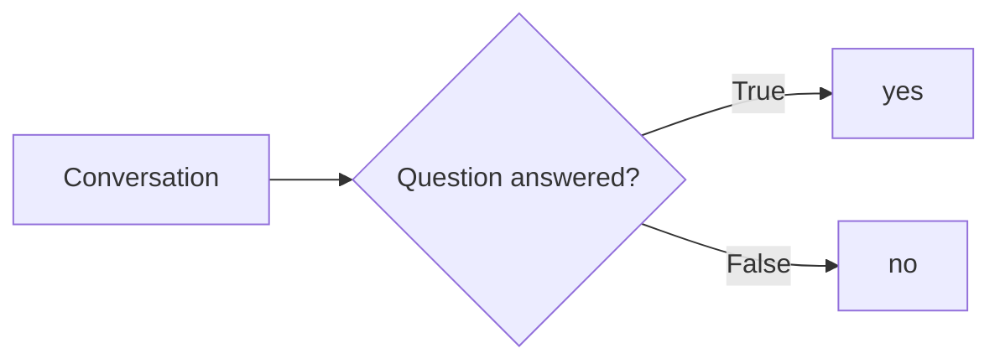

Every Custom Metric has a `response_type` that determines the shape of the score Bluejay produces. Choose the type that matches how you want to reason about the result downstream, whether that's in dashboards, alerts, or workflows.

## Pass / Fail

**`response_type: pass_fail`**

<Tip>
  Use Pass / Fail for binary compliance checks, required steps, or any criteria where the outcome is clear-cut. Results aggregate cleanly into pass rates on your dashboard.
</Tip>

The most common type. Bluejay returns either `pass` or `fail` based on whether the conversation meets your criteria.



To create this metric via API, use the [Create Custom Metric](/api-reference/endpoint/create-custom-metric) endpoint with `response_type` set to `pass_fail`. The endpoint accepts optional fields such as `agent_id`, `agent_ids`, `category`, `tags`, and `allow_not_applicable`. See the full request schema on that page.

---

## Quantitative

**`response_type: quantitative`**

<Tip>
  Use Quantitative when gradations matter, such as tone of voice, resolution depth, or explanation clarity. Set explicit `min_value` and `max_value` so Bluejay knows the scale boundaries.
</Tip>

Bluejay returns a numeric score within the range you define using `min_value` and `max_value`. Use this for nuanced scoring on a scale.



To create this metric via API, use the [Create Custom Metric](/api-reference/endpoint/create-custom-metric) endpoint with `response_type` set to `quantitative` and include **`min_value`** and **`max_value`** so Bluejay knows the allowed range.

---

## Qualitative

**`response_type: qualitative`**

<Tip>
  Use Qualitative for feedback that needs nuance and context, such as coaching notes, tone summaries, or structured observations. Because results are text, they don't aggregate numerically, so pair them with a quantitative or pass/fail metric if you also need trend tracking.
</Tip>

Bluejay returns a free-form text summary describing its assessment. Useful for generating narrative feedback rather than a structured score.


To create this metric via API, use the [Create Custom Metric](/api-reference/endpoint/create-custom-metric) endpoint with `response_type` set to `qualitative`. No extra type-specific fields are required beyond `name` and `description`.

---

## Enum

**`response_type: enum`**

<Tip>
  Use Enum when you need consistent, controlled labels, such as call outcomes, escalation reasons, or issue categories. The discrete labels make it easy to group and filter results across many conversations.
</Tip>

Bluejay classifies the conversation into one of the exact labels you define in `enum_options`. This is ideal for categorization tasks.



To create this metric via API, use the [Create Custom Metric](/api-reference/endpoint/create-custom-metric) endpoint with `response_type` set to `enum` and include **`enum_options`** as an array of allowed labels.

---

## JSON

**`response_type: json`**

<Tip>
  Use JSON when you want to extract multiple structured signals from a single evaluation. Keep the output schema well-defined in your description so Bluejay consistently produces the same shape.
</Tip>

Bluejay returns a structured JSON object, letting you extract multiple signals from a single metric evaluation in one pass.



To create this metric via API, use the [Create Custom Metric](/api-reference/endpoint/create-custom-metric) endpoint with `response_type` set to `json`. Describe the desired object shape clearly in `description` so evaluations stay consistent.

---

## Yes / No (Deprecated)

**`response_type: yes_no`**

<Warning>
  Yes / No is deprecated and can no longer be created. Use Pass / Fail instead — it is functionally identical. Existing Yes / No metrics continue to run, render, and aggregate normally.
</Warning>

Semantically identical to Pass / Fail, but the framing uses question-style prompts. Bluejay returns `yes` or `no`.



---

## Quick Reference

| Type | Returns | Best For | Status |
|---|---|---|---|
| `pass_fail` | `pass` or `fail` | Binary compliance checks, required steps | Active |
| `quantitative` | Number in `[min, max]` | Graded scoring, quality ratings | Active |
| `qualitative` | Free-form text | Narrative feedback, coaching notes | Active |
| `enum` | One of your defined labels | Classification, call outcomes | Active |
| `json` | Structured JSON object | Multi-signal extraction in one pass | Active |
| `yes_no` | `yes` or `no` | Question-style criteria | Deprecated |

---

## Not Applicable

Any metric type can be configured with `allow_not_applicable: true`. When enabled, Bluejay may return `Not Applicable` if the criteria simply doesn't apply to a given conversation. For example, a transfer metric on a call that never needed a transfer.

```json
{
  "name": "Transfer Handled Correctly",
  "description": "If the customer requested a transfer, did the agent complete it correctly?",
  "response_type": "pass_fail",
  "allow_not_applicable": true
}
```

Set `allow_not_applicable` when creating or updating the metric via the [Create Custom Metric](/api-reference/endpoint/create-custom-metric) or [Update Custom Metric](/api-reference/endpoint/update-custom-metric) endpoints.

---

## Resources

<CardGroup cols={2}>
  <Card title="Prompting Guide" icon="pen-fancy" href="/key-concepts/custom-metrics/prompting-guide">
    Write LLM-as-a-Judge prompts that score consistently for any response type.
  </Card>
  <Card title="Dynamic Variables" icon="brackets-curly" href="/key-concepts/custom-metrics/dynamic-variables">
    Inject call-specific context into your metric definitions at evaluation time.
  </Card>
  <Card title="Metrics Lab" icon="flask" href="/key-concepts/metrics-lab/overview">
    Prototype and refine metrics against sample transcripts before going live.
  </Card>
  <Card title="Create Custom Metric API" icon="code" href="/api-reference/endpoint/create-custom-metric">
    Define a new Custom Metric programmatically with any response type.
  </Card>
</CardGroup>
