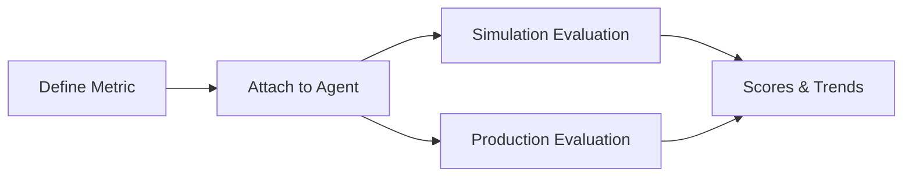

Custom Metrics let you define the exact quality signals that matter for your use case. They turn abstract product goals into measurable outcomes that Bluejay can evaluate repeatedly.

## What You'll Learn

- What Custom Metrics are and why they matter
- How to define evaluation criteria for your specific use case
- How Custom Metrics integrate with simulations and observability

## How Custom Metrics Work

You create Custom Metrics to score conversations on domain-specific behavior such as compliance, resolution quality, empathy, or escalation accuracy. Those metrics can then be reused across simulations and production evaluations.

Custom Metrics support two evaluation modes: LLM-as-a-Judges that use a prompt to score conversations, and formula-based definitions that compute composite scores from other metrics. You can prototype and refine metrics in Metrics Lab before deploying them.

## Key Capabilities

Click each capability to see what it gives you.

<AccordionGroup>
  <Accordion title="LLM-as-a-Judge" icon="gavel">
    Write a natural-language prompt that scores conversations on any criteria you define. The judge runs against the call transcript and returns a verdict shaped by your prompt and the metric's response type.
  </Accordion>
  <Accordion title="Formula metrics" icon="calculator">
    Combine existing metric scores using arithmetic expressions to create composite indicators. Useful for "call quality" scores that weight several signals together.
  </Accordion>
  <Accordion title="Cross-workflow reuse" icon="arrows-rotate">
    The same metric works in both simulation and observability evaluations. Define it once and apply it to test runs and production calls.
  </Accordion>
  <Accordion title="Metrics Lab integration" icon="flask">
    Test scoring logic against sample transcripts in Metrics Lab before pointing the metric at production. Iterate on the prompt until the judge agrees with your spot-checks.
  </Accordion>
</AccordionGroup>

## Common Use Cases

- Score whether an agent correctly verified a customer's identity before sharing account details
- Track empathy and de-escalation quality across production calls
- Create a composite "call quality" score that weights resolution, tone, and compliance together

## Resources

<CardGroup cols={2}>
  <Card title="Metric Types" icon="shapes" href="/key-concepts/custom-metrics/metric-types">
    Pick the right response type for each measurement goal.
  </Card>
  <Card title="Prompting Guide" icon="pen-fancy" href="/key-concepts/custom-metrics/prompting-guide">
    Write LLM-as-a-Judge prompts that score consistently across runs.
  </Card>
  <Card title="Dynamic Variables" icon="brackets-curly" href="/key-concepts/custom-metrics/dynamic-variables">
    Inject call-specific context into metric definitions at evaluation time.
  </Card>
  <Card title="Metrics Lab" icon="flask" href="/key-concepts/metrics-lab/overview">
    Prototype and test metrics against sample transcripts before deployment.
  </Card>
  <Card title="Create Custom Metric API" icon="code" href="/api-reference/endpoint/create-custom-metric">
    Define a new Custom Metric programmatically.
  </Card>
  <Card title="Evaluate Endpoint" icon="play" href="/api-reference/endpoint/evaluate">
    Submit calls for evaluation and pass metadata for dynamic variable substitution.
  </Card>
</CardGroup>
