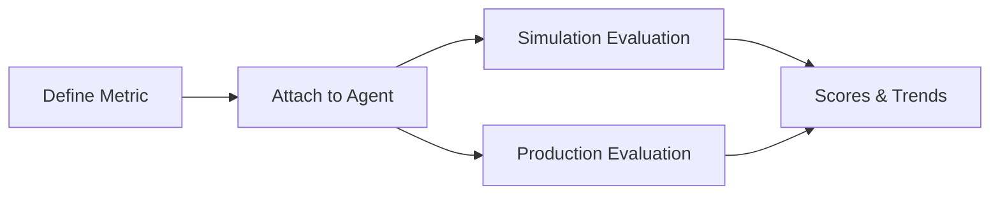

Custom Metrics let you define the exact quality signals that matter for your use case. They turn abstract product goals into measurable outcomes that Bluejay can evaluate repeatedly.

## What You'll Learn

- What Custom Metrics are and why they matter
- How to define evaluation criteria for your specific use case
- How Custom Metrics integrate with simulations and observability

## How Custom Metrics Work

You create Custom Metrics to score conversations on domain-specific behavior such as compliance, resolution quality, empathy, or escalation accuracy. Those metrics can then be reused across simulations and production evaluations.

Custom Metrics support two evaluation modes: LLM-judged evaluations that use a prompt to score conversations, and formula-based definitions that compute composite scores from other metrics. You can prototype and refine metrics in Metrics Lab before deploying them.

## Key Capabilities

- **LLM-judged evaluation** -- write a natural-language prompt that scores conversations on any criteria you define
- **Formula metrics** -- combine existing metric scores using arithmetic expressions for composite indicators
- **Cross-workflow reuse** -- the same metric works in both simulation and observability evaluations
- **Metrics Lab integration** -- test scoring logic against sample transcripts before going live

## Common Use Cases

- Score whether an agent correctly verified a customer's identity before sharing account details
- Track empathy and de-escalation quality across production calls
- Create a composite "call quality" score that weights resolution, tone, and compliance together

## Next Steps

<CardGroup cols={2}>
  <Card title="Create Custom Metric API" icon="code" href="/api-reference/endpoint/create-custom-metric">
    Define a new Custom Metric programmatically.
  </Card>
  <Card title="Metrics Lab" icon="flask" href="/key-concepts/metrics-lab/overview">
    Prototype and test metrics before deployment.
  </Card>
</CardGroup>
