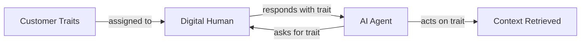

Customer Traits capture the characteristics that shape how a customer sounds, behaves, and responds during evaluation. They make your testing more representative of real-world conversations.

## What You'll Learn

- What Customer Traits are and how they shape simulations
- How to use traits to create diverse, realistic test populations
- How traits connect to Digital Humans and Customer Personas

## How Customer Traits Work

You use Customer Traits to encode tone, urgency, language, demographic signals, and scenario-specific behavior so Bluejay can simulate or analyze customers in a more structured way across runs.

Traits are the building blocks of realistic customer behavior. They define how a simulated customer sounds, what they care about, and how they react during a conversation. Bluejay's generation engine uses traits to produce diverse populations that reflect real-world customer demographics.

## Key Capabilities

- **Behavioral encoding** -- define tone, urgency, patience, and communication style
- **Language and demographic signals** -- specify language preferences, technical proficiency, and contextual background
- **Scenario-aware generation** -- traits adapt based on the simulation scenario context
- **Full Customization** -- create any trait with any data type: Numbers, Strings, Dates, and more.

## Common Use Cases

- Create member IDs, birthdays, and other simulated PII data to enable testing of flows gated by verification
- Define a max budget that a customer has to spend for outbound lead qualification flows
- Define credit card numbers, CVC codes, and expiry dates for testing purchase flows

## Next Steps

<CardGroup cols={2}>
  <Card title="Create Customer Persona API" icon="code" href="/api-reference/endpoint/create-customer-persona">
    Define customer personas with traits via the API.
  </Card>
  <Card title="Digital Humans" icon="users" href="/key-concepts/digital-humans/overview">
    Learn how traits feed into Digital Human behavior.
  </Card>
</CardGroup>
