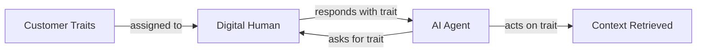

Customer Traits are the structured attributes Bluejay uses to describe or segment a caller. Where an intent describes **what the caller wants**, traits describe **who the caller is**. Together they let you test how your agent behaves across the full range of customers it will actually meet in production, not just across the scripts they'll follow.

## What You'll Learn

- The difference between traits and intent, and why both matter
- The common categories of traits you can attach to a caller
- How traits shape Digital Human behavior and simulation generation
- Where traits live in the Bluejay product and how to reuse them

## Traits vs Intent

The simplest way to think about Customer Traits is as the persona side of a test.

| Type | What it captures | Example |
|---|---|---|
| **Intent** | What the caller wants | Book an appointment |
| **Trait** | Who the caller is | Elderly rider |
| **Trait** | Who the caller is | First-time caller |
| **Trait** | Who the caller is | Frustrated |
| **Trait** | Who the caller is | Spanish-speaking |

A single intent paired with a few different trait combinations gives you several distinct tests from the same starting prompt.

## How Customer Traits Work

You attach Customer Traits to a Digital Human so Bluejay can simulate that persona in a structured, repeatable way during evaluation.

Traits are the building blocks of realistic customer behavior. They define how a simulated customer sounds, what they care about, and how they react during a conversation. Bluejay's generation engine uses traits to produce diverse populations that reflect real-world customer demographics.

## Common Trait Categories

Click each category to see the kinds of traits that fit there.

<AccordionGroup>
  <Accordion title="Language and communication" icon="language">
    The language the caller speaks, dialect, accent, formality, and level of technical literacy. Useful for testing whether your agent handles multilingual flows, non-native speakers, and varied phrasing.
  </Accordion>
  <Accordion title="Emotion and urgency" icon="face-frown">
    Sentiment, urgency, patience, frustration level. Useful for testing de-escalation, prioritization, and whether the agent responds appropriately when a caller is upset or in a hurry.
  </Accordion>
  <Accordion title="Customer status" icon="id-badge">
    VIP, returning vs. new customer, plan tier, account age, lifetime value. Useful for testing whether the agent personalizes correctly for different customer segments.
  </Accordion>
  <Accordion title="Context and scenario" icon="map-location-dot">
    Location, time of day, appointment type, reason for calling. Useful for testing context-aware behavior, time-sensitive flows, and policies that vary by region.
  </Accordion>
  <Accordion title="Identity and verification data" icon="shield-halved">
    Names, member IDs, birthdays, addresses, order numbers, and other simulated PII. Useful for exercising verification gates, lookup flows, and any path that depends on the caller providing specific data.
  </Accordion>
  <Accordion title="Custom and domain-specific" icon="sliders">
    Any trait specific to your product: max budget, accessibility needs, language preference, dietary restrictions, plan type, household size. Customer Traits accept Numbers, Strings, Dates, and more, so you can model any persona attribute you need.
  </Accordion>
</AccordionGroup>

## Why Traits Matter

Traits make simulations look more like real production traffic. Instead of running only one shape of caller against your agent, you can model the actual mix you see in production.

<AccordionGroup>
  <Accordion title="Without traits" icon="circle-minus">
    Every simulated caller sounds and behaves the same way. You test the script, but you do not test how the agent handles different customer types.

    For example: "caller wants to reschedule."
  </Accordion>
  <Accordion title="With traits" icon="circle-plus">
    Each caller carries persona attributes that drive how they speak and what they expect. The same scenario now produces several distinct tests.

    For example:

    - An **angry returning customer** who wants to reschedule
    - A **Spanish-speaking new customer** asking about availability
    - A **high-priority caller** following up on a missed appointment
  </Accordion>
</AccordionGroup>

## Where Traits Are Used

<AccordionGroup>
  <Accordion title="Digital Humans" icon="users">
    Traits attach to a Digital Human and drive how that persona speaks and responds during a simulated call.
  </Accordion>
  <Accordion title="Simulation scenario generation" icon="flask-vial">
    Bluejay's generation engine uses traits to produce diverse populations of Digital Humans from a single agent description, so generated personas span the customer mix you actually serve.
  </Accordion>
  <Accordion title="Persona variation" icon="shuffle">
    Reuse the same intent with different trait combinations to produce many distinct tests from one starting scenario.
  </Accordion>
  <Accordion title="Segmented testing" icon="layer-group">
    Group traits to test specific customer segments end-to-end (for example, VIP customers in a particular region) and confirm the agent behaves correctly for that slice.
  </Accordion>
</AccordionGroup>

## Key Capabilities

- **Behavioral encoding.** Define tone, urgency, patience, and communication style on each persona.
- **Language and demographic signals.** Specify language preferences, technical proficiency, and contextual background.
- **Scenario-aware generation.** Traits adapt based on the simulation scenario context.
- **Full customization.** Create any trait with any data type: Numbers, Strings, Dates, and more.

## Common Use Cases

- Create member IDs, birthdays, and other simulated PII so you can test flows gated by verification.
- Define a max budget that a customer has to spend for outbound lead qualification flows.
- Define credit card numbers, CVC codes, and expiry dates for testing purchase flows.
- Stack traits like "elderly" plus "first-time caller" plus "limited English" to confirm the agent handles accessibility-sensitive conversations.

## Resources

<CardGroup cols={2}>
  <Card title="Digital Humans" icon="users" href="/key-concepts/digital-humans/overview">
    How traits combine with intent and success criteria inside a Digital Human.
  </Card>
  <Card title="Communities" icon="people-group" href="/key-concepts/communities/overview">
    Group Digital Humans that share trait patterns into a reusable test suite.
  </Card>
  <Card title="Create Customer Persona API" icon="code" href="/api-reference/endpoint/create-customer-persona">
    Define customer personas with traits via the API.
  </Card>
  <Card title="Customer Traits in Bluejay" icon="up-right-from-square" href="https://app.getbluejay.ai/customer-traits">
    Open the live Customer Traits screen in your Bluejay workspace.
  </Card>
</CardGroup>
