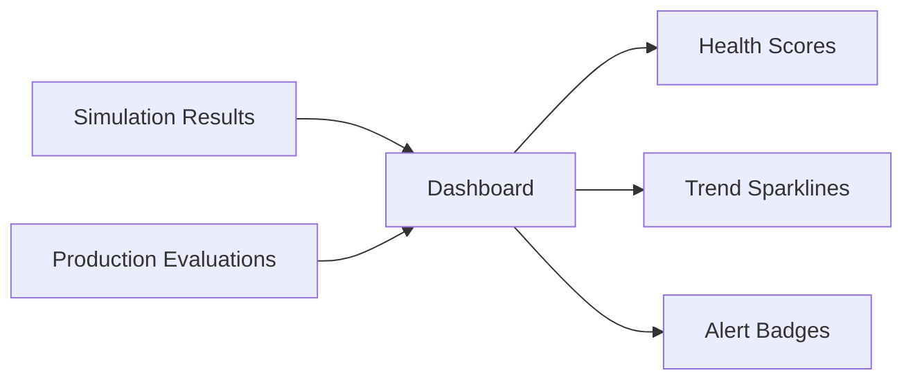

Dashboards give teams a shared view of how agents are performing over time. They turn raw evaluation output into something easy to monitor, compare, and act on.

## What You'll Learn

- What Dashboards show and how to read them
- How dashboards surface trends across simulations and production
- How alert badges and sparklines accelerate triage

## How Dashboards Work

You use Dashboards to review trends, spot regressions, and monitor important quality indicators across simulations and production conversations without digging through individual runs one by one.

Dashboards aggregate data from both simulation runs and production evaluations into a single view. Each agent gets an at-a-glance health score, trend sparklines showing metric performance over time, and alert badges when something needs attention.

## Key Capabilities

- **At-a-glance health scores** -- see how each agent is performing across simulation and production metrics
- **Trend sparklines** -- visualize metric performance over time without opening individual runs
- **Alert badges** -- agents that need attention are flagged automatically
- **Quick-launch actions** -- run simulations or view recent call logs directly from the dashboard

## Common Use Cases

- Monitor production call quality across a fleet of agents from a single view
- Spot a regression trend after a prompt change before it impacts customers
- Use alert badges to prioritize which agents need investigation first

## Next Steps

<CardGroup cols={2}>
  <Card title="Observability Deep Dive" icon="chart-line" href="/core-concepts/observability">
    Understand the evaluation data that feeds dashboards.
  </Card>
  <Card title="Observability Cookbook" icon="book-open" href="/cookbook/observability">
    Practical examples for integrating with the evaluation pipeline.
  </Card>
</CardGroup>
