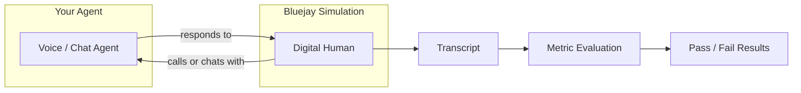

Digital Humans are synthetic replicas of your customers. They are highly configurable test entities that interact with your agent during Bluejay simulations, enabling you to validate behavior, catch edge cases, and build confidence before going live.

Think of Digital Humans as the **test cases of your agentic test suite**. Just like unit tests exercise individual functions, Digital Humans exercise individual conversation scenarios against your agent. The best way to create them is to start by thinking about how your real customers will interact with your agent.

## What You'll Learn

- What a Digital Human represents in Bluejay
- The anatomy of a Digital Human: intent, success criteria, and behavior
- How Digital Humans drive realistic simulation conversations
- Why Digital Humans are central to every evaluation on Bluejay

## The Mental Model

Every simulation run pairs one or more Digital Humans against your agent. Each Digital Human carries a specific **intent** (what it wants to talk about) and **success criteria** (how Bluejay determines whether the interaction went well). After the conversation, Bluejay evaluates the transcript against those criteria and any custom metrics you've attached.

## Anatomy of a Digital Human

A **Digital Human** is composed of three core layers. Click each to expand.

<AccordionGroup>
  <Accordion title="Intent" icon="bullseye">
    The intent defines **what the Digital Human will talk about** during the conversation. This might be a billing dispute, a product return, an appointment booking, or any scenario your agent should handle. The more specific the intent, the more targeted the test.
  </Accordion>
  <Accordion title="Success Criteria" icon="circle-check">
    Success criteria define **how Bluejay determines whether the interaction was successful**. These are the conditions that must be met for the test to pass. For example, "the agent offered a refund" or "the agent correctly transferred the call to a supervisor."
  </Accordion>
  <Accordion title="Behavior & Traits" icon="sliders">
    Behavior settings control **how the Digital Human sounds and acts** during the conversation. This includes accent, language, emotion, speaking speed, background noise, and more. These traits make every Digital Human feel like a distinct, realistic customer.
  </Accordion>
</AccordionGroup>

## Why Digital Humans Matter

Digital Humans are one of the most important concepts on Bluejay. They are the **individual test case** that will run against your agent. Without well-crafted Digital Humans, your simulations won't reflect reality.

<CardGroup cols={2}>
  <Card title="Realistic coverage" icon="bullseye">
    Each Digital Human represents a real-world customer scenario. Build a diverse set and you'll cover the full spectrum of interactions your agent will face.
  </Card>
  <Card title="Repeatable benchmarks" icon="arrows-rotate">
    Group Digital Humans into Communities to reuse the same benchmark population across agents, versions, and evaluation cycles.
  </Card>
  <Card title="Automated at scale" icon="bolt">
    Generate up to 100 diverse Digital Humans in a single API call. The more you tell Bluejay about your agent's behavior, the more diverse the generated Digital Humans will be.
  </Card>
  <Card title="Configurable behaviors" icon="sliders">
    Fine-tune accents, languages, emotions, DTMF tones, scripted responses, IVR navigation, silence, and more to match any real-world scenario.
  </Card>
</CardGroup>

## How Digital Humans Fit into the Workflow

<Steps>
  <Step title="Describe your agent">
    Tell Bluejay what your agent does, who it serves, and what success looks like. This context drives Digital Human generation.
  </Step>
  <Step title="Create, generate, or upload Digital Humans">
    Build individual Digital Humans manually, let Bluejay generate a diverse population from your agent's description and goals, or [upload a CSV](/key-concepts/digital-humans/csv-upload) to create many at once from an existing test matrix.
  </Step>
  <Step title="Run simulations">
    Launch a simulation and each Digital Human calls or chats with your agent independently, producing a transcript for every interaction.
  </Step>
  <Step title="Evaluate results">
    Bluejay evaluates each transcript against the Digital Human's success criteria and your custom metrics, giving you a pass/fail result with detailed scoring.
  </Step>
</Steps>

## Resources

<CardGroup cols={2}>
  <Card title="Configuration" icon="gear" href="/key-concepts/digital-humans/configuration">
    Configure accents, DTMF, scripted responses, IVR simulation, and more.
  </Card>
  <Card title="Bulk Upload via CSV" icon="file-csv" href="/key-concepts/digital-humans/csv-upload">
    Create many Digital Humans at once from a CSV, with intent, behavior, tool calls, and traits per row.
  </Card>
  <Card title="Prompting Guide" icon="pen-fancy" href="/key-concepts/digital-humans/prompting-guide">
    Write intents and success criteria that grade cleanly and run consistently.
  </Card>
  <Card title="Use Cases" icon="lightbulb" href="/key-concepts/digital-humans/use-cases">
    Real-world patterns for building effective Digital Human test suites.
  </Card>
  <Card title="Deep Dive" icon="book" href="/core-concepts/digital-humans">
    Full reference for Digital Human fields, generation, and best practices.
  </Card>
</CardGroup>
