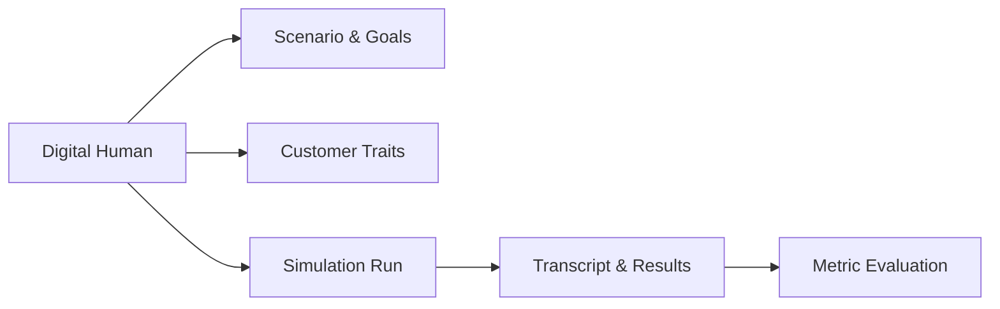

Digital Humans are synthetic customers that interact with your agent during Bluejay evaluations. They make it possible to test realistic behavior before your product reaches production users.

## What You'll Learn

- What a Digital Human represents in Bluejay
- How Digital Humans drive realistic simulation conversations
- How to configure personas for different testing scenarios

## How Digital Humans Work

Digital Humans act as the other side of the conversation during simulations. Each one carries a persona, a scenario, and success criteria that define how it behaves, what it wants, and what a good outcome looks like.

You can create Digital Humans manually with specific scenarios, or generate them in bulk using Bluejay's generation engine. Group them into Communities to reuse the same benchmark population across multiple agents and evaluation cycles.

## Key Capabilities

- **Scenario-driven behavior** -- each Digital Human carries a scenario, success criteria, and conversational style
- **Trait customization** -- configure tone, urgency, language, technical proficiency, and emotional state
- **Bulk generation** -- generate up to 100 diverse Digital Humans in a single API call
- **Community grouping** -- organize Digital Humans by audience, language, or scenario type for consistent benchmarks

## Common Use Cases

- Create a frustrated customer persona to stress-test de-escalation handling
- Generate a diverse population of 50 Digital Humans for a billing support simulation
- Reuse a Community of personas across multiple agents to compare performance

## Next Steps

<CardGroup cols={2}>
  <Card title="Digital Humans Deep Dive" icon="book" href="/core-concepts/digital-humans">
    Full reference for Digital Human fields and configuration.
  </Card>
  <Card title="Generate Digital Humans API" icon="code" href="/api-reference/endpoint/generate-digital-humans">
    Create Digital Humans programmatically via the API.
  </Card>
</CardGroup>
