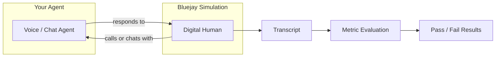

Digital Humans are fundamental test cases that interact with your agent when you launch a [simulation](/test/simulations/overview).

## What You'll Learn

- What a Digital Human represents in Bluejay
- How a Digital Human is built
- Why Digital Humans are central to your test suite

## The Mental Model

```mermaid
flowchart LR
    subgraph YourAgent["Your Agent"]
        A[Voice / Chat Agent]
    end

    subgraph Bluejay["Bluejay Simulation"]
        DH[Digital Human] -->|calls or chats with| A
        A -->|responds to| DH
    end

    DH --> T[Transcript]
    T --> E[Metric Evaluation]
    E --> R[Pass / Fail Results]
```

Digital Humans are configurable test cases that behave like your customers. When creating a Digital Human, ask yourself: "how would my customers interact with my agent?"

## Anatomy of a Digital Human

A **Digital Human** is composed of the following:

<AccordionGroup>
  <Accordion title="Intent" icon="bullseye">
    Intent defines **what the Digital Human will talk about** during the conversation. This field is defined in plain English.
  </Accordion>
  <Accordion title="Success Criteria" icon="circle-check">
    Success criteria defines **how Bluejay determines whether the interaction was successful**. This field is defined in plain English.
  </Accordion>
  <Accordion title="Behavior" icon="sliders">
    Behavior settings control **how the Digital Human sounds and acts**, including accent, language, emotion, speaking speed, background noise, when to speak first, and more.
  </Accordion>
  <Accordion title="Traits" icon="sliders">
    Traits set fields specific to the Digital Human, e.g. DoB or credit card information. Full responses can be configured with [scripted responses](/key-concepts/digital-humans/configuration#scripted-responses).
  </Accordion>
</AccordionGroup>

More configuration options are listed in [configuration](/key-concepts/digital-humans/configuration).

## Why Digital Humans Matter

Digital Humans are the core of simulating real interactions with your agent. Without well-crafted Digital Humans, your simulations won't reflect reality.

<CardGroup cols={2}>
  <Card title="Exhaustive coverage" icon="bullseye">
    Each Digital Human represents a real-world customer scenario. Build a diverse set and you'll battle test your agent to the sky.
  </Card>
  <Card title="Automated at scale" icon="bolt">
    Tell Bluejay about your agent's behavior, and Bluejay will automatically create hundreds of test cases for you.
  </Card>
  <Card title="Real human behaviors" icon="sliders">
    Fine-tune accents, languages, emotions, DTMF tones, scripted responses, IVR navigation, silence, and more to match any real-world scenario.
  </Card>
  <Card title="Repeatable benchmarks" icon="arrows-rotate">
    Group Digital Humans into Communities to reuse the same benchmark population across agents, versions, and evaluation cycles.
  </Card>
</CardGroup>

## Resources

<CardGroup cols={2}>
  <Card title="Best Practices" icon="pen-fancy" href="/key-concepts/digital-humans/best-practices">
    Best practices to create reliable and exhaustive tests with Digital Humans.
  </Card>
  <Card title="Configuration" icon="gear" href="/key-concepts/digital-humans/configuration">
    Configure accents, DTMF, scripted responses, IVR simulation, and more.
  </Card>
  <Card title="Bulk Upload via CSV" icon="file-csv" href="/key-concepts/digital-humans/csv-upload">
    Create many Digital Humans at once from a CSV, with intent, behavior, tool calls, and traits per row.
  </Card>
  <Card title="Use Cases" icon="lightbulb" href="/key-concepts/digital-humans/use-cases">
    Real-world patterns for building effective Digital Human test suites.
  </Card>
  <Card title="Deep Dive" icon="book" href="/key-concepts/digital-humans/configuration">
    Full reference for Digital Human fields, generation, and best practices.
  </Card>
</CardGroup>
