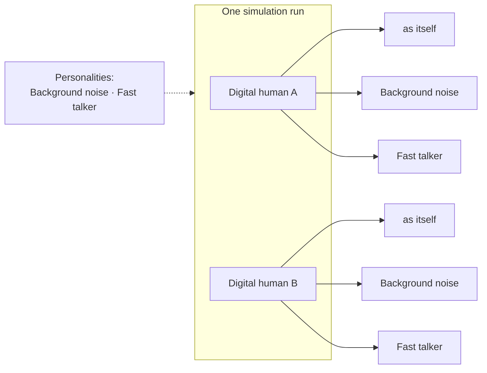

A personality is a saved configuration of a digital human's behavior settings: background noise, pacing, interruptions, audio quality, and the other levers on the [Configuration](/key-concepts/digital-humans/configuration) page. You pick them on a simulation run, and every digital human in that run calls as itself **and** once per personality — same scenario, same success criteria, different behavior.

## What You'll Learn

- What a personality changes and what it leaves alone
- How many conversations a run produces
- How to add personalities to a run

## The Mental Model

Two digital humans and two personalities produce six conversations. The run count is always **digital humans × (itself + personalities)**, and the Create New Run dialog shows the arithmetic next to the Run button.

<Note>
A personality can never change what is being tested. Intent, success criteria, traits and scripted responses always come from the digital human.
</Note>

## What a Personality Owns

A personality overrides only the fields you set on it. Everything you leave alone stays as the caller's own, so "Background noise" adds noise to each digital human's own voice rather than replacing it.

<AccordionGroup>
  <Accordion title="Voice" icon="microphone">
    Language, accent and gender. Set as a group, so a personality that changes the voice still sounds like one caller.
  </Accordion>
  <Accordion title="Background noise" icon="waveform">
    The ambient sound and its volume — traffic, a cafe, a call centre.
  </Accordion>
  <Accordion title="Audio quality and fluency" icon="signal">
    Line quality and how fluently the caller speaks the language.
  </Accordion>
  <Accordion title="Pacing" icon="gauge">
    Speaking speed, verbosity, patience before the caller speaks again, and silence timeout.
  </Accordion>
  <Accordion title="Interruptions" icon="scissors">
    Whether the caller cuts the agent off, and how often.
  </Accordion>
  <Accordion title="Creativity" icon="shuffle">
    How much the caller improvises around the scenario.
  </Accordion>
</AccordionGroup>

## Adding Personalities to a Run

Open **Create New Run** and click **Add Personalities**, on the same row as Bulk Edit and Duplicate. The dialog lists your organization's personalities: tick the ones this run should use.

Personalities are shared across your organization, so one called "Fast talker" is defined once and any simulation can select it. The selection is saved on the simulation, so the next run — including a scheduled one — starts with the same set.

| Preset | What it sets |
| --- | --- |
| Background noise | Traffic at 0.8 volume |
| Interruptions | Frequent interruptions, and less patience before the caller speaks again |
| Poor audio | Low line quality |
| Second language | Intermediate fluency and slow speech |
| Fast talker | Fast speech and high verbosity |
| Long pauses | A long wait before the caller speaks again, and slow speech |
| Unpredictable | More improvisation and high verbosity |

<Tip>
Presets are starting points, not fixed types. Edit any field afterwards and rename it: a fast talker on a noisy line is a single personality.
</Tip>

## Reading the Results

Each conversation is evaluated on its own, against the same success criteria. On the run results page a digital human's conversations group into one row, and expanding it shows the base run and each personality by name. Opening a conversation shows the personality it ran as on the **Digital Human** tab.

Because every run includes the unmodified call, you always have a baseline: if the base passes and the background-noise conversation fails, the scenario is fine and the noise handling is not.

## Limits

- A [customer journey](/test/simulations/customer-journeys) keeps its own step count and does not fan out into personalities.
- Deleting a personality does not change conversations that already ran; they keep the name they ran under.
- Editing a personality affects future runs only.

## Next Steps

<CardGroup cols={2}>
  <Card title="Configuration" icon="gear" href="/key-concepts/digital-humans/configuration">
    Every behavior lever a digital human and its personalities can set.
  </Card>
  <Card title="Simulation Results" icon="chart-mixed" href="/test/simulations/simulation-results">
    How to read a run once every personality has called.
  </Card>
</CardGroup>
