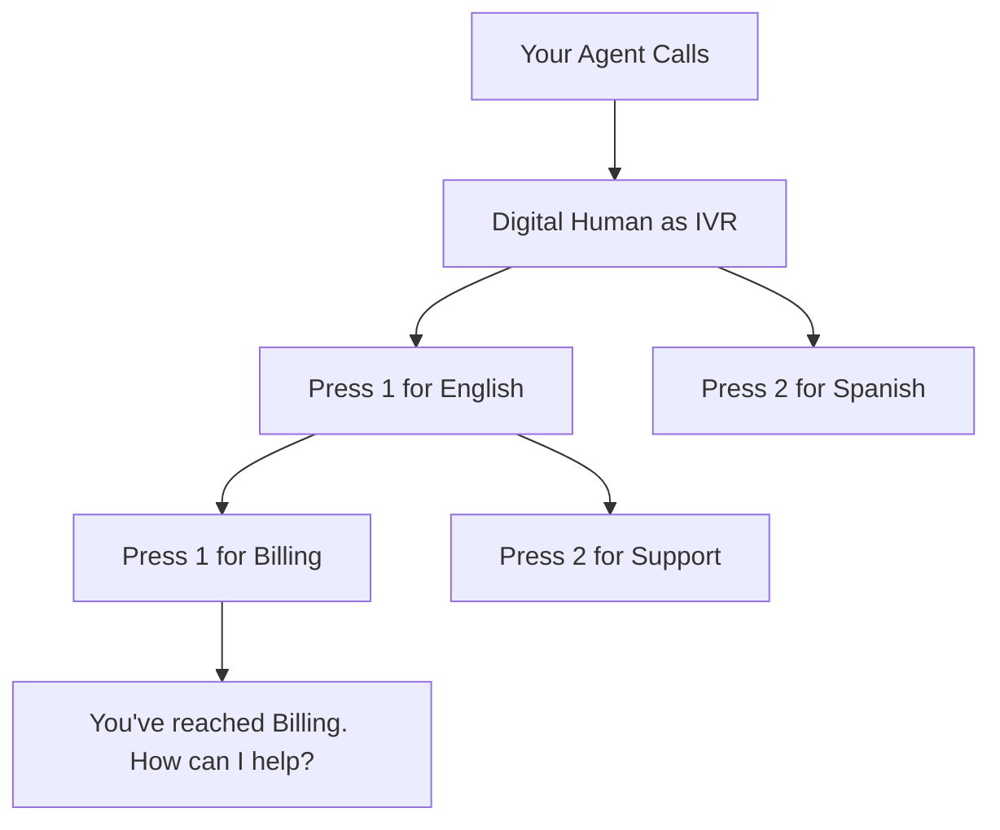

Digital Humans are flexible enough to test virtually any conversational scenario your agent will encounter. This page walks through common and advanced use cases, with guidance on how to structure your Digital Humans for each one.

## Customer Service & Support

The most common use case for Digital Humans. Model the range of customers who call into your support line -- from simple inquiries to heated escalations.

<CardGroup cols={2}>
  <Card title="Billing dispute" icon="credit-card">
    A customer calls about an unexpected charge. Tests whether your agent can pull up account details, explain the charge, and issue a refund or escalate appropriately.
  </Card>
  <Card title="Password reset" icon="key">
    A customer locked out of their account needs help resetting credentials. Tests identity verification and step-by-step guidance.
  </Card>
  <Card title="Product return" icon="box">
    A customer wants to return an item and get a refund. Tests policy adherence, return authorization flows, and label generation.
  </Card>
  <Card title="Escalation handling" icon="arrow-up">
    A frustrated customer demands to speak with a manager. Tests de-escalation techniques and proper transfer protocols.
  </Card>
</CardGroup>

## Stress Testing & Edge Cases

Push your agent to its limits by creating Digital Humans that simulate adversarial or unusual scenarios.

### Rapid-fire questions

Create a Digital Human with **fast speaking speed** and an intent to ask multiple unrelated questions in quick succession. Tests whether your agent can keep up, manage context switching, and provide accurate answers under pressure.

### Language switching

Configure a Digital Human to **start in one language and switch mid-conversation**. For example, a customer begins in English but transitions to Spanish when describing a technical issue. Tests multilingual fallback handling and graceful language detection.

### Extended silence

Set a Digital Human to **go silent for 30+ seconds** at a critical point in the conversation. Tests your agent's timeout behavior, re-prompting logic, and whether it hangs up prematurely.

### Background noise overload

Configure **loud background noise** (airport, construction, crowded restaurant) to test how your agent handles low audio quality. Does it ask the customer to repeat? Does it misinterpret speech? Does it gracefully adapt?

## Compliance & Regulatory Testing

For industries with strict regulatory requirements, Digital Humans can validate that your agent follows the rules every time.

<Steps>
  <Step title="Identity verification">
    Create Digital Humans that require your agent to verify identity before sharing any account information. Set success criteria to fail if the agent shares PII without completing verification.
  </Step>
  <Step title="Disclosure scripts">
    Test whether your agent reads required legal disclosures (e.g., call recording notices, terms of service) at the correct points in the conversation.
  </Step>
  <Step title="Data handling">
    Configure Digital Humans to provide sensitive information (SSN, credit card numbers) and verify that your agent handles, redacts, or stores it according to policy.
  </Step>
</Steps>

## Outbound Agent Testing

Your agent doesn't always receive calls -- sometimes it makes them. Digital Humans can simulate the person (or system) on the other end of an outbound call.

### Appointment confirmations

Your agent calls a customer to confirm a dentist appointment. The Digital Human can:
- Answer and confirm
- Answer and request to reschedule
- Not answer (voicemail scenario)
- Answer confused, not knowing about any appointment

### Lead qualification

Your agent calls a prospect from a lead list. The Digital Human simulates varying levels of interest, from enthusiastic to hostile, testing how your agent qualifies and routes leads.

### Collections calls

Your agent calls about an overdue balance. The Digital Human can dispute the amount, request a payment plan, hang up immediately, or become agitated -- testing your agent's compliance with collections regulations.

## IVR Navigation Testing

When your agent needs to call into another system (a partner API, a legacy phone tree, a government hotline), Digital Humans can simulate the IVR on the other end.

<Tip>
IVR simulation is particularly useful for agents that automate tasks on behalf of customers -- like calling an insurance company to check claim status, or navigating a government agency's phone system to schedule an appointment.
</Tip>

## Regression Testing with Scripted Responses

When you need **deterministic, repeatable tests** that catch regressions between agent versions, use scripted Digital Humans.

<Steps>
  <Step title="Establish a baseline">
    Create a set of Digital Humans with scripted responses that produce known-good transcripts against your current agent version.
  </Step>
  <Step title="Lock the scripts">
    Freeze the Digital Human configurations so every simulation run produces the same input. This removes variability and isolates agent behavior changes.
  </Step>
  <Step title="Run after every deploy">
    Add the simulation to your CI/CD pipeline. If a new agent version fails a previously passing Digital Human, you've caught a regression.
  </Step>
</Steps>

## Multi-Turn Workflow Validation

Test complex, multi-step workflows where the conversation spans several stages -- identity verification, information gathering, action execution, and confirmation.

| Turn | Digital Human Says | Expected Agent Behavior |
|---|---|---|
| 1 | "Hi, I'd like to cancel my subscription." | Agent asks for account email or phone number |
| 2 | "It's jane@example.com" | Agent verifies identity with security question |
| 3 | "My mother's maiden name is Rodriguez" | Agent confirms cancellation and retention offer |
| 4 | "No thanks, just cancel it" | Agent processes cancellation and confirms |
| 5 | "Can I get a confirmation email?" | Agent confirms email will be sent |

## Population-Scale Testing

Generate large populations of Digital Humans to simulate real-world call volume and diversity.

<CardGroup cols={3}>
  <Card title="50 billing callers" icon="users">
    Generate a diverse set of billing-related Digital Humans with varying emotions, languages, and specific disputes to stress-test your billing support flow.
  </Card>
  <Card title="25 new customers" icon="user-plus">
    Generate onboarding-focused Digital Humans to validate your agent handles first-time callers with different levels of technical proficiency.
  </Card>
  <Card title="10 adversarial callers" icon="user-secret">
    Generate edge-case Digital Humans: social engineering attempts, nonsensical questions, profanity, and rapid topic changes.
  </Card>
</CardGroup>

## Next Steps

<CardGroup cols={2}>
  <Card title="Configuration" icon="gear" href="/key-concepts/digital-humans/configuration">
    Learn how to configure every aspect of a Digital Human's behavior and voice.
  </Card>
  <Card title="Create via API" icon="code" href="/api-reference/endpoint/create-digital-human">
    Build Digital Humans programmatically with the create endpoint.
  </Card>
</CardGroup>
