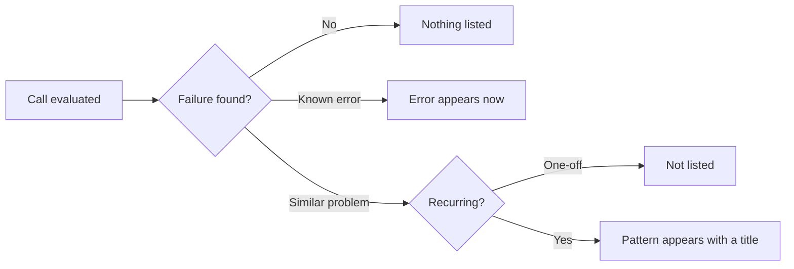

Issues group what went wrong on production calls so you can own a pattern instead of hunting through logs. They are built from [observability](/monitor/observability/overview) evaluations. Open **Monitor → Issues**.

## Where Issues sit

Each evaluated production call is scored and checked for failures. Failures become Issues.

Issues collect those failures so you can assign, prioritize, and close them. [Alerts](/key-concepts/alerts/overview) notify you when something you care about crosses a threshold.

## How Issues appear

Bluejay finds issues two ways. The list labels them **Pattern** and **Error**.

| Kind | When it shows | Example |
|------|----------------|---------|
| **Pattern** | Once the same problem recurs across calls, and only once it has a title | The agent ends the call without confirming the outcome |
| **Error** | As soon as Bluejay recognizes a known failure | A tool returns a 500, or a tool that should have run never does |

A one-off Pattern does not appear. That is expected. Until it has a title, it is not listed anywhere, including the API.

If a new failure matches an issue you already have, the calls join that issue. An issue that goes quiet stays on the list. Last Seen tells you how recently it happened.

Errors often come from [tool calls](/monitor/observability/tool-calls) sent with the [evaluate](/api-reference/endpoint/evaluate) request.

## What you can change

Set status, priority, assignee, and due date. Status is Open, In Progress, Resolved, or Ignored. Priority stays empty until someone sets it.

The title and the calls attached to an issue are produced by Bluejay. You cannot edit them.

## Resources

<CardGroup cols={2}>
  <Card title="Using Issues" icon="list" href="/monitor/observability/issues">
    The Monitor → Issues list, filters, and triage.
  </Card>
  <Card title="Observability" icon="eye" href="/monitor/observability/overview">
    How production calls get into Bluejay.
  </Card>
  <Card title="Alerts" icon="bell" href="/key-concepts/alerts/overview">
    Notifications when something you care about crosses a threshold.
  </Card>
  <Card title="Custom Metrics" icon="gauge-high" href="/key-concepts/custom-metrics/overview">
    The scores from evaluated calls.
  </Card>
  <Card title="Tool Calls" icon="wrench" href="/monitor/observability/tool-calls">
    Include tool data so Errors like a 500 can be recognized.
  </Card>
  <Card title="Traces" icon="route" href="/key-concepts/traces/overview">
    Send OpenTelemetry traces with production calls.
  </Card>
  <Card title="Webhooks" icon="bolt" href="/key-concepts/webhooks/overview">
    Ingest calls and receive evaluation events.
  </Card>
  <Card title="List Issues API" icon="code" href="/api-reference/endpoint/list-issues">
    List, filter, and page issues. Newest last-seen first.
  </Card>
  <Card title="Update Issue API" icon="pen" href="/api-reference/endpoint/update-issue">
    Set status, priority, assignee, or due date.
  </Card>
</CardGroup>
