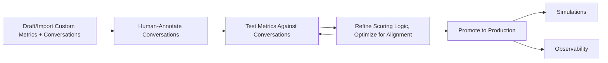

Metrics Lab is the experimental layer where teams define, test, and refine what they want Bluejay to measure. It helps turn evaluation design into an intentional, iterative process.

## What You'll Learn

- What Metrics Lab is and when to use it
- How to prototype and test evaluation prompts
- How to promote metrics from experimentation to production

## How Metrics Lab Works

You use Metrics Lab to prototype measurement ideas, compare scoring approaches, and mature Custom Metrics before you depend on them across simulations, alerts, and reporting workflows.

Metrics Lab provides an interactive environment where you write evaluation prompts, test them against sample transcripts, and iterate on scoring criteria. Once a metric performs reliably, you promote it to production where it runs automatically across simulations and observability evaluations.

## Key Capabilities

- **Interactive prototyping** -- write and test evaluation prompts against sample transcripts in real time
- **Side-by-side comparison** -- compare different scoring approaches to find the most reliable one
- **Safe experimentation** -- iterate without affecting production data or live evaluations
- **One-click promotion** -- move a validated metric directly into your simulation and observability workflows

## Common Use Cases

- Draft a new "compliance check" metric and test it against 10 sample transcripts before deploying
- Compare two different prompts for scoring empathy to see which produces more consistent results
- Validate that a formula metric correctly computes a composite score before attaching it to alerts

## Next Steps

<CardGroup cols={2}>
  <Card title="Custom Metrics" icon="gauge-high" href="/key-concepts/custom-metrics/overview">
    Learn about the metrics that Metrics Lab helps you create.
  </Card>
  <Card title="Create Custom Metrics API" icon="code" href="/api-reference/endpoint/create-custom-metrics">
    Create metrics programmatically via the API.
  </Card>
</CardGroup>
