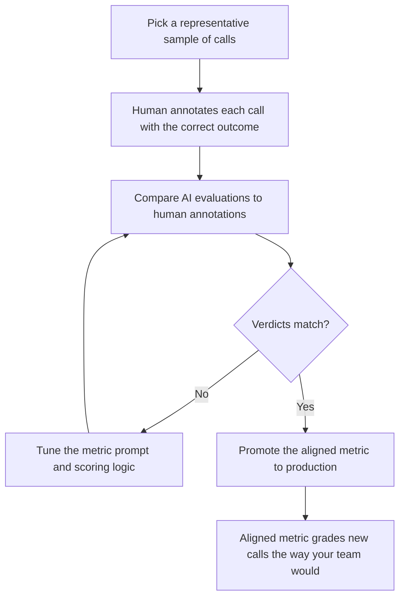

The Metrics Lab is Bluejay's workspace for **building, testing, and refining evaluation metrics** so you can measure agent performance in a way that matches real business outcomes. You annotate a representative set of calls with the outcome you believe is correct, and Bluejay tunes your **Custom Metric** so that its verdicts on future calls match the verdicts you would have given. This process is called **agent alignment**, and it is a practical application of reinforcement learning from human feedback (RLHF).

## What You'll Learn

- What you can actually do in the Metrics Lab
- What **agent alignment** is and why it matters
- How human annotations shape the metric's future evaluations
- Where the Metrics Lab fits relative to Custom Metrics, Dashboards, and Logs
- How to run an alignment cycle end to end

## What You Can Do in the Metrics Lab

The Lab is for moving a metric from "this call felt right or wrong" to "this call passed or failed for a specific measurable reason." Three activities cover most of what the Lab is used for.

<AccordionGroup>
  <Accordion title="Define evaluation logic" icon="pen-ruler">
    Create or refine the criteria you care about. Typical examples:

    - **Booking completed successfully**
    - **Caller identity confirmed**
    - **Date and time collected**
    - **Empathy shown**
    - **No pricing hallucination**
    - **Escalation handled correctly**

    The Lab is where the wording, scope, and scoring rules of each metric get sharpened until the metric actually captures the business outcome you care about.
  </Accordion>
  <Accordion title="Test metrics against real conversations" icon="vials">
    Inspect how a metric behaves on real or test conversations and check whether it is:

    - **Too strict.** The metric fails calls a human would pass.
    - **Too vague.** The metric passes calls a human would fail.
    - **Too noisy.** Verdicts swing based on phrasing that should not matter.
    - **Missing the business intent.** The metric grades the wrong thing.

    Running the metric across a sample is the fastest way to surface these problems before the metric reaches production.
  </Accordion>
  <Accordion title="Compare expected vs actual scoring" icon="scale-balanced">
    Look at a specific verdict and reason about it. The Lab helps you answer:

    - Why did this conversation get this score?
    - Is the metric description precise enough?
    - Does the metric need better wording or a tighter scope?

    This is the loop that drives agent alignment, covered in the next sections.
  </Accordion>
</AccordionGroup>

## The Idea in One Paragraph

Take a representative subset of your calls. Annotate each one with the outcome a human reviewer believes is correct. Bluejay then adjusts your Custom Metric so that its AI evaluations on that subset match your human annotations. If the subset is representative of the calls your agent handles, the tuned metric will generalize, returning verdicts on new calls that line up with how your team would grade them.

## How Agent Alignment Works

The loop is the part that does the work. Each pass, Bluejay closes the distance between the AI's verdict and the human's verdict. When the two agree across the sample, the metric is ready to leave the Lab.

### Why a Subset Generalizes

Every alignment system rests on one assumption: the calls you annotate are a fair cross-section of the calls you actually receive. If your sample covers the scenarios that occur in production, including the borderline cases, then a metric tuned to match human verdicts on that sample will continue to match them on new calls. If your sample is skewed, the tuning will be skewed too.

A short rule of thumb when you build the sample:

- **Include obvious passes and obvious fails** so the metric has clear anchors.
- **Include the ambiguous middle**, because that is where the AI and humans disagree most often.
- **Cover each Digital Human intent or production scenario** that you care about.

### Where RLHF Fits In

Reinforcement learning from human feedback is the family of techniques that powers most modern AI assistants. The recipe is always the same: a model produces an output, a person rates it, and the system updates so that future outputs look more like what the person preferred. Agent alignment is the same idea applied to a single Custom Metric. The "model" is the metric. The "rating" is your annotation. The "update" is the metric tuning that the Lab runs for you.

## Metrics Lab vs Other Tools

The Metrics Lab is closely related to a few other surfaces in Bluejay. The simplest way to keep them straight is by the job each one does.

<AccordionGroup>
  <Accordion title="Metrics Lab vs Custom Metrics" icon="gauge-high">
    - **Custom Metrics** is where the metric objects live (name, description, response type, scoring rules).
    - **Metrics Lab** is where you iterate on those metrics: tune the wording, inspect verdicts on real calls, and validate that the metric behaves the way your team expects.

    Custom Metrics holds the definition. The Lab is the bench where you tune it.
  </Accordion>
  <Accordion title="Metrics Lab vs Dashboards" icon="chart-line">
    - **Dashboards** show trends across many calls over time.
    - **Metrics Lab** helps you define and validate the scoring logic behind those trends.

    If a Dashboard line looks wrong, you fix the underlying metric in the Lab.
  </Accordion>
  <Accordion title="Metrics Lab vs Logs" icon="list">
    - **Logs** show the individual conversations.
    - **Metrics Lab** helps you interpret and score them consistently.

    Logs are the raw material. The Lab is where you decide how that material gets graded.
  </Accordion>
</AccordionGroup>

## What You Get Out of It

<CardGroup cols={2}>
  <Card title="Evaluations you trust" icon="circle-check">
    The metric grades calls the way your team would, so the dashboard reflects reality and not a generic LLM's intuition.
  </Card>
  <Card title="Faster iteration" icon="bolt">
    Instead of rewriting the prompt by hand and guessing at the right phrasing, you annotate calls and let the Lab close the gap.
  </Card>
  <Card title="Defensible standards" icon="scale-balanced">
    Your alignment set is a record of how your team grades calls. New hires can review it. Auditors can review it. The standard lives somewhere concrete.
  </Card>
  <Card title="Continuous improvement" icon="arrows-rotate">
    Add new annotations as edge cases come up. Re-run alignment. The metric stays in lockstep with how your team thinks about quality.
  </Card>
</CardGroup>

## When to Use the Metrics Lab

- A metric is close, but its **pass rate disagrees with your team's gut** on borderline calls.
- You want a metric that encodes **your team's specific standards** rather than a generic definition.
- A **new edge case** has appeared in production and the existing metric mishandles it.
- You are **launching a new metric** and want to validate it against real annotated data before depending on it.
- You need to **understand why** a specific conversation got the score it did.

## A Walkthrough

<Steps>
  <Step title="Pick a representative sample">
    Pull twenty to fifty calls that cover the full range of behaviors you care about. Include obvious passes, obvious fails, and the ambiguous middle.
  </Step>
  <Step title="Annotate each call">
    For every call, mark the outcome you believe is correct. For a Pass / Fail metric, that is pass or fail. For an enum, the right label. For a quantitative metric, the score.
  </Step>
  <Step title="Run alignment">
    Bluejay compares the metric's AI evaluations on the sample to your annotations and tunes the metric to close the gap.
  </Step>
  <Step title="Validate on a holdout">
    Run the tuned metric against a handful of calls you did not annotate. If the verdicts match what you would have said, the metric is ready.
  </Step>
  <Step title="Promote to production">
    Push the aligned metric out to your simulations and live monitoring. New calls will be graded the way your team would grade them.
  </Step>
</Steps>

## A Worked Analysis

Imagine a Pass / Fail metric for "Identity Verified Before Sharing Account Details." Out of the box, the AI is generous: it passes calls where the agent confirmed only a name, even when policy requires two factors.

You annotate fifty calls. Twenty are clear passes (two factors confirmed). Twenty are clear fails (no verification at all). Ten are borderline: the agent confirmed one factor and the customer volunteered another. Your team's policy says the agent must explicitly request both, so you mark all ten as fail.

You run alignment. The Lab observes the gap on the borderline cases and tightens the metric so that "agent explicitly requested two factors" is the threshold. On the validation set, the AI now fails the borderline calls just like you did. Promoted to production, the metric flags the same gap consistently across thousands of calls, with verdicts that match what your team would have said.

This is the value of agent alignment in one example: a metric that is close becomes a metric that is right.

## Resources

<CardGroup cols={2}>
  <Card title="Custom Metrics" icon="gauge-high" href="/key-concepts/custom-metrics/overview">
    Understand the metrics that the Lab tunes.
  </Card>
  <Card title="Custom Metrics Prompting Guide" icon="pen-fancy" href="/key-concepts/custom-metrics/prompting-guide">
    Learn the prompt patterns that make alignment converge faster.
  </Card>
  <Card title="Dashboards" icon="table-columns" href="/key-concepts/dashboards/overview">
    Visualize the metrics you tune in the Lab over time.
  </Card>
  <Card title="Create Custom Metric API" icon="code" href="/api-reference/endpoint/create-custom-metric">
    Define a metric programmatically before bringing it into the Lab.
  </Card>
  <Card title="Metrics Lab in Bluejay" icon="up-right-from-square" href="https://app.getbluejay.ai/metrics-lab">
    Open the live Metrics Lab in your Bluejay workspace.
  </Card>
</CardGroup>
