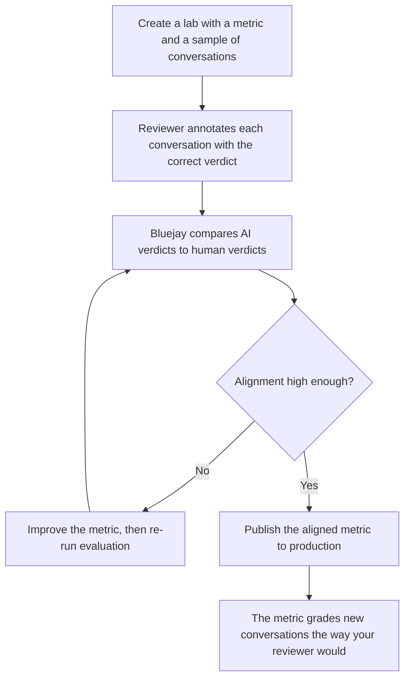

The Metrics Lab is where you teach Bluejay's evaluator to grade conversations the way your QA team would. You bring in a set of real conversations, your reviewer annotates each one with the verdict they believe is correct, and Bluejay tunes your Custom Metric until its AI verdicts line up with your reviewer's. The result is an evaluator that keeps your QA engineer's decision making in the loop, applied automatically across every conversation.

The walkthrough below covers the entire flow end to end, from creating a lab through annotating conversations, improving the metric, and publishing it to production.

<iframe
  src="https://www.youtube.com/embed/9OaFvPKCvaI"
  width="100%"
  height="450"
  frameBorder="0"
  allowFullScreen
  style={{ borderRadius: '0.5rem' }}
></iframe>

## The Idea in One Paragraph

Your best QA engineer already knows what a passing conversation looks like. The problem is that their judgment lives in one person's head and cannot scale to thousands of conversations. The Metrics Lab is how you clone that judgment into the evaluator. Your reviewer annotates a representative set of conversations with the correct outcome, Bluejay measures where the AI disagrees with them, and you improve the metric until the two agree. Once they agree on your sample, the metric carries your reviewer's standard onto every new conversation automatically.

## Human in the Loop

Most automated evaluation hands the entire decision to a generic model and hopes it matches your standard. The Metrics Lab does the opposite. Your reviewer stays in the loop the whole time, and their annotations are the ground truth that the metric is tuned against.

<CardGroup cols={2}>
  <Card title="Your standard, not a generic one" icon="user-check">
    The metric is graded against your reviewer's verdicts, so it encodes how your team defines a good conversation rather than how a generic LLM guesses.
  </Card>
  <Card title="Decision making that scales" icon="arrows-rotate">
    One reviewer annotates a sample, and the aligned metric applies that same judgment to thousands of conversations.
  </Card>
  <Card title="A defensible record" icon="scale-balanced">
    Your annotations are a concrete record of how your team grades conversations. New hires can review it, and auditors can review it.
  </Card>
  <Card title="Evaluations you trust" icon="circle-check">
    Because the metric is measured against human verdicts, the dashboard reflects reality and not a model's intuition.
  </Card>
</CardGroup>

## How Alignment Works

The loop is the part that does the work. Each pass closes the distance between the AI's verdict and your reviewer's verdict. When the two agree across the sample, measured by the alignment score, the metric is ready to leave the lab.

### Why a Sample Generalizes

Alignment rests on one assumption: the conversations you annotate are a fair cross section of the conversations you actually receive. If your sample covers the scenarios that occur in production, including the borderline ones, then a metric tuned to match human verdicts on that sample keeps matching them on new conversations. If your sample is skewed, the tuning will be skewed too.

A short rule of thumb when you build the sample:

- Include obvious passes and obvious fails so the metric has clear anchors.
- Include the ambiguous middle, because that is where the AI and your reviewer disagree most often.
- Cover each Digital Human intent or production scenario you care about.

Twenty to fifty conversations is a good starting range for a single metric.

## Walkthrough

### 1. Create a Lab

From the **Metrics Lab** page, click **Create Lab**. The dialog walks you through three steps:

1. **Lab Name.** Name the lab after what you are validating, for example "Identity Verification Standard."
2. **Metrics.** Select one or more Custom Metrics to optimize. These are the metrics the lab will tune against your annotations.
3. **Conversations.** Select the conversations to bring in. You can pull from your agent's **Conversations** or from a **Simulation** run.

Click **Create Lab** to finish. If the selected conversations already have evaluations, Bluejay reuses them so you can start annotating right away.

<Tip>
  If you have not built the metric yet, define it first in [Custom Metrics](/key-concepts/custom-metrics/overview), then bring it into the lab here.
</Tip>

### 2. Annotate the Conversations

Open the **Annotate** tab. You see a table with one row per conversation and one column per metric. Each metric column is split into an **AI** verdict and a **Human** verdict, side by side.

Click any row to open the detail panel. From here your reviewer records the ground truth verdict:

- **Transcript** tab shows the full conversation so the reviewer can read it.
- **Details** tab shows each metric with the AI verdict on the left and the **Human** input on the right.

The human input matches the metric's response type:

- **Pass / Fail** metrics use simple buttons.
- **Quantitative** metrics take a numeric score within the metric's range.
- **Enum** metrics use a dropdown of your defined options.
- **Qualitative** and **JSON** metrics take free text.

Add an optional note in the **Human reasoning** field to capture why the reviewer graded the conversation that way, then click **Save**. Use the **Previous** and **Next** buttons, or the arrow keys, to move through the sample quickly. The header tracks your progress with an **Annotated X/Y** counter.

<Note>
  Annotate every conversation in the sample before moving on. The alignment score is only meaningful once the AI has a human verdict to compare against on each conversation.
</Note>

### 3. Improve and Optimize

Open the **Optimize** tab and select the metric you want to tune. At the top you see the **Alignment** score, the percentage of conversations where the AI verdict matches your reviewer's annotation.

You have two ways to close the gap:

- **Improve** asks Bluejay to rewrite the metric prompt based on where the AI and human verdicts disagree. You can add optional instructions, and you review the suggested change as a diff before accepting it.
- Edit the metric definition by hand. Adjust the description, model, evaluation route, or temperature directly.

When you are ready to test a change, click **Run**. Bluejay creates a new revision of the metric and re-evaluates every conversation in the lab against it. The alignment score updates so you can see whether the change moved the AI closer to your reviewer.

Step through revisions with the **Previous** and **Next** controls to compare versions. The goal is an alignment score high enough that you trust the metric to grade unseen conversations the way your reviewer would. For most metrics, aim for the green band at the top of the range.

### 4. Publish to Production

Once alignment is where you want it, click **Publish**. The revision becomes the live definition of the metric, and every future simulation and production evaluation grades conversations with your reviewer's standard baked in.

## Fuzzy Alignment for Scored Metrics

For quantitative metrics, an exact match is often too strict. A human score of 3 out of 5 and an AI score of 4 out of 5 are close enough to count as agreement in most cases.

Open the **Settings** tab and turn on **Fuzzy Alignment**, then set a **Numerical Score Threshold**. Scores within that many points of each other count as aligned. For example, with a threshold of 1, an AI score of 2 and a human score of 3 count as a match.

## Keep the Lab Alive

Alignment is not a one time event. As new edge cases appear in production, add them to the lab and keep your reviewer's judgment current.

- **Add Conversations** brings new conversations into the lab. Toggle on evaluation so they are scored against the current metrics as they land.
- **Add Metrics** brings another metric into the same lab.
- **Re-evaluate** re-scores every conversation with the latest metric definitions.

Annotate the new conversations, check the alignment score, improve if it dropped, and publish again. The metric stays in lockstep with how your team thinks about quality.

## A Worked Example

Imagine a Pass / Fail metric for "Identity Verified Before Sharing Account Details." Out of the box the AI is generous: it passes conversations where the agent confirmed only a name, even when policy requires two factors.

Your reviewer annotates fifty conversations. Twenty are clear passes with two factors confirmed. Twenty are clear fails with no verification at all. Ten are borderline, where the agent confirmed one factor and the customer volunteered another. Your policy says the agent must explicitly request both, so your reviewer marks all ten as fail.

The alignment score comes back low because the AI passed those ten borderline conversations. You click **Improve**, accept a revision that tightens the threshold to "agent explicitly requested two factors," and click **Run**. The AI now fails the borderline conversations just like your reviewer did, and the alignment score jumps into the green. You **Publish**, and the metric flags the same gap consistently across thousands of conversations, with verdicts that match what your team would have said.

That is the whole point of the Metrics Lab: a metric that is close becomes a metric that is right, and your reviewer's judgment scales to every conversation.

## Next Steps

<CardGroup cols={2}>
  <Card title="Custom Metrics" icon="gauge-high" href="/key-concepts/custom-metrics/overview">
    Understand the metrics that the lab tunes.
  </Card>
  <Card title="Custom Metrics Prompting Guide" icon="pen-fancy" href="/key-concepts/custom-metrics/prompting-guide">
    Learn the prompt patterns that make alignment converge faster.
  </Card>
  <Card title="Metric Types" icon="shapes" href="/key-concepts/custom-metrics/metric-types">
    Pick the right response type for each measurement goal.
  </Card>
  <Card title="Create Custom Metric API" icon="code" href="/api-reference/endpoint/create-custom-metric">
    Define a metric programmatically before bringing it into the lab.
  </Card>
</CardGroup>
