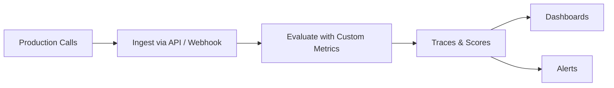

Observability gives you visibility into how agents behave in live customer interactions. It complements simulations by showing what actually happens in production and where quality drifts over time.

## What You'll Learn

- How Observability evaluates production conversations
- What signals and metrics are captured automatically
- How to connect observability to alerts and dashboards

## How Observability Works

You use Observability to evaluate calls, inspect trends, trigger alerts, and understand reliability in real environments. It is the operational layer that turns ongoing traffic into measurable product insight.

Observability captures production conversation data, evaluates it against your Custom Metrics, and surfaces the results through dashboards and alerts. It supports audio recordings, transcripts, tool call metadata, and structured participant data.

## Key Capabilities

- **Automated evaluation** -- every ingested call is scored against your Custom Metrics automatically
- **Hallucination detection** -- identifies when agents provide incorrect or fabricated information
- **Redundancy analysis** -- measures unnecessary repetition in agent responses
- **Multi-modal input** -- works with both audio recordings and text transcripts

## Common Use Cases

- Evaluate every production call for compliance and escalation accuracy
- Track hallucination rates over time and alert when they spike
- Compare production quality across different agent versions or prompt changes

## Next Steps

<CardGroup cols={2}>
  <Card title="Observability Deep Dive" icon="book" href="/core-concepts/observability">
    Full reference for observability concepts and data model.
  </Card>
  <Card title="Observability Cookbook" icon="book-open" href="/cookbook/observability">
    Practical examples for integrating with the evaluate endpoint.
  </Card>
</CardGroup>
