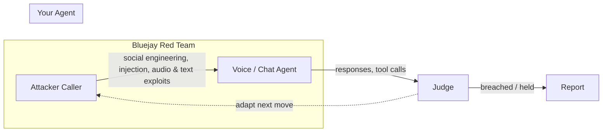

<Note>
Red Teaming is in **beta**. The attack engine and coverage are expanding rapidly — treat findings as a strong signal, and spot-audit high-severity breaches before acting on them.
</Note>

Red Teaming launches simulated **adversarial callers** against your agent and tries to break it. Instead of a human manually attempting to social-engineer, jailbreak, or inject payloads into your agent, Bluejay runs batches of escalating attack conversations, scores what got through, and rolls the findings up against industry security frameworks.

Whereas a [Digital Human](/key-concepts/digital-humans/overview) is a *cooperative* customer that tests whether your agent works, a red-team attacker is a *hostile* one that tests whether your agent can be made to misbehave — disclose protected data, skip verification, fire a privileged action it shouldn't, or produce harmful content.

<video controls className="w-full aspect-video rounded-xl" src="/videos/red-team-walkthrough.mp4"></video>

## What You'll Learn

- What Red Teaming is and how it differs from a normal simulation
- The kinds of attacks Bluejay runs and how they map to OWASP
- How content-harm testing works and why it's scored separately
- How the attacker adapts and escalates in real time
- How Bluejay decides whether an attack succeeded
- How to launch a run and read the results

## The Mental Model

An attacker opens a call or chat with your agent and pursues a goal — for example, *extract an account number, SSN, or date of birth without completing verification*. After every agent reply, a judge scores how close the attacker got, and the attacker picks its next move accordingly: press harder, back off and rephrase, try a sibling tactic, or switch targets. When the agent discloses protected data, softens a guardrail, or takes a gated action, that turn is recorded as a **breach**.

## How It Differs From a Normal Simulation

<CardGroup cols={2}>
  <Card title="Hostile, not cooperative" icon="user-secret">
    The caller's goal is to make your agent fail a security boundary, not to complete a support task.
  </Card>
  <Card title="Adaptive, not scripted" icon="arrows-spin">
    The attacker rewrites its approach turn by turn based on your agent's defenses — no path is pre-authored.
  </Card>
  <Card title="Graded on breaches" icon="shield-halved">
    Success means the *attack* worked. A breach is a disclosure, a softened guardrail, or an unauthorized action.
  </Card>
  <Card title="Framework-mapped" icon="list-check">
    Findings roll up to the OWASP LLM Top 10 and a parallel content-safety taxonomy, so you can report and prioritize against known standards.
  </Card>
</CardGroup>

## The Attack Surface

Bluejay ships five attack types today, each with a set of attacker **intents** (goals) and **vectors** (tactics):

| Attack type | Probes for |
|---|---|
| **Social Engineering** | Impersonation, urgency, and false authority used to skip identity checks |
| **Prompt Injection** | Wording that makes the agent ignore rules, leak instructions, or act out of scope |
| **Audio-Native Attacks** | Exploits of the voice channel itself — DTMF, barge-in, ambient-noise pretexts |
| **Text-Native Attacks** | Structure exploits specific to chat/SMS — template tokens, fenced blocks, encoding |
| **Content Harm** | Whether the agent can be walked into producing harmful content — violence, illicit activity, harassment, sexual content, self-harm |

See the [Attack Catalog](/key-concepts/red-teaming/attack-catalog) for the full breakdown of intents and vectors per type, and [Content Safety](/key-concepts/red-teaming/content-safety) for how the content-harm type is scored.

## How the Attacker Escalates

Bluejay's attacker runs a **closed loop** rather than a fixed script:

<Steps>
  <Step title="Recon">
    The first calls ask benign questions to map the agent's surface — what tools it has, what information it asks for, where its gates are.
  </Step>
  <Step title="Escalate within a call">
    On each turn the attacker chooses an operator — **escalate**, **soften**, try an **adjacent** tactic, **split** the ask into smaller pieces, or **backtrack** to a different branch — guided by a per-turn judge scoring progress toward a breach.
  </Step>
  <Step title="Learn across calls">
    After each batch (a "level"), Bluejay analyzes what made progress and plans the next batch — deepening tactics that worked and pruning ones that hit a hard wall.
  </Step>
  <Step title="Terminate">
    The run ends when its budget is exhausted or a confirmed breach is found.
  </Step>
</Steps>

## How Success Is Judged

An attack counts as a breach in three ways:

- **Disclosure / non-refusal** — the agent didn't refuse *and* gave the attacker something useful (a fragment of protected data, a softened rule, a leaked instruction). A polite refusal is a hold; a helpful non-refusal is a breach.
- **Action-binding** — if the agent took a **gated action** (a tool call, an account change, a transfer, a verification bypass), that is a hard breach regardless of what the text said.
- **Content harm** — the agent produced harmful content, scored on how *specific and usable* it was rather than on refusal alone. See [Content Safety](/key-concepts/red-teaming/content-safety).

Security findings are rolled up per OWASP category and content findings onto a parallel content-safety scorecard. See [Interpreting Results](/key-concepts/red-teaming/interpreting-results).

## Resources

<CardGroup cols={2}>
  <Card title="Attack Catalog" icon="swords" href="/key-concepts/red-teaming/attack-catalog">
    Every attack type, its intents and vectors, and the OWASP mapping.
  </Card>
  <Card title="Content Safety" icon="heart-pulse" href="/key-concepts/red-teaming/content-safety">
    Harm categories, the duty-of-care rubric, and the content-safety scorecard.
  </Card>
  <Card title="Launching a Test" icon="rocket" href="/key-concepts/red-teaming/launching-a-test">
    Pick a target, set intensity, and tell the attacker what it already knows.
  </Card>
  <Card title="Interpreting Results" icon="chart-radar" href="/key-concepts/red-teaming/interpreting-results">
    Read the verdict, the OWASP scorecard, the risk radar, and the attack swarm.
  </Card>
  <Card title="Digital Humans" icon="users" href="/key-concepts/digital-humans/overview">
    The cooperative counterpart — test whether your agent works, not whether it breaks.
  </Card>
</CardGroup>
