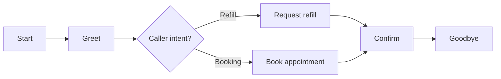

The Scenario Builder lets you describe how a conversation should go as a path graph. Each path through the graph becomes a digital human you can run against your agent. Use it when you want fine‑grained control over what your digital humans say, in what order, and on which branches.

## What You'll Learn

- What a scenario is and how it produces digital humans
- How to enumerate paths and assign counts per path
- How scenarios connect to simulations

## How Scenarios Work

A scenario is a graph of nodes (utterances, branches, decisions) connected by edges. Starting from the `Start` node, the builder enumerates every distinct path through the graph up to a per‑scenario cap. Each path becomes a single digital human whose `enriched_playback` follows that path turn by turn.

In the example above the builder enumerates two paths from `Start` (Refill and Booking). Selecting this scenario in a simulation produces two digital humans, one per path.

## Key Capabilities

- **Deterministic playback**: each generated digital human follows its assigned path turn by turn
- **Branching coverage**: every reachable branch yields its own digital human, up to the per‑scenario cap
- **Pasted JSON or LLM draft**: author scenarios visually, paste a graph, or generate from a prompt
- **Reuse across simulations**: one scenario can drive many simulation runs

## Common Use Cases

- Capture every meaningful branch of a workflow (happy path + edge cases) as one scenario
- Reproduce specific incidents from production transcripts as a deterministic path
- Build a regression suite of conversation paths an agent must consistently handle

## Next Steps

<CardGroup cols={2}>
  <Card title="Scenario Builder Cookbook" icon="book-open" href="/cookbook/scenario-builder">
    Practical examples and patterns for building scenarios.
  </Card>
  <Card title="Create Scenario API" icon="code" href="/api-reference/endpoint/create-scenario">
    Create and manage scenarios programmatically.
  </Card>
</CardGroup>
