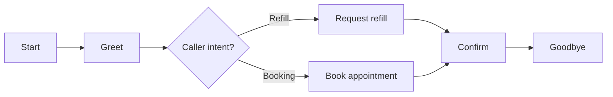

The **Scenario Builder** is Bluejay's visual editor for designing **structured call flows and test paths**. Instead of testing your agent with a single freeform persona, you draw a flowchart for the conversation: what happens first, where the call branches, where the caller is held, where a human rep appears, and which paths get tested. Each path through the graph becomes one Digital Human you can run against the agent.

## What You'll Learn

- What the Scenario Builder is and why you'd reach for it
- The core building blocks: **nodes** and **edges**
- The main **node types** Bluejay supports (Start, IVR menu, Hold, Human agent)
- How paths through one scenario produce many tests
- Where Scenario Builder sits relative to a normal simulation and to provider workflows

## When to Use the Scenario Builder

A plain simulation tests broad behavior against a persona. The Scenario Builder is the right tool when you need to validate **structure** in the conversation:

- **Exact branching logic** that the agent must follow
- **Handoff paths** to humans or specialists
- **IVR menu behavior** and DTMF routing
- **Hold and queue steps** inside a longer journey
- **Specific customer journeys** that span several stages

If a simulation answers "did the agent handle this persona?", a Scenario Builder run answers "did the agent follow the right path through this workflow?"

## Core Concept: Nodes and Edges

Every scenario is a graph.

- **Nodes** are the steps in the scenario (greeting, decision, menu, hold, human rep, goodbye).
- **Edges** connect one node to the next and define how the conversation moves through the flow.

Starting from the `Start` node, the builder enumerates every distinct path through the graph up to a per-scenario cap. Each path becomes a single Digital Human whose `enriched_playback` follows that path turn by turn.

In the example above the builder finds two paths (Refill and Booking). Selecting this scenario in a simulation produces two Digital Humans, one per path.

## Main Node Types

Click each node type to see what it simulates and what you configure on it.

<AccordionGroup>
  <Accordion title="Start node" icon="play">
    The **entry point** of the scenario. Every scenario needs one. The Start node is where the run begins before branching into the next step.
  </Accordion>
  <Accordion title="IVR menu node" icon="phone">
    Simulates an **interactive phone menu**. Each menu option becomes its own branch, which is useful for testing booking systems with menu routing, validating DTMF flows, and confirming downstream routing logic.

    Example menu:

    - "Press 1 for appointments"
    - "Press 2 for billing"
    - "Press 3 to speak to an agent"

    **What you define on an IVR node:**

    - Menu options
    - The spoken phrase for each option
    - Barge-in settings
    - Optional voice overrides
  </Accordion>
  <Accordion title="Hold node" icon="pause">
    Simulates a **hold experience**. Use it when the caller should be put on hold, hear a message before hold, wait for some duration, and then hear a post-hold message. Useful for transfer flows, queue simulations, and realistic service workflows.

    **What you define on a Hold node:**

    - Hold duration
    - Optional message before hold
    - Optional message after hold
  </Accordion>
  <Accordion title="Human agent node" icon="user-headset">
    Simulates a **live representative** or a downstream human-style rep. Use it to test escalation, transfer-to-human behavior, or specialized human-assisted flows.

    **What you define on a Human agent node:**

    - The rep's intent
    - Success criteria
    - Timing
    - Whether the rep speaks first
    - Optional voice overrides
  </Accordion>
</AccordionGroup>

## How Paths Work

A single scenario can hold **many distinct paths**, and the builder treats each one as its own test. You build one graph, and Bluejay generates one Digital Human per reachable path up to the per-scenario cap.

That means one scenario can cover:

- A **happy path** (booking succeeds end to end)
- A **rescheduling path**
- A **cancellation path**
- An **escalation path** (handoff to a human)
- An **IVR routing path** (caller picks menu option 2)

Instead of building separate tests for each branch, you build one graph and get broad branch coverage for free.

## What You Can Control

The Scenario Builder is strong for controlling the **structure** of a scenario:

- Which branch happens next
- Which step is tested
- Whether hold music plays
- Whether DTMF input is used
- Whether a live rep step exists
- What each branch is supposed to accomplish

That gives you much more control than a single open-ended simulation.

## Scenario Builder vs Simulations

These two work together. Use the right tool for the job.

<AccordionGroup>
  <Accordion title="Simulation" icon="flask-vial">
    Tests the agent against **personas and goals**. Answers "who is calling and what does success look like?"
  </Accordion>
  <Accordion title="Scenario Builder" icon="map">
    Designs the **workflow structure** the test should follow. Answers "what does the conversation path actually look like?"
  </Accordion>
</AccordionGroup>

Plain mapping: **Simulation = who is calling and what success looks like. Scenario Builder = what the conversation path looks like.** Most teams use both together.

## Scenario Builder vs Workflows

Two Bluejay concepts can sound similar but do different jobs.

- The **Scenario Builder** is for designing **test scenarios and journey flows** that you run against an agent.
- **Workflows** are for editing the **agent's own provider workflow**, such as an ElevenLabs multi-agent workflow.

If you came here looking to edit the live agent itself, head to the [Workflows page](/key-concepts/agents/workflow) instead.

## Common Actions

In the editor, you typically use the Scenario Builder to:

<AccordionGroup>
  <Accordion title="Create a new scenario" icon="plus">
    Start with a blank canvas, paste an existing scenario graph as JSON, or generate a draft from a prompt.
  </Accordion>
  <Accordion title="Add nodes and connect edges" icon="diagram-project">
    Drop nodes onto the canvas and wire them together. Each edge is a transition the conversation can take.
  </Accordion>
  <Accordion title="Define routing" icon="route">
    Decide which branch fires based on caller intent or input.
  </Accordion>
  <Accordion title="Configure hold and human-agent steps" icon="sliders">
    Set durations, hold messages, rep intents, and timing on the specialized node types.
  </Accordion>
  <Accordion title="Validate the flow" icon="circle-check">
    Confirm every path reaches an end state and that no branch is unreachable.
  </Accordion>
  <Accordion title="Test the resulting scenario" icon="play">
    Select the scenario in a simulation and run it against the agent to see how each path plays out.
  </Accordion>
</AccordionGroup>

## Typical Use Cases

The Scenario Builder is especially strong for:

- **IVR flows** with multi-level menus
- **Routing trees** that branch on caller input
- **Escalation logic** with explicit handoffs
- **Complex support journeys** that span several stages
- **Branch coverage testing** for graph-shaped agent behavior
- **Validating multiple customer paths** through one system

## Key Capabilities

- **Deterministic playback.** Each generated Digital Human follows its assigned path turn by turn.
- **Branching coverage.** Every reachable branch yields its own Digital Human, up to the per-scenario cap.
- **Multiple authoring modes.** Author scenarios visually, paste a graph as JSON, or draft from a prompt.
- **Reuse across simulations.** One scenario can drive many simulation runs against different agents and agent versions.

## Common Use Cases

- Capture every meaningful branch of a workflow (happy path plus edge cases) as one scenario.
- Reproduce a specific incident from a production transcript as a deterministic path.
- Build a regression suite of conversation paths an agent must consistently handle.
- Model a multi-stage support journey with IVR routing, hold, and human handoff in one graph.

## Resources

<CardGroup cols={2}>
  <Card title="Scenario Builder Cookbook" icon="book-open" href="/cookbook/scenario-builder">
    Practical examples and patterns for building scenarios.
  </Card>
  <Card title="Workflows" icon="diagram-project" href="/key-concepts/agents/workflow">
    Edit the agent's own provider workflow (different from a test scenario).
  </Card>
  <Card title="Create Scenario API" icon="code" href="/api-reference/endpoint/create-scenario">
    Create and manage scenarios programmatically.
  </Card>
  <Card title="Scenario Builder in Bluejay" icon="up-right-from-square" href="https://app.getbluejay.ai/scenario-builder">
    Open the live Scenario Builder in your Bluejay workspace.
  </Card>
</CardGroup>
