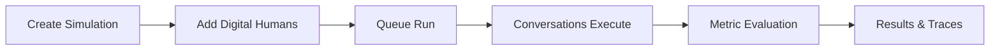

Simulations let you test your agent against realistic scenarios before those scenarios happen in production. They provide controlled, repeatable coverage for the customer behaviors you care about most.

## What You'll Learn

- What a Simulation represents in Bluejay
- How the simulation lifecycle works from creation to evaluation
- How to choose the right simulation type for your use case

## How Simulations Work

You use Simulations to run Digital Humans against an Agent, compare outcomes, and identify failure modes early. They are the core of pre-production testing and regression detection in Bluejay.

Each Simulation is a container for a set of Digital Humans that will interact with your Agent. When you queue a run, Bluejay orchestrates each conversation, captures transcripts, and evaluates them against your Custom Metrics. Simulations are re-runnable, so you can track performance over time and catch regressions.

## Key Capabilities

- **Re-runnable scenarios** -- execute the same simulation repeatedly to measure performance over time
- **Multi-channel support** -- run simulations over telephony, SIP, LiveKit, WebSocket, or HTTP webhooks
- **Batch execution** -- run an entire Community of Digital Humans in a single batch
- **Automated evaluation** -- every conversation is scored against your Custom Metrics automatically

## Common Use Cases

- Validate a new agent build against a standard set of customer scenarios before launch
- Re-run a regression suite after prompt or knowledge base changes
- Stress-test edge cases like angry customers, language switching, or long hold times

## Next Steps

<CardGroup cols={2}>
  <Card title="Simulations Deep Dive" icon="book" href="/core-concepts/simulations">
    Full reference for Simulation configuration and execution.
  </Card>
  <Card title="Simulation Types" icon="shapes" href="/test/simulations/types">
    Understand the different types of simulations available.
  </Card>
  <Card title="Queue a Simulation Run" icon="play" href="/api-reference/endpoint/queue-simulation-run">
    Start a simulation run via the API.
  </Card>
</CardGroup>
