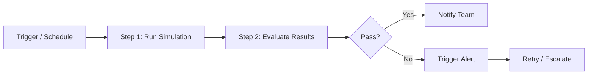

Workflows model how a conversation or evaluation should progress through multiple steps. They help teams reason about branching behavior, automation, and repeatable execution paths.

## What You'll Learn

- What Workflows are and how they model evaluation logic
- How scheduling and automation work
- How to connect workflows to simulations and observability

## How Workflows Work

You use Workflows to formalize conversation paths, connect supporting systems, and automate evaluation logic around complex customer journeys. They are especially useful when your agent needs to support many branching outcomes.

Workflows support cron-based scheduling so you can run simulation batches or observability evaluations on a recurring cadence. Each step can trigger the next, and failed steps support retry logic and webhook notifications.

## Key Capabilities

- **Cron-based scheduling** -- run evaluations hourly, daily, or on any custom cron expression
- **Step chaining** -- connect simulation runs, evaluations, and notifications into a single automated pipeline
- **Retry logic** -- failed workflow steps retry automatically based on your configuration
- **Webhook notifications** -- get notified on workflow completion or failure via webhook

## Common Use Cases

- Schedule a nightly regression suite that runs simulations and alerts on failures
- Chain a simulation run with a Slack notification so the team sees results each morning
- Build a workflow that re-evaluates production calls weekly with updated Custom Metrics

## Next Steps

<CardGroup cols={2}>
  <Card title="Workflows Cookbook" icon="book-open" href="/cookbook/workflows">
    Practical examples and patterns for building workflows.
  </Card>
  <Card title="Create Workflow API" icon="code" href="/api-reference/endpoint/create-workflow-v2">
    Create and manage conversation-path workflows programmatically.
  </Card>
</CardGroup>
