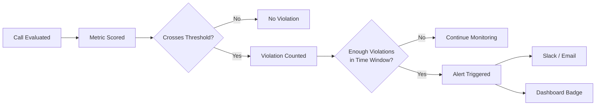

Alerts notify your team when production metrics cross a boundary repeatedly within a time window. Instead of manually checking dashboards, alerts push signals to Slack or email the moment a sustained problem appears.

## How Alerts Work

After every production call is scored through the [observability pipeline](/monitor/observability/overview), Bluejay checks whether any metric has crossed its configured threshold. Violations are counted over a rolling time window, and the alert only fires when enough violations accumulate — filtering out transient noise while catching real problems.

## Configuration

| Field | Description | Example |
|-------|-------------|---------|
| **Metric** | The Custom Metric or built-in metric to monitor | Average Agent Latency |
| **Condition** | Whether to alert when the score is _above_ or _below_ the boundary | Above |
| **Threshold** | The numeric boundary that counts as a violation | 3 seconds |
| **Occurrences** | How many violations must occur before the alert fires | 5 |
| **Time Window** | The rolling interval over which violations are counted | 10 minutes |

## Example: Latency Spike Detection

An alert configured to fire when average agent latency exceeds 3 seconds at least 5 times within 10 minutes:

- A single slow call does **not** trigger the alert — one violation is below the required 5.
- Three slow calls in 10 minutes still does **not** trigger — only 3 of 5 occurrences reached.
- A fifth slow call within the same 10-minute window **fires** the alert and notifies your team.
- If 20 minutes pass with only 2 violations, earlier ones roll out of the window — no alert.

For zero-tolerance metrics like hallucination detection, set occurrences to 1 so the alert fires on the first violation.

## Routing to Slack

Connect Bluejay to your Slack workspace through the [Slack integration](/integrations/slack) and route alerts to specific channels:

- **Engineering** -- latency spikes, error rate increases, model regressions
- **Support/QA** -- hallucination detections, compliance failures, low satisfaction
- **Leadership** -- quality summaries, sustained threshold breaches

## Common Configurations

| Scenario | Occurrences | Time Window |
|----------|-------------|-------------|
| Critical safety violation | 1 | 60 min |
| Latency regression | 5 | 10 min |
| Quality drift | 10 | 30 min |
| Compliance check | 1–2 | 60 min |
| Customer sentiment shift | 15 | 60 min |

## Best Practices

- **Start with a few high-signal alerts** -- avoid alert fatigue by focusing on metrics that drive the most business impact
- **Route alerts to the team that can act** -- engineering alerts go to engineering channels, quality alerts go to QA
- **Review and tune thresholds regularly** -- as your agent improves, tighten thresholds to maintain a rising quality bar
- **Pair alerts with dashboards** -- alerts tell you something happened; dashboards help you investigate why

## Next Steps

<CardGroup cols={2}>
  <Card title="Slack Integration" icon="/logo/slack-blue.svg" href="/integrations/slack">
    Connect Bluejay to Slack for real-time alert delivery.
  </Card>
  <Card title="Custom Metrics" icon="gauge-high" href="/key-concepts/custom-metrics/overview">
    Define the metrics that power your alert thresholds.
  </Card>
  <Card title="Dashboards" icon="table-columns" href="/monitor/observability/dashboards">
    Visualize the trends behind your alerts.
  </Card>
  <Card title="Observability Overview" icon="eye" href="/monitor/observability/overview">
    Understand the evaluation pipeline that feeds alerts.
  </Card>
</CardGroup>
