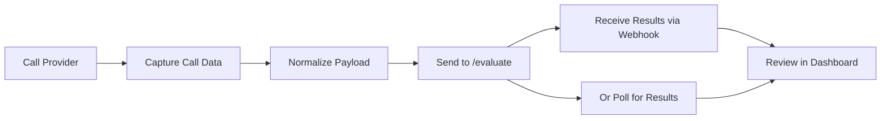

This tutorial walks you through connecting production conversation data to Bluejay's observability pipeline. By the end, you'll have a working integration that sends calls for evaluation and receives scored results.

## Prerequisites

- A Bluejay account and API key
- Access to production transcripts, audio, or metadata
- A place in your stack where completed calls or conversations can be forwarded to Bluejay

## What You'll Learn

- How to send conversation data to the evaluate endpoint
- How to receive results via webhook or polling
- How to structure transcripts, audio, and metadata for best results

## Integration Flow

Most teams connect their runtime or post-call pipeline to the Bluejay evaluate endpoint, attach any useful metadata, and then review the resulting metrics, traces, and alerts inside Monitor.

## Recommended Steps

<Steps>
  <Step title="Capture production data">
    Extract the transcript, audio recording URL, participant roles, and any tool call metadata from your provider or backend.
  </Step>
  <Step title="Normalize the payload">
    Structure the data so the transcript, metadata, and identifiers are consistent with the [evaluate endpoint schema](/api-reference/endpoint/evaluate).
  </Step>
  <Step title="Send to Bluejay">
    POST the conversation to the `/v1/evaluate` endpoint with your API key and agent ID.
  </Step>
  <Step title="Receive and review results">
    Results arrive via your configured [events webhook](/api-reference/webhook/events-webhook) or can be retrieved by [polling the call log](/api-reference/endpoint/retrieve-call-log).
  </Step>
</Steps>

## Next Steps

<CardGroup cols={2}>
  <Card title="Evaluate Endpoint" icon="code" href="/api-reference/endpoint/evaluate">
    Full API reference for the evaluate endpoint.
  </Card>
  <Card title="Tool Calls" icon="wrench" href="/monitor/observability/tool-calls">
    Include tool call data and metadata in evaluations.
  </Card>
  <Card title="Webhooks" icon="bolt" href="/core-concepts/webhook">
    Receive real-time notifications for evaluation events.
  </Card>
</CardGroup>
