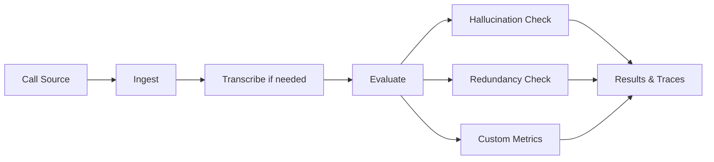

Observability gives you visibility into live customer interactions so you can understand quality, reliability, and operational health in the real world. It complements testing by showing what actually happens after deployment.

## What You'll Learn

- How to send production conversations to Bluejay for evaluation
- What gets captured and scored automatically
- How to use results for dashboards, alerts, and continuous improvement

## How Observability Works

Use Observability to evaluate production calls, inspect transcripts and traces, review metrics, and identify where your agent is drifting from the experience you intended to ship.

You can send conversations to Bluejay via the evaluate API, webhooks, or native integrations with providers like Retell, Vapi, Bland, and ElevenLabs. Bluejay accepts audio recordings, transcripts, or both. Every conversation is evaluated against your Custom Metrics and the built-in hallucination and redundancy detectors.

## What Gets Captured

- **Hallucination detection** -- identifies when agents provide incorrect or fabricated information
- **Redundancy analysis** -- measures unnecessary repetition in agent responses
- **Custom Metric scores** -- every metric you've defined is evaluated and scored
- **Token and latency data** -- operational signals for understanding performance
- **Full transcripts** -- stored and searchable for detailed investigation

## Ingestion Methods

| Method | Best For |
|--------|----------|
| [Evaluate API](/api-reference/endpoint/evaluate) | Direct integration from your backend |
| [Webhook ingestion](/core-concepts/webhook) | Platforms that support outbound webhooks |
| [Retell integration](/integrations/retell) | Retell-powered agents |
| [Vapi integration](/integrations/vapi) | Vapi-powered agents |
| [Bland integration](/integrations/bland) | Bland-powered agents |
| [ElevenLabs integration](/integrations/eleven-labs) | ElevenLabs Conversational AI |

## Next Steps

<CardGroup cols={2}>
  <Card title="API Integration Tutorial" icon="code" href="/monitor/observability/api-integration-tutorial">
    Step-by-step guide to connecting your pipeline.
  </Card>
  <Card title="Observability Deep Dive" icon="book" href="/core-concepts/observability">
    Full reference for observability concepts and data model.
  </Card>
  <Card title="Observability Cookbook" icon="book-open" href="/cookbook/observability">
    Python examples for the evaluate endpoint.
  </Card>
</CardGroup>
