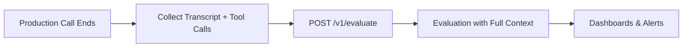

When you evaluate production calls through Bluejay's Observability pipeline, you must include the tool calls your agent made during the conversation to give your Custom Metrics access to business-level context — not just what the agent said, but what it actually did.

## How It Works

Tool calls and metadata must be passed directly in the request body of the [`/v1/evaluate`](/api-reference/endpoint/evaluate) endpoint. There is no separate enrichment step — everything must be submitted together when you send a call for evaluation.



## Passing Tool Calls to the Evaluate Endpoint

The [`/v1/evaluate`](/api-reference/endpoint/evaluate) endpoint accepts a `tool_calls` array alongside your transcript and recording data. Each tool call entry describes a single invocation your agent made during the conversation.

### Tool Call Schema

Each entry in the `tool_calls` array supports the following fields:

| Field | Type | Required | Description |
|-------|------|----------|-------------|
| `name` | string | Yes | The name of the tool or function invoked |
| `start_offset_ms` | integer | Yes | When the tool call started, in milliseconds from conversation start |
| `description` | string | No | A human-readable description of what the tool does |
| `parameters` | object | No | The input parameters passed to the tool |

### Example Request

```python
import requests
from datetime import datetime, timezone

api_key = "your-api-key-here"

call_data = {
    "agent_id": "your-agent-id",
    "recording_url": "https://storage.example.com/call-recording.mp3",
    "start_time_utc": "2024-01-15T10:00:00Z",
    "participants": [
        {"role": "AGENT", "spoke_first": True},
        {"role": "USER", "spoke_first": False}
    ],
    "transcript": [
        {
            "start_offset_ms": 100,
            "end_offset_ms": 1000,
            "speaker": "AGENT",
            "utterance": "Hello, how can I help you today?"
        },
        {
            "start_offset_ms": 1000,
            "end_offset_ms": 2000,
            "speaker": "USER",
            "utterance": "I need to check on my order status."
        },
        {
            "start_offset_ms": 2000,
            "end_offset_ms": 3500,
            "speaker": "AGENT",
            "utterance": "Let me look that up for you. Your order is currently in transit."
        }
    ],
    "tool_calls": [
        {
            "name": "check_order_status",
            "start_offset_ms": 2000,
            "description": "Look up order status by order ID",
            "parameters": {"order_id": "ORD-2024-001"}
        },
        {
            "name": "send_tracking_email",
            "start_offset_ms": 3000,
            "description": "Send tracking information to customer",
            "parameters": {
                "customer_email": "customer@example.com",
                "tracking_number": "1Z999AA1234567890"
            }
        }
    ],
    "metadata": {
        "call_duration": 120,
        "resolution_status": "resolved",
        "customer_tier": "premium"
    }
}

response = requests.post(
    "https://api.getbluejay.ai/v1/evaluate",
    headers={"X-API-Key": api_key, "Content-Type": "application/json"},
    json=call_data
)

result = response.json()
print(f"Evaluation submitted. Call ID: {result['call_id']}")
```

## Adding Metadata

The top-level `metadata` field is a free-form key-value object that stores additional context alongside the evaluation. It also powers [Dynamic Variables](/key-concepts/custom-metrics/dynamic-variables) in Custom Metrics — any `{{placeholder}}` in your metric descriptions will be substituted with matching keys from `metadata`.

```json
{
  "agent_id": "your-agent-id",
  "transcript": [],
  "tool_calls": [],
  "metadata": {
    "customer_name": "Marcus",
    "call_reason": "billing dispute",
    "account_type": "enterprise"
  }
}
```

<Tip>
  Keys in `metadata` that don't match a placeholder in any metric are simply stored as call context — they won't cause errors and are always accessible in the call trace.
</Tip>

## Adding Events

You can also pass structured events that occurred during the call using the `events` array. Events are distinct from tool calls — they represent higher-level occurrences like escalations, hold periods, or sentiment shifts.

```json
{
  "events": [
    {
      "title": "Customer Escalation",
      "start_offset_ms": 15000,
      "end_offset_ms": 18000,
      "description": "Customer requested to speak with a manager",
      "tags": ["escalation", "manager_request"],
      "metadata": {"escalation_reason": "unresolved_complaint"}
    }
  ]
}
```

## Use Cases

### Customer Support Quality

Track whether the agent used the right tools in the right order during support interactions:

```json
{
  "tool_calls": [
    {
      "name": "lookup_customer",
      "start_offset_ms": 500,
      "parameters": {"phone": "+1234567890"}
    },
    {
      "name": "check_open_tickets",
      "start_offset_ms": 1500,
      "parameters": {"customer_id": "cust_123"}
    },
    {
      "name": "create_ticket",
      "start_offset_ms": 8000,
      "parameters": {"issue": "billing_discrepancy", "priority": "high"}
    }
  ],
  "metadata": {
    "resolution_status": "ticket_created",
    "first_call_resolution": false
  }
}
```

### Compliance Monitoring

Verify that agents follow required verification procedures in regulated industries:

```json
{
  "tool_calls": [
    {
      "name": "verify_identity",
      "start_offset_ms": 1000,
      "parameters": {"method": "knowledge_based_auth", "questions_asked": 3}
    },
    {
      "name": "check_account_balance",
      "start_offset_ms": 5000,
      "parameters": {"account_id": "12345"}
    }
  ],
  "metadata": {
    "compliance_check_passed": true,
    "verification_method": "KBA",
    "regulated_action_taken": false
  }
}
```

### Appointment Scheduling

Monitor agents that interact with booking and calendar systems:

```json
{
  "tool_calls": [
    {
      "name": "check_availability",
      "start_offset_ms": 3000,
      "parameters": {"provider_id": "dr_smith", "date_range": "2024-01-20 to 2024-01-25"}
    },
    {
      "name": "book_appointment",
      "start_offset_ms": 12000,
      "parameters": {"provider_id": "dr_smith", "datetime": "2024-01-22T14:00:00Z", "type": "follow_up"}
    }
  ],
  "metadata": {
    "appointment_booked": true,
    "slots_offered": 3,
    "patient_preference_met": true
  }
}
```

## Best Practices

- **Include `start_offset_ms`** — timing data lets Bluejay correlate tool calls with specific moments in the conversation, giving metrics richer context
- **Use descriptive names** — tool call names should clearly indicate the action taken (e.g., `check_order_status` not `api_call_1`)
- **Add descriptions** — the `description` field helps Custom Metrics understand what the tool does, improving evaluation accuracy
- **Send parameters** — input parameters let you build metrics that check whether the agent used the correct inputs
- **Combine with metadata** — use `metadata` for call-level context (duration, resolution status, customer tier) and `tool_calls` for action-level detail
- **Send everything in one request** — unlike simulations, observability tool calls are submitted in the same [`/v1/evaluate`](/api-reference/endpoint/evaluate) call as the transcript and recording

## Next Steps

<CardGroup cols={2}>
  <Card title="Evaluate Endpoint Reference" icon="code" href="/api-reference/endpoint/evaluate">
    Full API reference for the evaluate endpoint.
  </Card>
  <Card title="API Integration Tutorial" icon="code" href="/monitor/observability/api-integration-tutorial">
    Step-by-step guide to connecting your pipeline.
  </Card>
  <Card title="Dynamic Variables" icon="wand-magic-sparkles" href="/key-concepts/custom-metrics/dynamic-variables">
    Use metadata to power dynamic variable substitution in metrics.
  </Card>
  <Card title="Tool Calls" icon="flask-vial" href="/test/simulations/tool-calls">
    Enrich simulation results with tool call data instead.
  </Card>
</CardGroup>
