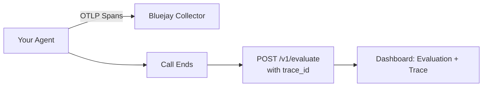

Link OTLP traces to production conversation evaluations so the trace flamegraph appears alongside call evaluations in the Bluejay dashboard.

## How It Works

1. **Instrument your agent** to export OTLP traces to Bluejay — see [Sending Traces to Bluejay](/core-concepts/traces/overview).
2. **Include the `trace_id`** in your request to the [`/v1/evaluate`](/api-reference/endpoint/evaluate) endpoint.
3. **Visualize** traces alongside call evaluations in the Bluejay dashboard.

<CardGroup cols={2}>
  <Card title="Evaluate Endpoint" icon="code" href="/api-reference/endpoint/evaluate">
    Full reference for the evaluate endpoint.
  </Card>
  <Card title="Sending Traces to Bluejay" icon="route" href="/core-concepts/traces/overview">
    OTLP setup and instrumentation.
  </Card>
</CardGroup>
