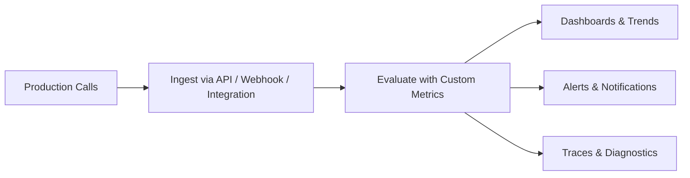

Monitor is the part of Bluejay that helps teams understand how agents behave once they are live. It turns production conversations into actionable quality signals, operational context, and ongoing feedback loops.

## What Monitor Covers

- **Observability** -- evaluate production calls with Custom Metrics and surface quality signals
- **Dashboards** -- track trends, health scores, and alert badges across your agent fleet
- **Alerts** -- get notified when metric scores cross thresholds that need attention
- **Traces** -- inspect individual conversations to understand exactly what happened

## How Monitoring Works

Use Monitor to evaluate real conversations, inspect performance trends, surface anomalies, and connect monitoring outputs to alerts and downstream workflows.

## Next Steps

<CardGroup cols={2}>
  <Card title="Observability" icon="chart-line" href="/monitor/observability/overview">
    Learn how to evaluate production conversations.
  </Card>
  <Card title="API Integration Tutorial" icon="code" href="/monitor/observability/api-integration-tutorial">
    Connect your production pipeline to Bluejay.
  </Card>
  <Card title="Dashboards" icon="table-columns" href="/key-concepts/dashboards/overview">
    Understand the dashboard views and health scores.
  </Card>
  <Card title="Alerts" icon="bell" href="/key-concepts/alerts/overview">
    Configure threshold-based notifications.
  </Card>
</CardGroup>
