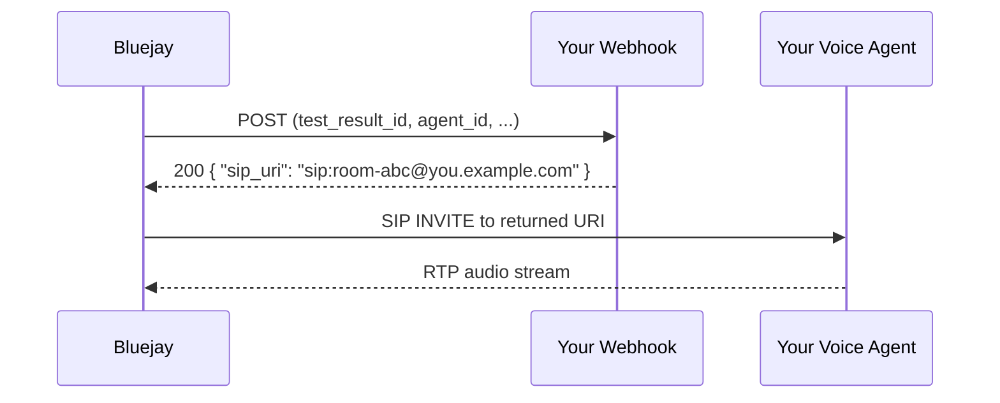

# Dynamic SIP Endpoint

A dynamic SIP webhook lets one agent reach a **different SIP destination on every call**. Instead of configuring a fixed [SIP URI](/simulation-integrations/sip), you give Bluejay a webhook URL. Right before each call dials, Bluejay POSTs that URL and dials whatever `sip_uri` (or `phone_number`) it returns.

Use this when each conversation needs its own room or endpoint — for example a fresh per-call SIP address minted by your platform — without creating a separate agent or simulation run per URI.

<Note>
This is an alternative to a static SIP URI, not an addition. An agent has **either** a fixed `sip_uri` **or** a `dynamic_sip_webhook_url`, never both.
</Note>

## How It Works



1. **Fetch** — at dial time, for each call, Bluejay POSTs your webhook URL.
2. **Resolve** — your endpoint returns the SIP URI (or phone number) to dial for this specific call.
3. **Dial** — Bluejay dials the returned destination and the simulation proceeds like any [SIP call](/simulation-integrations/sip), including the injected `X-Simulation-Result-Id` header.

If the fetch fails after retries, the call is marked `NO_CONNECTION` with error code `DYNAMIC_ENDPOINT_FAILED` — Bluejay fails loudly rather than dialing a stale endpoint. There is no static fallback.

## Setup

<Steps>
<Step title="Host your webhook">

Expose an HTTPS endpoint that Bluejay can reach from the public internet. It must accept a `POST` with a JSON body and return the destination for the call. See [Webhook Contract](#webhook-contract) below.

</Step>
<Step title="Configure your agent">

Set `dynamic_sip_webhook_url` on the agent. Providing it makes the agent a SIP agent automatically.

<Tabs>
<Tab title="Website">
Open **Agent Settings → Connection**, choose **SIP** as the connection type, and paste your endpoint into **Dynamic SIP Webhook URL**. Leave the static **SIP URI** field blank.
</Tab>
<Tab title="API">

```bash
curl -X POST https://api.getbluejay.ai/v1/add-agent \
  -H "X-API-Key: your-api-key" \
  -H "Content-Type: application/json" \
  -d '{
    "name": "My SIP Agent",
    "system_prompt": "...",
    "knowledge_base": "...",
    "goals": ["..."],
    "dynamic_sip_webhook_url": "https://your-service.com/bluejay/sip-endpoint"
  }'
```

To set it on an existing agent, use [`/v1/update-agent`](/api-reference/endpoint/update-agent) with `agent_id` and `dynamic_sip_webhook_url`.

</Tab>
<Tab title="MCP">
Pass `dynamic_sip_webhook_url` to the `add_agent` or `update_agent` tool.
</Tab>
</Tabs>

</Step>
<Step title="Run a simulation">

Create a simulation and queue runs as usual — see [Simulations](/core-concepts/simulations). Each call independently fetches its own destination from your webhook.

</Step>
</Steps>

## Webhook Contract

### Request

Bluejay sends a `POST` with `Content-Type: application/json`:

```json
{
  "test_result_id": "583149",
  "experiment_run_id": 163456,
  "agent_id": 22330,
  "organization_id": "fb838ba6-...",
  "nonce": "583149",
  "timestamp": "2026-07-07T21:43:48.461190+00:00"
}
```

| Field | Description |
|-------|-------------|
| `test_result_id` | Unique ID for this call. Use it as your idempotency key. |
| `experiment_run_id` | The simulation run this call belongs to. |
| `agent_id` | The Bluejay agent being dialed. |
| `organization_id` | Your organization ID. |
| `nonce` | Equal to `test_result_id`; safe to treat as the idempotency key. |
| `timestamp` | ISO 8601 UTC time the request was issued. |

### Response

Return `200 OK` with a JSON object containing **`sip_uri`** (or **`phone_number`**):

```json
{
  "sip_uri": "sip:room-abc@your-sip.example.com",
  "sip_username": "optional-per-call-user",
  "sip_password": "optional-per-call-secret",
  "custom_headers": { "X-Your-Header": "value" },
  "metadata": { "room": "abc" }
}
```

| Field | Required | Description |
|-------|----------|-------------|
| `sip_uri` | one of `sip_uri` / `phone_number` | SIP destination to dial for this call. |
| `phone_number` | one of `sip_uri` / `phone_number` | Phone number to dial instead of a SIP URI. |
| `sip_username` | optional | Per-call SIP auth username. |
| `sip_password` | optional | Per-call SIP auth password. |
| `custom_headers` | optional | Extra headers merged into the SIP INVITE. |
| `metadata` | optional | Echoed back and stored on the test result for your reference. |

<Warning>
The endpoint must be **idempotent on `test_result_id`**. Bluejay retries with exponential backoff (3 attempts), so a given `test_result_id` must always resolve to the same destination — return the room you already minted rather than allocating a new one on a retry.
</Warning>

## Security

Bluejay POSTs your endpoint from its own infrastructure, so treat it like any inbound webhook: restrict who can reach it. Where a shared signing secret is available for your agent, Bluejay signs the request body with HMAC-SHA256 and sends it in the `X-Bluejay-Signature` header — verify it the same way as other [Bluejay webhooks](/simulation-integrations/http-webhooks#verifying-webhook-signatures). If no signing secret is configured, requests are sent unsigned; in that case gate access with an allowlist or a secret embedded in the URL path.

## Troubleshooting

| Symptom | Cause | Fix |
|---------|-------|-----|
| Call ends immediately as `NO_CONNECTION` / `DYNAMIC_ENDPOINT_FAILED` | Webhook returned non-2xx, timed out, or returned no `sip_uri`/`phone_number` after 3 attempts | Confirm the endpoint is publicly reachable and returns a valid destination JSON. |
| Same call dialed a stale/wrong room on retry | Endpoint is not idempotent on `test_result_id` | Key your room allocation on `test_result_id` and return the same value across retries. |
| Webhook never called | Agent has a static `sip_uri` set, or connection type isn't SIP | Clear `sip_uri`; setting `dynamic_sip_webhook_url` alone infers SIP. |
