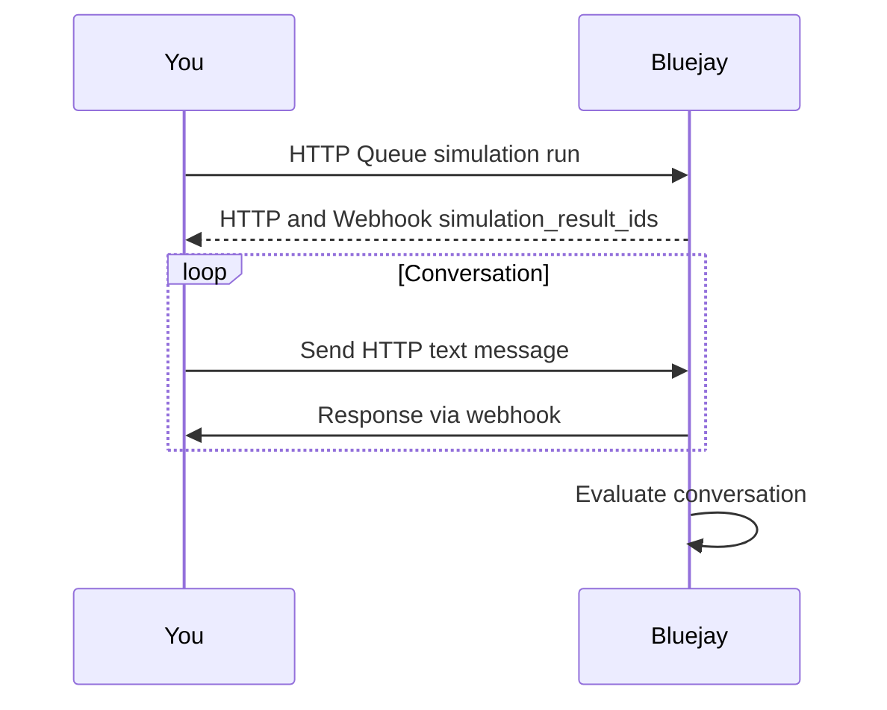

Bluejay supports testing text-based agents through HTTP webhooks, enabling bidirectional communication for chat applications, SMS bots, customer support systems, and any text-based conversational interface.

## How It Works

The HTTP webhook integration allows you to simulate conversations with your text-based agent. Bluejay sends messages to your agent via HTTP, and your agent responds through a configured webhook endpoint.



## Quick Start

### 1. Queue a Simulation Run

Start a new HTTP text simulation by calling the Queue HTTP Text Simulation Run endpoint. This initializes the simulation and returns IDs you'll need for sending messages.

```bash
curl -X POST https://api.getbluejay.ai/v1/queue-http-text-simulation-run \
  -H "X-API-Key: your-api-key" \
  -H "Content-Type: application/json" \
  -d '{
    "simulation_id": "your-simulation-id"
  }'
```

**Response:**

```json
{
  "simulation_run_id": "run_abc123",
  "simulation_result_ids": ["result_xyz789", "result_def456"],
  "agent_id": "agent_123",
  "status": "success"
}
```

The response includes:
- **simulation_run_id**: Unique identifier for this simulation run
- **simulation_result_ids**: Array of result IDs, one per digital human in the simulation
- **agent_id**: The agent being tested

### 2. Send Messages

Use the Send HTTP Text Message endpoint to send messages during the simulation. Each message should include the `simulation_result_id` from the previous step.

```bash
curl -X POST https://api.getbluejay.ai/v1/send-http-text-message \
  -H "X-API-Key: your-api-key" \
  -H "Content-Type: application/json" \
  -d '{
    "message": "Hello, I need help with my order",
    "simulation_result_id": "result_xyz789"
  }'
```

**Request Parameters:**

| Parameter | Type | Required | Description |
|-----------|------|----------|-------------|
| `message` | string | Yes | The text message to send |
| `simulation_result_id` | string | Yes | ID of the simulation result |
| `end_conversation` | boolean | No | If `true`, ends and evaluates the conversation |
| `end_turn` | boolean | No | If `true` (default), processes the message immediately; if `false`, stacks it for later |
| `message_id` | string | No | Unique ID for deduplication |

### 3. Receive Responses

Bluejay sends the digital human's responses to your configured webhook URL. Your server should be ready to receive POST requests with the conversation messages.

## Verifying Webhook Signatures

To ensure webhook requests are genuinely from Bluejay, you should verify the signature included in each request. Bluejay signs the request body using HMAC-SHA256 and includes the signature in the `X-Bluejay-Signature` header.


