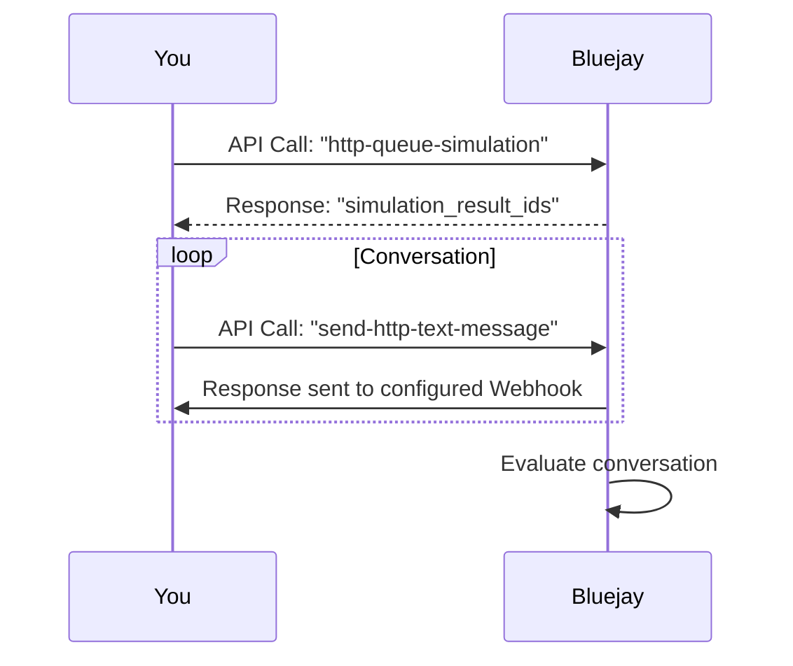

## How It Works

The HTTP webhook integration allows you to simulate conversations with your text-based agent. Bluejay sends messages to your agent via HTTP, and your agent responds through a configured webhook endpoint.



## Tutorial

<Steps>
<Step title="Create an Agent">

<Tabs>
<Tab title="Website">
Go to the "Agents & Simulations" section in the sidebar. Click the "+" button to create a new agent. Choose "Text/Chat" as the agent type and select "HTTP Webhook" as the integration. Make sure to enter your webhook URL in the designated field.

<Frame>
  
</Frame>
</Tab>

<Tab title="API">
Use the [Add Agent endpoint](/api-reference/endpoint/add-agent) to create an agent programmatically and save the `agent_id`.

```bash
curl -X POST https://api.getbluejay.ai/v1/agents \
  -H "X-API-Key: your-api-key" \
  -H "Content-Type: application/json" \
  -d '{
    "name": "Customer Support Bot",
    "webhook_url": "https://your-server.com/webhook",
    ...
  }'
```
</Tab>
</Tabs>
</Step>

<Step title="Create a Simulation">

<Tabs>
<Tab title="Website">
Click the "Create new simulation" button.

<Frame>
  
</Frame>
</Tab>

<Tab title="API">
Use the [Create Simulation endpoint](/api-reference/endpoint/create-simulation) to create a simulation programmatically and save the `simulation_id`.

```bash
curl -X POST https://api.getbluejay.ai/v1/create-simulation \
  -H "X-API-Key: your-api-key" \
  -H "Content-Type: application/json" \
  -d '{
    "agent_id": "258",
    "name": "Customer Support Test",
    ...
  }'
```
</Tab>
</Tabs>
</Step>

<Step title="Create Digital Humans">

<Tabs>
<Tab title="Website">
After selecting the number of agents in the "Goal Adherence" section, click "Next".

<Frame>
  
</Frame>
</Tab>

<Tab title="API">
Use the [Create Digital Human endpoint](/api-reference/endpoint/create-digital-human) to create digital humans programmatically:

```bash
curl -X POST https://api.getbluejay.ai/v1/create-digital-human \
  -H "X-API-Key: your-api-key" \
  -H "Content-Type: application/json" \
  -d '{
    "simulation_id": "2154",
    "name": "Frustrated Customer",
    "scenario": "Customer waiting for refund for 2 weeks",
    "success_criteria": "Agent provides clear timeline and reference number",
    ...
  }'
```

You can create multiple digital humans with different scenarios.
</Tab>
</Tabs>
</Step>

<Step title="Queue a Simulation Run">

<Tabs>
<Tab title="Website">
Click "Create and start X chats" to queue a new simulation run. The "#ID" shown is the `simulation_result_id` that you'll need for sending messages.

<Frame>
  
</Frame>
</Tab>

<Tab title="API">
Use the [Queue HTTP Text Simulation Run endpoint](/api-reference/endpoint/queue-http-text-simulation-run) to start a simulation run. This initializes the simulation and returns the `simulation_result_ids` that you'll need for sending messages. 

```bash
curl -X POST https://api.getbluejay.ai/v1/queue-http-text-simulation-run \
  -H "X-API-Key: your-api-key" \
  -H "Content-Type: application/json" \
  -d '{
    "simulation_id": "2154"
  }'
```

**Response:**

```json
{
    "simulation_run_id": "4434",
    "simulation_result_ids": [
        "13062"
    ],
    "agent_id": "258",
    "status": "success"
}
```

The response includes:
- **simulation_run_id**: Unique identifier for this simulation run
- **simulation_result_ids**: Array of result IDs, one per digital human in the simulation
- **agent_id**: The agent being tested
</Tab>
</Tabs>
</Step>

  <Step title="Send Messages">
    Use the [Send HTTP Text Message endpoint](/api-reference/endpoint/send-http-text-message) to send messages during the simulation. Each message should include the `simulation_result_id` from the previous step.

```bash
curl -X POST https://api.getbluejay.ai/v1/send-http-text-message \
  -H "X-API-Key: your-api-key" \
  -H "Content-Type: application/json" \
  -d '{
    "simulation_result_id": "13062",
    "message": "What operating system do you have?",
    "end_conversation": false,
    "end_turn":false,
    "message_id": "682098ae-2ec1-4d4f-8223-0cdd9580cff3"
}'
```

**Request Parameters:**

| Parameter | Type | Required | Description |
|-----------|------|----------|-------------|
| `message` | string | Yes | The text message to send |
| `simulation_result_id` | string | Yes | ID of the simulation result |
| `end_conversation` | boolean | No | If `true`, ends and evaluates the conversation |
| `end_turn` | boolean | No | If `true` (default), processes the message immediately; if `false`, stacks it for later |
| `message_id` | string | No | Unique ID for deduplication |
  </Step>

  <Step title="Receive Webhook Responses">
    Bluejay sends the digital human's responses to your configured webhook URL. Your server should be ready to receive POST requests with the conversation messages.

**Webhook Payload:**

When a digital human responds, Bluejay will POST to your webhook URL with the following structure:

```json
{
  "simulation_result_id": "13062",
  "message": "I can help you with that. Can you provide your order number?",
  "message_id": "15a481c1-asd2-s9322-9bac-788d52effdc8",
  "end_conversation": false
}
```

**Webhook Request Headers:**

| Header | Description |
|--------|-------------|
| `Content-Type` | `application/json` |
| `X-Bluejay-Signature` | HMAC-SHA256 signature for verification |
| `X-Simulation-Result-Id` | The simulation result ID for this conversation |

Your webhook endpoint should:
1. Return a `200 OK` status code to acknowledge receipt
2. Verify the `X-Bluejay-Signature` header (see Verifying Webhook Signatures section below)
3. Process the message and send follow-up messages using the Send HTTP Text Message endpoint
  </Step>
</Steps>

## Verifying Webhook Signatures

To ensure webhook requests are genuinely from Bluejay, you should verify the signature included in each request. Bluejay signs the request body using HMAC-SHA256 and includes the signature in the `X-Bluejay-Signature` header.


