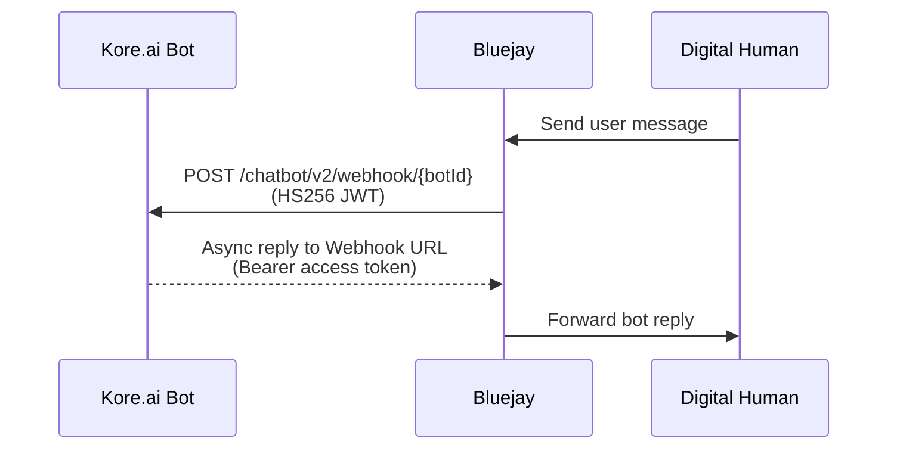
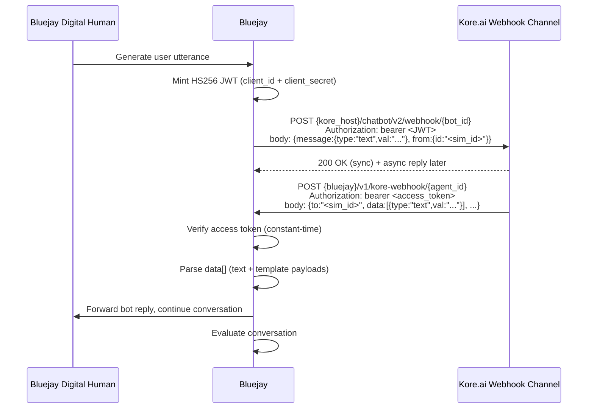

## How It Works

Bluejay provisions a per-agent **Webhook URL** and **Access Token** that you paste into your Kore.ai bot's Webhook channel. Bluejay handles the bidirectional translation between its HTTP webhook contract (HMAC-signed) and Kore.ai's Webhook V2 API (HS256 JWT) — no customer-hosted shim required.

<Tabs>
<Tab title="Simple">



</Tab>

<Tab title="Technical">



</Tab>
</Tabs>

## Prerequisites

You need:

- A Kore.ai bot with a **Webhook channel** configured (Bot Builder → Channels & Flows → Webhook).
- The Webhook channel's **app credentials** with **HS256** as the JWT signing algorithm. RS256 is not supported.
- A Bluejay account.

<Warning>
  If your Kore.ai tenant is on an internal network (private IPs like `10.x.x.x` resolving via DNS), Bluejay must be able to reach the host. Test reachability from a public network with `curl https://<your-kore-host>/` before configuring the integration. Internal-only tenants require a VPN tunnel or a publicly reachable Kore endpoint.
</Warning>

## Setting Up the Integration

<Steps>
<Step title="Collect Kore.ai credentials">

In the Kore.ai Bot Builder, go to **Channels & Flows → Webhook → Configurations**. From the panel, copy:

| Field | Example | Notes |
|---|---|---|
| **Host URL** | `https://platform.kore.ai` | The Kore.ai platform domain — **just the host**, no path. |
| **Bot ID** | `st-d536681d-57be-5068-88e3-eb4b9644b9a8` | Shown as "Bot Id". |
| **Client ID** | `cs-8167aff9-e1ed-5ff3-9d27-12d09462ff27` | Shown under the Webhook channel's app. |
| **Client Secret** | (hidden) | Click *Display* to reveal. **Treat as a secret.** Must be paired with **HS256**. |

<Tip>
  Do **not** paste the full Post URL (`https://.../chatbot/v2/webhook/<bot_id>`) into the Kore Host field — Bluejay appends the path automatically and you'll get a 404. The Host field is just the platform domain.
</Tip>

</Step>

<Step title="Create the agent in Bluejay">

<Tabs>
<Tab title="Website">
Go to **Agents → New Agent**. Choose **Mode = Text** and **Text Connection Type = Kore.ai**. Fill in:

- **Kore Host** — paste the Host URL from step 1
- **Bot ID** — paste the Bot ID from step 1
- **Client ID** — paste the Client ID from step 1
- **Client Secret** — paste the Client Secret from step 1

Click **Create**. Bluejay will generate the Webhook URL and Access Token in the dialog. Copy both — the Access Token is shown **once**.

<Frame>
  
</Frame>
</Tab>

<Tab title="API">
Use the [Add Agent endpoint](/api-reference/endpoint/add-agent) and pass `connection_type: "KORE"` with all four Kore fields:

```bash
curl -X POST https://api.getbluejay.ai/v1/add-agent \
  -H "X-API-Key: your-api-key" \
  -H "Content-Type: application/json" \
  -d '{
    "name": "Kore Support Bot",
    "type": "INBOUND",
    "mode": "TEXT",
    "connection_type": "KORE",
    "system_prompt": "...",
    "knowledge_base": "",
    "goals": [],
    "kore_host": "https://platform.kore.ai",
    "kore_bot_id": "st-d536681d-57be-5068-88e3-eb4b9644b9a8",
    "kore_client_id": "cs-8167aff9-e1ed-5ff3-9d27-12d09462ff27",
    "kore_client_secret": "<HS256 secret>"
  }'
```

Then call `/v1/generate-kore-inbound-token` with the returned `agent_id` to receive the plaintext access token (shown once).
</Tab>
</Tabs>

</Step>

<Step title="Configure Bluejay's Webhook URL in Kore.ai">

Back in the Kore.ai Bot Builder → **Channels & Flows → Webhook → Configurations**:

1. Set **Integration Mode** to **Asynchronous**.
2. Paste Bluejay's **Webhook URL** into the **Post URL** field. The URL format is:
   ```
   https://api.getbluejay.ai/v1/kore-webhook/<agent_id>
   ```
3. Paste Bluejay's **Access Token** into the **Access Token** field.
4. **Save**, then **Publish** the bot.

<Warning>
  The Webhook channel will not fire until the bot is published. If you re-publish later, the existing URL and Access Token stay valid — you don't need to rotate them.
</Warning>

</Step>

<Step title="Run a simulation">

<Tabs>
<Tab title="Website">
Create digital humans, then queue a chat simulation against the Kore.ai agent. Bluejay's first user message is POSTed to Kore.ai; Kore.ai's async reply lands on Bluejay's Webhook URL and continues the turn loop.

<Frame>
  
</Frame>
</Tab>

<Tab title="API">
Use the [Queue HTTP Text Simulation Run endpoint](/api-reference/endpoint/queue-http-text-simulation-run) — Kore agents route through the same simulation queue as HTTP webhook agents.

```bash
curl -X POST https://api.getbluejay.ai/v1/queue-http-text-simulation-run \
  -H "X-API-Key: your-api-key" \
  -H "Content-Type: application/json" \
  -d '{ "simulation_id": "<id>" }'
```
</Tab>
</Tabs>

</Step>
</Steps>

## How Bluejay parses Kore.ai replies

Kore.ai's V2 webhook replies put text in the `data[]` array, not in a top-level `text` field. Bluejay automatically extracts user-facing content from:

- `data[].type == "text"` → uses `data[].val` directly
- `data[].type == "template"` → uses `payload.text` plus button `title` values (rendered as `Options: A | B | C`)
- Pure event/echo packets (where `to` is a bot ID, or `data[]` is empty) → skipped, no transcript impact

Kore's `endOfTask` and `endReason` fields are logged but do **not** terminate the Bluejay conversation — only the digital human's turn-limit / goal-achievement logic ends the run. This is intentional: a "task ended" in Kore (e.g. `Failed_TaskFailureEvent_Triggered` for a KB miss) just means the current intent finished; the user can ask a follow-up.

## Rotating credentials

- **Access Token** — click **Regenerate access token** in Bluejay's Connection Settings. The old token is invalidated immediately; re-paste the new one into Kore.ai.
- **Client Secret** — update it in both Kore.ai (regenerate on Kore's side) and Bluejay (paste the new value into Client Secret on the agent's Connection Settings).

## Troubleshooting

| Symptom | Likely cause | Fix |
|---|---|---|
| `[KORE→] httpx error … type=ConnectTimeout` | Kore host unreachable from Bluejay's network (private IPs / firewall) | Use a publicly reachable Kore tenant, or arrange a network tunnel |
| `[KORE→] response status=401 invalid access token` | JWT rejected by Kore | Verify Client ID and Client Secret match the Webhook channel exactly, and the channel uses **HS256** |
| `[KORE→] response status=404` | Bot ID wrong, or bot not published | Check `kore_bot_id`; ensure the bot was published after enabling the Webhook channel |
| URL contains `/chatbot/v2/webhook/...` doubled | `kore_host` was set to the full Post URL instead of just the host | Edit Kore Host to just `https://<platform>` |
| Inbound `POST /v1/kore-webhook/{id}` returns 401 | Access Token in Kore doesn't match Bluejay's encrypted token | Click **Regenerate access token** in Bluejay and re-paste in Kore |
| Bot replies appear in Kore but never reach Bluejay | Webhook channel set to **Synchronous** instead of **Asynchronous** | Switch to Asynchronous and re-publish |

## Out of scope

- **Voice mode** — Kore.ai supports voice channels, but the Bluejay Kore integration is text-only.
- **Tool-call traces** — Kore's V2 webhook channel does not expose internal integration calls (KB lookup, IDP query, agent transfer). The final bot reply is the only signal Bluejay receives; tool-adherence evaluations against Kore agents are thinner than against agents that emit `tool_call` payloads directly.
- **Multi-turn template forms** — Kore can prompt with structured forms; Bluejay flattens the visible text into the transcript and skips the form fields.
