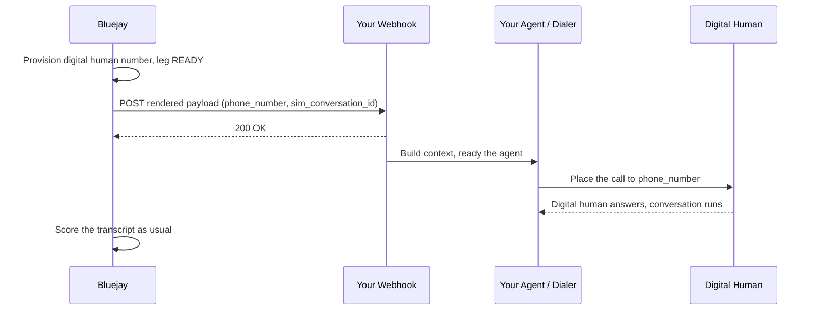

# Outbound Trigger Webhook

An outbound trigger webhook inverts who places the call. Instead of Bluejay dialing your agent, **your system dials Bluejay's digital human**. When a run dispatches, Bluejay provisions the digital human's number, POSTs your webhook with that number, and waits for your call to arrive.

Use this when the thing you want to test *is* your own outbound pipeline: the context your flow assembles, the agent it warms up, the number it dials from. Bluejay originates nothing, so nothing about your dialing path is simulated away.

<Note>
This is the mirror image of a [dynamic SIP webhook](/simulation-integrations/dynamic-sip-webhook). There, Bluejay asks you *where to dial*. Here, Bluejay tells you *what number to call* and then answers. An agent should use one or the other, never both.
</Note>

## How It Works



1. **Provision**: the run creates the digital human's inbound number and moves the leg to `READY`.
2. **Trigger**: Bluejay POSTs your webhook with the number to call and a `sim_conversation_id` to correlate.
3. **Dial**: your flow assembles whatever context it needs and places a real call to that number.
4. **Converse**: the digital human answers as the caller persona; the call is recorded and scored like any other simulation.

The leg waits for your call for `ringing_timeout` seconds (a simulation setting). If nothing arrives in that window it ends as `NO_ANSWER` / `INBOUND_NO_INCOMING_CALL`.

<Tip>
Set `ringing_timeout` generously when your flow has queueing or build-up time before it dials. If your pipeline can take four minutes to place the call, a 300-second timeout will fail runs that would otherwise have connected.
</Tip>

## What It Is Not

| Not this | Why |
|----------|-----|
| A [dynamic SIP webhook](/simulation-integrations/dynamic-sip-webhook) | That one answers "which SIP URI should Bluejay dial?" This one asks you to dial us. |
| A results or event webhook | Nothing is reported back through it. Transcripts and scores stay in Bluejay; see [webhooks](/simulation-integrations/http-webhooks) for outbound notifications. |
| A chat/HTTP agent connection (`http_webhook`) | That is how Bluejay talks to a text agent. This fires once per voice leg, before any audio exists. |
| A way to pass per-call context into Bluejay | The payload flows Bluejay → you. Your flow owns the context it gives its own agent. |

## Setup

<Steps>
<Step title="Host your webhook">

Expose an HTTPS endpoint Bluejay can reach from the public internet. It must accept a `POST`, return 2xx quickly, and then place the call out of band. Do not hold the response open until the call connects.

<Tip>
**Let an AI build it for you.** Paste the prompt below into any coding assistant. It fully specifies the contract, so you only add your own dialing logic.
</Tip>

```text Prompt: generate a Bluejay outbound trigger webhook
Build an HTTP webhook endpoint for Bluejay's "outbound trigger webhook" feature in <your language/framework, e.g. Python + FastAPI>.

Requirements:
- Expose a single POST route (e.g. POST /bluejay/outbound-call) that accepts a JSON body:
  { "phone_number": "+15551234567", "sim_conversation_id": "1234567" }
  (The exact keys come from the payload template configured on the Bluejay agent, so read
   them defensively and log the whole body.)
- Respond 200 immediately, then place the call ASYNCHRONOUSLY: dial "phone_number" with my
  own agent/dialer so it talks to whoever answers.
- Accept ANY phone number Bluejay sends. Do not validate it against a registry of known
  numbers. Bluejay may assign a new digital human number at any time, and rejecting it
  fails the test before a call is ever placed.
- Idempotency: the same "sim_conversation_id" may be delivered more than once (Bluejay
  retries up to 3x with backoff, and delivery is at-least-once). Dial only once per
  sim_conversation_id; ignore duplicates.
- Optional security: if I set an env var BLUEJAY_WEBHOOK_SECRET, verify the request's
  "X-Bluejay-Signature" header as HMAC-SHA256(secret, raw_request_body) and reject on mismatch.
- Leave a clearly marked TODO where I plug in my own dialing call and context building.
- Include a one-line run command and a curl example that exercises the endpoint.
```

</Step>
<Step title="Configure your agent">

The agent must be **OUTBOUND**. Set `outbound_trigger_webhook_url`, and optionally a payload template.

<Tabs>
<Tab title="Website">
Open **Agent Settings → Connection**, set the agent type to **Outbound**, and paste your endpoint into **Outbound Trigger Webhook URL**. Leave **SIP URI** and **Dynamic SIP Webhook URL** blank.
</Tab>
<Tab title="API">

```bash
curl -X POST https://api.getbluejay.ai/v1/update-agent \
  -H "X-API-Key: your-api-key" \
  -H "Content-Type: application/json" \
  -d '{
    "agent_id": 12345,
    "agent_type": "OUTBOUND",
    "outbound_trigger_webhook_url": "https://your-service.com/bluejay/outbound-call",
    "outbound_trigger_payload_template": {
      "phone_number": "{{digital_human.phone_number}}",
      "sim_conversation_id": "{{sim_conversation_id}}"
    }
  }'
```

</Tab>
<Tab title="MCP">
Pass `outbound_trigger_webhook_url` (and optionally `outbound_trigger_payload_template`) to the `add_agent` or `update_agent` tool.
</Tab>
</Tabs>

</Step>
<Step title="Give every digital human a number">

Each digital human in the simulation needs its own phone number, since that is the number your flow will dial. Two digital humans sharing one number collide when both run, and the second leg is aborted with `SIP_TRUNK_RECYCLED`.

</Step>
<Step title="Run a simulation">

Queue a run as usual, see [Simulations](/test/simulations/overview). Every leg fires its own webhook and waits for its own inbound call.

</Step>
</Steps>

## Payload Contract

### Default payload

With no template configured, Bluejay sends exactly:

```json
{
  "phone_number": "+15551234567",
  "sim_conversation_id": "1234567"
}
```

### Custom template

Set `outbound_trigger_payload_template` to any JSON object. Literal values pass through untouched (useful for your own auth key), and `{{tokens}}` are substituted:

```json
{
  "webhook_key": "your-own-shared-secret",
  "phone_number": "{{digital_human.phone_number}}",
  "sim_conversation_id": "{{sim_conversation_id}}",
  "persona": "{{digital_human.name}}",
  "notes": "Bluejay sim {{simulation.name}}"
}
```

### Available tokens

| Token | Value |
|-------|-------|
| `{{digital_human.phone_number}}` | The number to dial. The one field your flow really needs. |
| `{{digital_human.id}}` | Digital human ID. |
| `{{digital_human.name}}` | Digital human name. |
| `{{digital_human.intent}}` | Intent summary or description. |
| `{{sim_conversation_id}}` | Unique ID for this leg. Use as your idempotency key. |
| `{{simulation.id}}` | Simulation ID. |
| `{{simulation.name}}` | Simulation name. |
| `{{agent.id}}` | Bluejay agent ID. |
| `{{agent.name}}` | Bluejay agent name. |

A token that is the entire value keeps its native type; a token embedded in a longer string is substituted as text. Unknown tokens are left verbatim rather than blanked, so a typo shows up in your logs as `{{digitl_human.phone_number}}`.

### Headers

| Header | Always sent | Description |
|--------|-------------|-------------|
| `Content-Type: application/json` | yes | |
| `X-Bluejay-Idempotency-Key` | yes | Equals `sim_conversation_id`. Dedupe on it. |
| `X-Bluejay-Signature` | when the agent has a signing key | HMAC-SHA256 of the raw request body. Verify as with other [Bluejay webhooks](/simulation-integrations/http-webhooks#verifying-webhook-signatures). |

### Delivery and failure

Bluejay makes up to 3 attempts with exponential backoff. If all fail, the leg is marked `NO_CONNECTION` with error code `OUTBOUND_TRIGGER_FAILED` and the failure text records the status your endpoint returned. Delivery is at-least-once: a POST that succeeded on your side but timed out on ours will be retried, which is why the idempotency key matters.

## Choosing The Right Field

Voice agents have several connection fields and only one of them should describe how a call starts.

| Field | Who dials | Use when |
|-------|-----------|----------|
| `outbound_trigger_webhook_url` | **You dial Bluejay** | You want your real outbound pipeline under test. |
| `sip_uri` | Bluejay dials you | Your agent has one fixed SIP destination. |
| `dynamic_sip_webhook_url` | Bluejay dials you | The SIP destination differs per call. |
| `phone_number` | Bluejay dials you | Your agent answers on a phone number. |

<Warning>
Setting a trigger webhook **and** a `sip_uri` (or `dynamic_sip_webhook_url`) puts two origination models on one agent. Clear the ones you are not using, or you will see a failed dial recorded against a leg that is simultaneously waiting for your inbound call.
</Warning>

### SIP digest credentials

`sip_username` / `sip_password` on a SIP agent make the digital human's inbound trunk demand SIP digest auth. If your flow reaches the digital human over the **PSTN** (dialing the phone number, which is the normal case here) the call arrives through Bluejay's carrier, which never answers a digest challenge, and the call fails before it rings. Leave the credentials empty unless your flow sends an authenticated SIP INVITE directly.

## Troubleshooting

| Symptom | Cause | Fix |
|---------|-------|-----|
| Webhook never fires, run sits at 0 tests | Dispatch failed before the trigger. Most often the digital human's number is held by an always-on digital human (`ALWAYS_ON_PHONE_IN_USE`). | Give the digital human a number no always-on digital human is serving. |
| `NO_CONNECTION` / `OUTBOUND_TRIGGER_FAILED` | Your endpoint returned non-2xx or timed out on all 3 attempts. A 403 usually means your endpoint validated the incoming number against a list. | Accept any `phone_number` Bluejay sends, and check auth on your endpoint. |
| `NO_ANSWER` / `INBOUND_NO_INCOMING_CALL` | Webhook succeeded but no call ever arrived within `ringing_timeout`. | Check your dialer's own logs; the call is failing on your side. Raise `ringing_timeout` if your flow is simply slow. |
| Call fails instantly at 0 seconds | Digest credentials on the agent, or your dialer cannot reach the number. | Clear `sip_username` / `sip_password` for a PSTN dial, then verify the number is dialable from your carrier. |
| Second leg aborted `SIP_TRUNK_RECYCLED` | Two digital humans share one phone number. | Give each digital human its own number. |
