This guide walks you through running Bluejay simulations directly against your Retell voice agents. Once configured, every simulation Bluejay runs against a Retell-bound agent will dial outbound through Retell automatically, and every tool call the agent makes during the conversation will land in Bluejay's Tool Adherence tab.

### Quick Prerequisites

- **Retell API Key with the Webhook badge**
- **At least one Retell agent with a phone number bound to it**
- **A Bluejay Account**

### Setting Up the Integration

### 1. Generate Your Retell API Key

1. In Retell → **Settings** → **API Keys**, generate a new API key
2. Ensure the key has the **Webhook** badge next to it (Bluejay uses it to verify webhook signatures)

{/* SCREENSHOT — Retell API Keys page with the Webhook badge highlighted next to a key. */}


### 2. Bind a Phone Number to Your Agent in Retell

1. In Retell → **Phone Numbers**, click into your phone number
2. Set both **Inbound Call Agent** AND **Outbound Call Agent** to your agent
3. Save

{/* SCREENSHOT — Retell phone-number config showing both Inbound + Outbound dropdowns set to the same agent. */}


### 3. Set the Webhook URL on Your Retell Agent

1. In Retell → your agent → **Webhook Settings**
2. Paste this URL into **Agent Level Webhook URL**:

```
https://api.getbluejay.ai/v1/integrations/retell
```

3. Keep the default events enabled: `call_started`, `call_ended`, `call_analyzed`
4. Save and publish the agent

### 4. Save Your Key in Bluejay and Sync

1. In Bluejay → **Settings** → **Integrations** → **Retell** tab
2. Paste your Retell API key and click **Save Changes**
3. Click **Sync Agents from Retell** — confirm in the prompt
4. Within 5–15 seconds, every Retell agent in your workspace appears in Bluejay as a native agent

{/* SCREENSHOT — Bluejay Integrations → Retell tab with the API key field and Sync button visible. */}


### 5. Enable Auto-Start on the Bluejay Agent

1. Open the Bluejay agent → **Agent Settings** → **Simulation Settings** tab
2. Toggle **"Auto-start outbound call"** ON (visible for Retell-bound agents)
3. Changes save automatically

{/* SCREENSHOT — Simulation Settings with Auto-start toggle ON. */}


<Warning>
  The auto-start toggle is **off by default**. Without it, your simulations will queue and reach READY but no call will be dialed. This is the most common reason customers think the integration isn't working.
</Warning>

## You're Done — Run a Simulation

Create a test case with a Digital Human persona and a Bluejay-routed test phone number, then click **Run Simulation**. Within ~10 seconds Bluejay will dial through Retell, the agent will run the conversation against your Digital Human, and after the call ends every tool call shows up in the conversation's **Tool Adherence** tab with name, parameters, timing, and (for Custom HTTP tools) the response body.

{/* SCREENSHOT — Bluejay conversation detail panel: Tool Adherence tab populated with 3-4 tool-call rows. */}


## How It Works Under the Hood

```mermaid
flowchart LR
    Sim["Run Simulation in Bluejay"] --> Dispatch["Bluejay calls Retell create_phone_call"]
    Dispatch --> Twilio["Retell dials via Twilio"]
    Twilio --> LiveKit["Call routed to LiveKit"]
    LiveKit --> DH["Digital Human joins the room"]
    DH --> Convo["Retell agent ↔ Digital Human"]
    Convo --> Webhook["call_analyzed webhook → Bluejay"]
    Webhook --> Capture["Tool calls saved to tool_call_logs"]
    Capture --> UI["Tool Adherence tab populates"]
```



## What Gets Captured

| Tool type | Name + arguments + timing | Result content |
|---|---|---|
| **Custom HTTP** (calls your API) | ✅ | ✅ — full response body |
| **Code** (inline JS in Retell) | ✅ | ⚠️ — always `{}` (Retell sandbox limitation) |
| **Built-ins** (`end_call`, `transfer_call`, etc.) | ✅ | n/a |

<Note>
  **Code-tool limitation**: Retell's Code-tool sandbox doesn't expose return values in their webhook payload, API, or trace logs — even Retell's own dashboard shows `{}` for these. For full output capture, use **Custom HTTP tools** that hit your own backend. Bluejay captures both faithfully — Custom tools just have richer data to show.
</Note>

## Re-Syncing

Click **Sync Agents from Retell** in Settings → Integrations → Retell any time:

- Agents are matched by Retell `agent_id` — **never duplicated**
- Name changes in Retell update the Bluejay agent name
- Prompt changes create a new prompt version with commit message `"synced from Retell"` (only when text actually changed)
- Phone-number binding changes flow through automatically

## Total Onboarding Time

About **5 minutes**, copy-paste only. Step 1 takes ~30s, Steps 2–3 are a couple of clicks in Retell, Steps 4–5 are a couple of clicks in Bluejay. No code on your side. No infrastructure.

## Common Gotchas

| Problem | Cause | Fix |
|---|---|---|
| Simulation queues but no call is placed | Auto-start toggle is off | Toggle it on in agent's Simulation Settings |
| Call rings but disconnects with no DH on the line | Test case phone is your personal number, not a Bluejay-routed test number | Use a Bluejay-routed test number |
| Webhook events never arrive | API key signing the webhook lacks the Webhook badge | Designate the correct key in Retell's API Keys page |
| Tool Adherence tab is empty even after a call | The agent didn't actually invoke any tools during the call | Check the Retell call detail to confirm tools fired; if not, the agent's flow didn't reach a tool node |
| Synced agent prompt is `[Conversation Flow managed in Retell …]` | Agent is a Conversation Flow type | Expected — edit the flow in Retell, then re-sync |

## Next Steps

<CardGroup cols={2}>
  <Card title="Retell Observability" icon="eye" href="/integrations/retell">
    Set up production-call evaluation with the Retell webhook.
  </Card>
  <Card title="Simulation Overview" icon="flask-vial" href="/test/simulations/overview">
    Learn how simulations work in Bluejay end-to-end.
  </Card>
  <Card title="Tool Calls" icon="wrench" href="/test/simulations/tool-calls">
    Understand how Bluejay handles tool call enrichment.
  </Card>
  <Card title="Digital Humans" icon="user" href="/key-concepts/digital-humans/overview">
    Configure the personas that converse with your agents.
  </Card>
</CardGroup>

