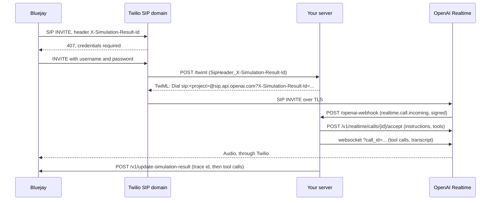

This guide builds one thing end to end: a voice agent on the OpenAI Realtime API that Bluejay can call over SIP through your Twilio account. When you finish, every simulated call shows the transcript, the tool calls the agent made, and an OpenTelemetry trace in the Bluejay result.

You will:

1. Get an OpenAI project id, an API key, and a webhook signing secret.
2. Create a Twilio SIP domain protected by a username and password.
3. Deploy a small Node server that Twilio and OpenAI both talk to.
4. Point a Bluejay agent at the SIP domain and run a simulation.

Audio never passes through your server. Twilio dials OpenAI's SIP endpoint directly. Your server only answers two HTTP requests per call and holds a websocket to run tools and collect the transcript.

### How it connects



### Prerequisites

- A Twilio account with Programmable Voice and one phone number (used as the caller id on the leg to OpenAI)
- An OpenAI account with a project that has Realtime API access
- Somewhere to run a Node 20+ server on a public HTTPS URL (Railway, Fly, Render, a VM)
- A Bluejay API key

## Part 1: OpenAI

### 1. Get the project id and an API key

Open [platform.openai.com](https://platform.openai.com), pick the project, and go to **Settings**, then **Project**, then **General**. Copy the **Project ID**. It starts with `proj_`.

Create an API key in the same project under **API keys**. The key and the project id must belong to the same project. If they do not, OpenAI rejects the accept call with `mismatched_project`.

To confirm which project a key belongs to, make any POST request with it and read the `openai-project` response header:

```bash
curl -s -D - -o /dev/null -X POST https://api.openai.com/v1/realtime/client_secrets \
  -H "Authorization: Bearer $OPENAI_API_KEY" -H "Content-Type: application/json" \
  -d '{"session":{"type":"realtime","model":"gpt-realtime"}}' | grep -i '^openai-project'
```

### 2. Register the webhook

OpenAI announces each incoming SIP call by posting to a webhook. Without one, every INVITE to `sip.api.openai.com` fails.

Go to **Settings**, then **Project**, then **Webhooks**, and create an endpoint:

| Field | Value |
|---|---|
| URL | `https://<your-server>/openai-webhook` |
| Events | `realtime.call.incoming` |

Copy the signing secret shown after you save. It starts with `whsec_` and is shown once. If the project already has an endpoint for `realtime.call.incoming`, edit that one. Two endpoints both try to accept the same call.

You now have `OPENAI_PROJECT_ID`, `OPENAI_API_KEY`, and `OPENAI_WEBHOOK_SECRET`.

## Part 2: Twilio

Everything in this part is under **Voice**, then **Manage**, then **SIP Domains** in the Twilio Console.

### 3. Create a credential list

Bluejay authenticates to your SIP domain with a username and password. Twilio stores those in a credential list.

1. Open the **Credential Lists** tab and click **Create new Credential List**.
2. Friendly name: `bluejay-sip-creds`.
3. Add a credential. Username: `bluejay`. Password: at least 12 characters with one uppercase letter, one lowercase letter, and one digit.
4. Save.

Keep the username and password. They go on the Bluejay agent in Part 4.

<Accordion title="Do this with the REST API">

```bash
export TWILIO_API=https://api.twilio.com/2010-04-01/Accounts/$TWILIO_ACCOUNT_SID

curl -X POST "$TWILIO_API/SIP/CredentialLists.json" \
  -u "$TWILIO_ACCOUNT_SID:$TWILIO_AUTH_TOKEN" \
  --data-urlencode "FriendlyName=bluejay-sip-creds"
# copy "sid" (CL...) from the response

curl -X POST "$TWILIO_API/SIP/CredentialLists/$CREDENTIAL_LIST_SID/Credentials.json" \
  -u "$TWILIO_ACCOUNT_SID:$TWILIO_AUTH_TOKEN" \
  --data-urlencode "Username=bluejay" \
  --data-urlencode "Password=YourStrongPassword123"
```

</Accordion>

### 4. Create the SIP domain

1. Open the **SIP Domains** tab and click **Create SIP Domain**.
2. **Friendly name**: `openai-realtime`.
3. **SIP URI**: pick a name, for example `yourcompany-openai`. Twilio appends `.sip.twilio.com`. The name must be unique across all of Twilio.
4. Under **Voice authentication**, in **Credential lists**, select `bluejay-sip-creds`.
5. Under **Call control configuration**, set **Configure method** to `Webhook`, **Webhook URL** to `https://<your-server>/twiml`, and **HTTP method** to `HTTP POST`.
6. Leave **SIP registration** disabled.
7. Save.

The webhook URL is what Twilio requests when a call arrives at the domain. Your server answers it with TwiML in Part 3.

<Accordion title="Do this with the REST API">

The REST parameter for the webhook URL is named `VoiceUrl`.

```bash
curl -X POST "$TWILIO_API/SIP/Domains.json" \
  -u "$TWILIO_ACCOUNT_SID:$TWILIO_AUTH_TOKEN" \
  --data-urlencode "DomainName=yourcompany-openai.sip.twilio.com" \
  --data-urlencode "FriendlyName=openai-realtime" \
  --data-urlencode "VoiceUrl=https://<your-server>/twiml" \
  --data-urlencode "VoiceMethod=POST" \
  --data-urlencode "SipRegistration=false"
# copy "sid" (SD...) from the response

curl -X POST "$TWILIO_API/SIP/Domains/$SIP_DOMAIN_SID/Auth/Calls/CredentialListMappings.json" \
  -u "$TWILIO_ACCOUNT_SID:$TWILIO_AUTH_TOKEN" \
  -d "CredentialListSid=$CREDENTIAL_LIST_SID"
```

The mapping must be created under `Auth/Calls`. The domain also has a top-level `CredentialListMappings` resource; that one controls SIP registration and does nothing for incoming calls.

</Accordion>

## Part 3: The server

The server has three routes. Twilio calls `/twiml` when a call arrives and `/dial-status` when the leg to OpenAI ends. OpenAI calls `/openai-webhook` when its SIP endpoint receives the call. After accepting, the server opens a websocket to the call to run tools and collect the transcript, and reports to Bluejay.

### 5. Create the project

```bash
mkdir openai-twilio-bridge && cd openai-twilio-bridge
npm init -y
npm install express ws @opentelemetry/api @opentelemetry/sdk-trace-base \
  @opentelemetry/exporter-trace-otlp-http @opentelemetry/resources
```

### 6. Set the environment

| Variable | Value |
|---|---|
| `OPENAI_API_KEY` | From step 1 |
| `OPENAI_PROJECT_ID` | From step 1, starts with `proj_` |
| `OPENAI_WEBHOOK_SECRET` | From step 2, starts with `whsec_` |
| `CALLER_ID` | A phone number on your Twilio account, in E.164 form. Twilio needs a phone number as the caller id on the leg to OpenAI because the incoming leg's caller is a SIP URI |
| `BLUEJAY_API_KEY` | Your Bluejay API key |
| `PUBLIC_HOST` | Your server's hostname, for example `openai-bridge.example.com` |
| `MODEL` | `gpt-realtime` |
| `VOICE` | `alloy` |
| `PORT` | Whatever your host expects |

### 7. Answer Twilio with TwiML

Twilio sends the SIP headers from Bluejay's INVITE as form fields prefixed with `SipHeader_`. Read `SipHeader_X-Simulation-Result-Id` and append it to the SIP URI Twilio dials. Twilio sends headers written after `?` on the URI, and OpenAI hands them back to you in the webhook. That is how the server knows which Bluejay result a call belongs to.

```javascript
app.all('/twiml', express.urlencoded({ extended: false }), (req, res) => {
  const b = req.body || {};
  const simId = b['SipHeader_X-Simulation-Result-Id'] || '';
  const uri = `sip:${OPENAI_PROJECT_ID}@sip.api.openai.com;transport=tls` +
    (simId ? `?X-Simulation-Result-Id=${encodeURIComponent(simId)}` : '');
  res.type('text/xml').send(
    `<?xml version="1.0" encoding="UTF-8"?><Response>` +
    `<Dial answerOnBridge="true" callerId="${CALLER_ID}" action="https://${PUBLIC_HOST}/dial-status" method="POST">` +
    `<Sip>${uri}</Sip></Dial></Response>`
  );
});

app.post('/dial-status', express.urlencoded({ extended: false }), (req, res) => {
  const b = req.body || {};
  console.log('dial-status', b.CallSid, b.DialCallStatus, 'sip', b.DialSipResponseCode);
  res.type('text/xml').send('<Response><Hangup/></Response>');
});
```

`DialSipResponseCode` on `/dial-status` is the SIP status OpenAI returned. When a call fails, this is where the reason is.

### 8. Verify and accept the OpenAI webhook

OpenAI signs each webhook with the Standard Webhooks scheme: an HMAC-SHA256 over `{webhook-id}.{webhook-timestamp}.{raw body}` using the base64-decoded secret (drop the `whsec_` prefix). The route needs the raw body, so it uses `express.raw()`.

Respond `200` before calling accept. OpenAI drops the call if the webhook takes too long.

```javascript
function verifyWebhook(req) {
  const id = req.get('webhook-id');
  const ts = req.get('webhook-timestamp');
  const sigs = (req.get('webhook-signature') || '').split(' ');
  if (!id || !ts || !sigs.length) return false;
  if (Math.abs(Date.now() / 1000 - Number(ts)) > 300) return false;
  const key = Buffer.from(OPENAI_WEBHOOK_SECRET.replace(/^whsec_/, ''), 'base64');
  const expected = crypto.createHmac('sha256', key).update(`${id}.${ts}.`).update(req.body).digest();
  return sigs.some((s) => {
    const [version, b64] = s.split(',');
    if (version !== 'v1' || !b64) return false;
    const got = Buffer.from(b64, 'base64');
    return got.length === expected.length && crypto.timingSafeEqual(got, expected);
  });
}

function sipHeader(data, name) {
  const hit = ((data && data.sip_headers) || []).find((h) => h.name.toLowerCase() === name.toLowerCase());
  return hit ? hit.value : undefined;
}

app.post('/openai-webhook', express.raw({ type: '*/*', limit: '1mb' }), async (req, res) => {
  if (!verifyWebhook(req)) return res.status(400).send('bad signature');
  const event = JSON.parse(req.body.toString('utf8'));
  res.status(200).end();
  if (event.type !== 'realtime.call.incoming') return;

  const callId = event.data.call_id;
  const simulationResultId = sipHeader(event.data, 'X-Simulation-Result-Id');

  const r = await fetch(`https://api.openai.com/v1/realtime/calls/${callId}/accept`, {
    method: 'POST',
    headers: { Authorization: `Bearer ${OPENAI_API_KEY}`, 'Content-Type': 'application/json' },
    body: JSON.stringify({
      type: 'realtime',
      model: MODEL,
      instructions: instructions(),
      tools: TOOLS,
      tool_choice: 'auto',
      audio: {
        input: { transcription: { model: 'gpt-4o-mini-transcribe' } },
        output: { voice: VOICE },
      },
    }),
  });
  if (r.status === 200) runCallSession(callId, simulationResultId);
});
```

`instructions()` returns the agent prompt with today's date appended. The Realtime model has no clock. Without the date, "next Tuesday" turns into an invented date.

```javascript
const today = () => new Date().toLocaleDateString('en-US', {
  weekday: 'long', year: 'numeric', month: 'long', day: 'numeric', timeZone: 'America/Los_Angeles',
});
const instructions = () => `${INSTRUCTIONS}\n\nToday is ${today()}.`;
```

### 9. Define a tool

Tools are declared in the accept body. This example books an appliance repair. Replace `runTool` with a call into your own system.

```javascript
const TOOLS = [{
  type: 'function',
  name: 'book_repair',
  description: 'Book an appliance repair visit. Call this once the caller has given the appliance and the day.',
  parameters: {
    type: 'object',
    properties: {
      appliance: { type: 'string' },
      requested_day: { type: 'string' },
      customer_name: { type: 'string' },
    },
    required: ['appliance', 'requested_day'],
  },
}];

function runTool(name, args) {
  if (name === 'book_repair') {
    return { confirmation: 'BJ-' + crypto.randomBytes(2).toString('hex').toUpperCase(), ...args };
  }
  return { error: `unknown tool ${name}` };
}
```

Tell the model in `INSTRUCTIONS` that it must call the tool before confirming anything. Otherwise it will announce a booking it never made.

### 10. Run the call session

After accept, attach to the call with a websocket. The model emits `response.function_call_arguments.done` when it wants a tool. Run the tool, send the result back as a `function_call_output` item, and ask for the next response. Transcripts arrive as `conversation.item.input_audio_transcription.completed` for the caller and `response.output_audio_transcript.done` for the agent.

Each call gets one root span. Tool calls and utterances become child spans. The exporter sends them to Bluejay's OTLP endpoint with your API key.

```javascript
const tracerProvider = new BasicTracerProvider({
  resource: resourceFromAttributes({ 'service.name': 'openai-twilio-bridge' }),
  spanProcessors: [new SimpleSpanProcessor(new OTLPTraceExporter({
    url: 'https://otlp.getbluejay.ai/v1/traces',
    headers: { 'X-API-KEY': BLUEJAY_API_KEY },
  }))],
});
const tracer = tracerProvider.getTracer('bridge');

async function bluejay(body) {
  await fetch('https://api.getbluejay.ai/v1/update-simulation-result', {
    method: 'POST',
    headers: { 'X-API-Key': BLUEJAY_API_KEY, 'Content-Type': 'application/json' },
    body: JSON.stringify(body),
  });
}

function runCallSession(callId, simulationResultId) {
  const startedAt = Date.now();
  const offset = () => Date.now() - startedAt;
  const toolCalls = [];
  let turns = 0;

  const rootSpan = tracer.startSpan('voice.call', { attributes: { 'call.id': callId } });
  const rootCtx = trace.setSpan(context.active(), rootSpan);
  const traceId = rootSpan.spanContext().traceId;

  // Send the trace id now. At hangup it races Bluejay's result finalisation.
  if (simulationResultId) bluejay({ simulation_result_id: simulationResultId, trace_ids: [traceId] });

  const ws = new WebSocket(`wss://api.openai.com/v1/realtime?call_id=${encodeURIComponent(callId)}`, {
    headers: { Authorization: `Bearer ${OPENAI_API_KEY}` },
  });

  ws.on('message', (raw) => {
    const ev = JSON.parse(raw.toString());
    if (ev.type === 'response.function_call_arguments.done') {
      const at = offset();
      const args = JSON.parse(ev.arguments || '{}');
      const span = tracer.startSpan(`execute_tool ${ev.name}`, { attributes: { 'tool.arguments': ev.arguments } }, rootCtx);
      const output = runTool(ev.name, args);
      span.setAttribute('tool.output', JSON.stringify(output));
      span.end();
      toolCalls.push({ name: ev.name, parameters: args, output, start_offset_ms: at });
      ws.send(JSON.stringify({ type: 'conversation.item.create', item: { type: 'function_call_output', call_id: ev.call_id, output: JSON.stringify(output) } }));
      ws.send(JSON.stringify({ type: 'response.create' }));
    } else if (ev.type === 'conversation.item.input_audio_transcription.completed') {
      turns++;
      tracer.startSpan('customer.speech', { attributes: { 'speech.text': ev.transcript } }, rootCtx).end();
    } else if (ev.type === 'response.output_audio_transcript.done') {
      turns++;
      tracer.startSpan('agent.speech', { attributes: { 'speech.text': ev.transcript } }, rootCtx).end();
    }
  });

  ws.on('close', async () => {
    rootSpan.end();
    if (!simulationResultId) return;
    await bluejay({
      simulation_result_id: simulationResultId,
      tool_calls: toolCalls,
      metadata: { model: MODEL, call_id: callId, duration_ms: offset(), turns },
    });
    await tracerProvider.forceFlush();
  });
}
```

Two separate POSTs to Bluejay on purpose. The trace id goes up as soon as the session opens. Tool calls go up once, after the call ends. The endpoint appends tool calls on every call and also derives tool calls from any `trace_ids` in the same body, so sending both together produces duplicates.

<Accordion title="Complete server.js">

```javascript
const crypto = require('crypto');
const express = require('express');
const { WebSocket } = require('ws');
const { trace, context } = require('@opentelemetry/api');
const { BasicTracerProvider, SimpleSpanProcessor } = require('@opentelemetry/sdk-trace-base');
const { OTLPTraceExporter } = require('@opentelemetry/exporter-trace-otlp-http');
const { resourceFromAttributes } = require('@opentelemetry/resources');

const {
  PORT = 8080, OPENAI_API_KEY, OPENAI_PROJECT_ID, OPENAI_WEBHOOK_SECRET,
  CALLER_ID, BLUEJAY_API_KEY, PUBLIC_HOST, MODEL = 'gpt-realtime', VOICE = 'alloy',
} = process.env;

const INSTRUCTIONS =
  "You are Robin, the front desk agent for Bluejay Repair Services, an appliance repair company. " +
  "Open the call with: 'Thanks for calling Bluejay Repair Services, this is Robin, how can I help?' " +
  "Keep every reply to one or two short spoken sentences. To book a repair you must call the book_repair tool " +
  "with the appliance and the requested day; never claim a booking is confirmed until the tool has returned. " +
  "After it returns, read the confirmation number and the date back to the caller and say goodbye.";

const today = () => new Date().toLocaleDateString('en-US', {
  weekday: 'long', year: 'numeric', month: 'long', day: 'numeric', timeZone: 'America/Los_Angeles',
});
const instructions = () => `${INSTRUCTIONS}\n\nToday is ${today()}.`;

const TOOLS = [{
  type: 'function',
  name: 'book_repair',
  description: 'Book an appliance repair visit. Call this once the caller has given the appliance and the day.',
  parameters: {
    type: 'object',
    properties: {
      appliance: { type: 'string' },
      requested_day: { type: 'string' },
      customer_name: { type: 'string' },
    },
    required: ['appliance', 'requested_day'],
  },
}];

function runTool(name, args) {
  if (name === 'book_repair') {
    return { confirmation: 'BJ-' + crypto.randomBytes(2).toString('hex').toUpperCase(), ...args };
  }
  return { error: `unknown tool ${name}` };
}

const tracerProvider = new BasicTracerProvider({
  resource: resourceFromAttributes({ 'service.name': 'openai-twilio-bridge' }),
  spanProcessors: [new SimpleSpanProcessor(new OTLPTraceExporter({
    url: 'https://otlp.getbluejay.ai/v1/traces',
    headers: { 'X-API-KEY': BLUEJAY_API_KEY },
  }))],
});
const tracer = tracerProvider.getTracer('bridge');

async function bluejay(body) {
  const r = await fetch('https://api.getbluejay.ai/v1/update-simulation-result', {
    method: 'POST',
    headers: { 'X-API-Key': BLUEJAY_API_KEY, 'Content-Type': 'application/json' },
    body: JSON.stringify(body),
  });
  console.log('bluejay', body.simulation_result_id, r.status);
}

function runCallSession(callId, simulationResultId) {
  const startedAt = Date.now();
  const offset = () => Date.now() - startedAt;
  const toolCalls = [];
  let turns = 0;

  const rootSpan = tracer.startSpan('voice.call', { attributes: { 'call.id': callId } });
  const rootCtx = trace.setSpan(context.active(), rootSpan);
  const traceId = rootSpan.spanContext().traceId;
  if (simulationResultId) bluejay({ simulation_result_id: simulationResultId, trace_ids: [traceId] });

  const ws = new WebSocket(`wss://api.openai.com/v1/realtime?call_id=${encodeURIComponent(callId)}`, {
    headers: { Authorization: `Bearer ${OPENAI_API_KEY}` },
  });

  ws.on('message', (raw) => {
    let ev;
    try { ev = JSON.parse(raw.toString()); } catch { return; }
    if (ev.type === 'response.function_call_arguments.done') {
      const at = offset();
      let args = {};
      try { args = JSON.parse(ev.arguments || '{}'); } catch {}
      const span = tracer.startSpan(`execute_tool ${ev.name}`, { attributes: { 'tool.arguments': ev.arguments || '' } }, rootCtx);
      const output = runTool(ev.name, args);
      span.setAttribute('tool.output', JSON.stringify(output));
      span.end();
      toolCalls.push({ name: ev.name, parameters: args, output, start_offset_ms: at });
      ws.send(JSON.stringify({ type: 'conversation.item.create', item: { type: 'function_call_output', call_id: ev.call_id, output: JSON.stringify(output) } }));
      ws.send(JSON.stringify({ type: 'response.create' }));
    } else if (ev.type === 'conversation.item.input_audio_transcription.completed') {
      turns++;
      tracer.startSpan('customer.speech', { attributes: { 'speech.text': ev.transcript || '' } }, rootCtx).end();
    } else if (ev.type === 'response.output_audio_transcript.done') {
      turns++;
      tracer.startSpan('agent.speech', { attributes: { 'speech.text': ev.transcript || '' } }, rootCtx).end();
    } else if (ev.type === 'error') {
      console.log('session error', JSON.stringify(ev).slice(0, 400));
    }
  });

  ws.on('close', async () => {
    rootSpan.end();
    console.log('call ended', callId, `${toolCalls.length} tool calls, ${turns} turns`);
    if (!simulationResultId) return;
    await bluejay({
      simulation_result_id: simulationResultId,
      tool_calls: toolCalls,
      metadata: { model: MODEL, call_id: callId, duration_ms: offset(), turns },
    });
    await tracerProvider.forceFlush();
  });
  ws.on('error', (e) => console.log('session ws error', e.message));
}

function verifyWebhook(req) {
  const id = req.get('webhook-id');
  const ts = req.get('webhook-timestamp');
  const sigs = (req.get('webhook-signature') || '').split(' ');
  if (!id || !ts || !sigs.length) return false;
  if (Math.abs(Date.now() / 1000 - Number(ts)) > 300) return false;
  const key = Buffer.from(OPENAI_WEBHOOK_SECRET.replace(/^whsec_/, ''), 'base64');
  const expected = crypto.createHmac('sha256', key).update(`${id}.${ts}.`).update(req.body).digest();
  return sigs.some((s) => {
    const [version, b64] = s.split(',');
    if (version !== 'v1' || !b64) return false;
    const got = Buffer.from(b64, 'base64');
    return got.length === expected.length && crypto.timingSafeEqual(got, expected);
  });
}

function sipHeader(data, name) {
  const hit = ((data && data.sip_headers) || []).find((h) => h.name.toLowerCase() === name.toLowerCase());
  return hit ? hit.value : undefined;
}

const app = express();
app.get('/', (_req, res) => res.json({ ok: true }));

app.all('/twiml', express.urlencoded({ extended: false }), (req, res) => {
  const b = req.body || {};
  const simId = b['SipHeader_X-Simulation-Result-Id'] || '';
  const uri = `sip:${OPENAI_PROJECT_ID}@sip.api.openai.com;transport=tls` +
    (simId ? `?X-Simulation-Result-Id=${encodeURIComponent(simId)}` : '');
  console.log('twiml', b.CallSid, 'simulation_result_id', simId || '(none)');
  res.type('text/xml').send(
    `<?xml version="1.0" encoding="UTF-8"?><Response>` +
    `<Dial answerOnBridge="true" callerId="${CALLER_ID}" action="https://${PUBLIC_HOST}/dial-status" method="POST">` +
    `<Sip>${uri}</Sip></Dial></Response>`
  );
});

app.post('/dial-status', express.urlencoded({ extended: false }), (req, res) => {
  const b = req.body || {};
  console.log('dial-status', b.CallSid, b.DialCallStatus, 'sip', b.DialSipResponseCode);
  res.type('text/xml').send('<Response><Hangup/></Response>');
});

app.post('/openai-webhook', express.raw({ type: '*/*', limit: '1mb' }), async (req, res) => {
  if (!verifyWebhook(req)) return res.status(400).send('bad signature');
  let event;
  try { event = JSON.parse(req.body.toString('utf8')); } catch { return res.status(400).send('bad json'); }
  res.status(200).end();
  if (event.type !== 'realtime.call.incoming') return;

  const callId = event.data.call_id;
  const simulationResultId = sipHeader(event.data, 'X-Simulation-Result-Id');
  const r = await fetch(`https://api.openai.com/v1/realtime/calls/${callId}/accept`, {
    method: 'POST',
    headers: { Authorization: `Bearer ${OPENAI_API_KEY}`, 'Content-Type': 'application/json' },
    body: JSON.stringify({
      type: 'realtime',
      model: MODEL,
      instructions: instructions(),
      tools: TOOLS,
      tool_choice: 'auto',
      audio: { input: { transcription: { model: 'gpt-4o-mini-transcribe' } }, output: { voice: VOICE } },
    }),
  });
  console.log('accept', callId, r.status, 'simulation_result_id', simulationResultId || '(none)');
  if (r.status === 200) runCallSession(callId, simulationResultId);
});

app.listen(PORT, () => console.log('listening on', PORT));
```

</Accordion>

### 11. Deploy

Deploy to any host that gives you a public HTTPS URL and set the environment variables from step 6. Then confirm the routes answer:

```bash
curl https://<your-server>/
# {"ok":true}

curl -X POST https://<your-server>/openai-webhook -d '{}'
# bad signature   (a 400 here is correct; unsigned requests must be rejected)
```

If your server's hostname was not known when you registered the webhook in step 2 or the SIP domain in step 4, go back and set it now.

## Part 4: Bluejay

### 12. Create the agent

In **Agent Settings**, then **Connection**, set the connection type to **SIP** and fill in:

| Field | Value |
|---|---|
| SIP URI | `sip:openai@yourcompany-openai.sip.twilio.com` |
| SIP Username | `bluejay` |
| SIP Password | The password from step 3 |

The user part of the URI (`openai` here) can be any value.

<Accordion title="Do this with the REST API">

```bash
curl -X POST https://api.getbluejay.ai/v1/add-agent \
  -H "X-API-Key: $BLUEJAY_API_KEY" \
  -H "Content-Type: application/json" \
  -d '{
    "name": "OpenAI Realtime via Twilio SIP",
    "system_prompt": "Front desk agent for an appliance repair company.",
    "goals": ["Greet the caller", "Collect the appliance and the day", "Book the repair and confirm the date"],
    "type": "INBOUND",
    "connection_type": "SIP",
    "mode": "VOICE",
    "sip_uri": "sip:openai@yourcompany-openai.sip.twilio.com",
    "sip_username": "bluejay",
    "sip_password": "YourStrongPassword123"
  }'
```

</Accordion>

### 13. Create and run a simulation

1. Go to the **Simulations** page, click **Create** in the top right, select the agent, and add a digital human. For the example agent, an intent like "Your dishwasher is leaking. Book a repair for next Tuesday afternoon." exercises the tool.
2. In the **Simulations** tab, click **Run** on the simulation, then click **Run calls**.

<video autoPlay muted loop playsInline className="w-full rounded-xl" src="/videos/create-simulation.mp4"></video>

### 14. Check the result

Open the finished call. You should see:

- The transcript, with the agent's greeting intact and a confirmed date that matches the calendar.
- A `book_repair` entry under tool calls, with the parameters the model extracted and the confirmation your `runTool` returned.
- A trace with a `voice.call` root span, one `execute_tool book_repair` child, and `agent.speech` and `customer.speech` spans for each turn.

Your server logs show the same call from the other side:

```
twiml CA... simulation_result_id 933691
accept rtc_... 200 simulation_result_id 933691
bluejay 933691 200
tool book_repair {"appliance":"dishwasher","requested_day":"next Tuesday afternoon"} -> {"confirmation":"BJ-4F1A",...}
call ended rtc_... 1 tool calls, 6 turns
bluejay 933691 200
```

## Troubleshooting

| Symptom | Cause | Fix |
|---|---|---|
| `/dial-status` logs `sip 400`, and your webhook never fires | No webhook registered on the OpenAI project, or it points at a dead URL | Register the webhook in step 2 on the same project as `OPENAI_PROJECT_ID` |
| Twilio error 13224 on the call | Generic Dial failure. Usually the far end rejected the INVITE, or `callerId` is missing | Read `DialSipResponseCode` on `/dial-status`. Set `CALLER_ID` to a number on your Twilio account |
| Accept returns `401 mismatched_project` | `OPENAI_API_KEY` belongs to a different project than `OPENAI_PROJECT_ID` | Check the key's project with the `openai-project` header command in step 1 |
| Webhook route returns `400 bad signature` on real calls | Wrong or rotated `OPENAI_WEBHOOK_SECRET` | Copy the secret from the webhook's page on platform.openai.com. Rotating creates a new one |
| Bluejay call fails with SIP `403` or `407` | Agent credentials do not match the credential list, or the list is attached under SIP registration and not under Voice authentication | Check the username and password on the agent. In the Console, the list must appear under **Voice authentication** |
| Tool calls missing from the result | The model confirmed without calling the tool, or `simulation_result_id` was undefined | Tighten `INSTRUCTIONS`. Check that `/twiml` logged a `simulation_result_id` and that it appears in the `accept` log line |
| Trace missing from the result | Trace id posted after Bluejay finalised the result | Post `trace_ids` when the session opens, as in step 10, and keep `tool_calls` in the separate post at hangup |
| Agent invents a date | Model has no clock | Keep the `Today is ...` line in `instructions()` |

For help, ask in our [Slack community](https://join.slack.com/t/bluejaycommunity/shared_invite/zt-442xk85k5-Qkbq65wVOxK~1FHU5OadEA).
