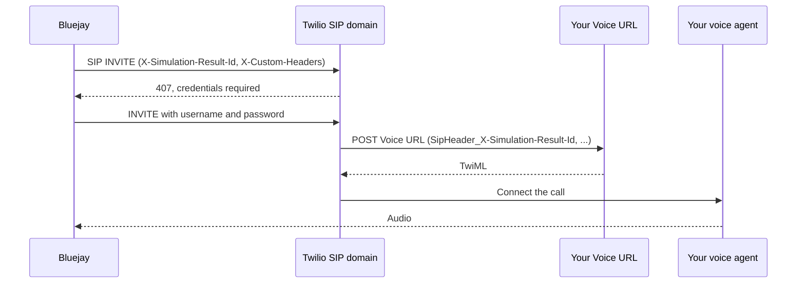

Use this when your voice agent runs behind Twilio Programmable Voice and you want Bluejay to reach it over SIP. You create a SIP domain on your Twilio account, protect it with a username and password, and return TwiML that connects the call to your agent. Bluejay dials the domain and the simulation runs like any other SIP call.

<Note>
  This method is for **inbound** agents: Bluejay dials in and your agent answers. If your agent places calls, see [Telephony Simulations](/simulation-integrations/telephony#outbound-your-agent-dials-bluejay).
</Note>

### How it connects

Bluejay sends a SIP INVITE to `sip:<user>@<your-domain>.sip.twilio.com`. Twilio challenges for credentials, Bluejay answers with the username and password you set on the agent, and Twilio requests your **Voice URL**. Your Voice URL returns TwiML that connects the call to your agent. Audio flows between the digital human, Twilio, and your agent.



### Prerequisites

- A Twilio account with Programmable Voice
- Your Twilio **Account SID** and **Auth Token** (Twilio Console, **Account Info**)
- A public HTTPS URL that returns TwiML for your agent
- A Bluejay account

All commands below use the Twilio REST API with `curl`. Every step can also be done in the Twilio Console under **Voice**, then **Manage**, then **SIP Domains**.

```bash
export TWILIO_ACCOUNT_SID=ACxxxxxxxxxxxxxxxxxxxxxxxxxxxxxxxx
export TWILIO_AUTH_TOKEN=your_auth_token
export TWILIO_API=https://api.twilio.com/2010-04-01/Accounts/$TWILIO_ACCOUNT_SID
```

## Setup

### 1. Create a credential list

A credential list holds the username and password Twilio accepts on incoming calls to the domain. Bluejay presents these credentials on every call.

```bash
curl -X POST "$TWILIO_API/SIP/CredentialLists.json" \
  -u "$TWILIO_ACCOUNT_SID:$TWILIO_AUTH_TOKEN" \
  --data-urlencode "FriendlyName=bluejay-sip-creds"
```

Copy the `sid` from the response (it starts with `CL`). Then add a credential to the list. The password needs at least 12 characters, one uppercase letter, one lowercase letter, and one digit.

```bash
export CREDENTIAL_LIST_SID=CLxxxxxxxxxxxxxxxxxxxxxxxxxxxxxxxx

curl -X POST "$TWILIO_API/SIP/CredentialLists/$CREDENTIAL_LIST_SID/Credentials.json" \
  -u "$TWILIO_ACCOUNT_SID:$TWILIO_AUTH_TOKEN" \
  --data-urlencode "Username=bluejay" \
  --data-urlencode "Password=YourStrongPassword123"
```

Keep the username and password. You enter them on the Bluejay agent in step 5.

<Note>
  Protect the domain with a credential list. Bluejay places calls from a range of addresses, and Twilio IP access control lists accept individual addresses only.
</Note>

### 2. Create the SIP domain

The domain name must end in `.sip.twilio.com` and be unique across Twilio. `VoiceUrl` is the endpoint Twilio requests when a call arrives. Set it to your TwiML endpoint from step 3, or set a placeholder now and update it later.

```bash
curl -X POST "$TWILIO_API/SIP/Domains.json" \
  -u "$TWILIO_ACCOUNT_SID:$TWILIO_AUTH_TOKEN" \
  --data-urlencode "DomainName=your-company-bluejay.sip.twilio.com" \
  --data-urlencode "FriendlyName=bluejay-sip" \
  --data-urlencode "VoiceUrl=https://your-app.example.com/twiml" \
  --data-urlencode "VoiceMethod=POST" \
  --data-urlencode "SipRegistration=false"
```

Copy the `sid` from the response (it starts with `SD`). Then attach the credential list to the domain so incoming calls are challenged for those credentials.

```bash
export SIP_DOMAIN_SID=SDxxxxxxxxxxxxxxxxxxxxxxxxxxxxxxxx

curl -X POST "$TWILIO_API/SIP/Domains/$SIP_DOMAIN_SID/Auth/Calls/CredentialListMappings.json" \
  -u "$TWILIO_ACCOUNT_SID:$TWILIO_AUTH_TOKEN" \
  -d "CredentialListSid=$CREDENTIAL_LIST_SID"
```

<Warning>
  Attach the credential list under `Auth/Calls`. The domain also has a `CredentialListMappings` resource at its top level, but that one controls SIP registration and has no effect on incoming calls.
</Warning>

### 3. Return TwiML from your Voice URL

When a call reaches the domain, Twilio sends a `POST` to your Voice URL and connects the call according to the TwiML you return. Choose the shape that matches how your agent receives audio.

<Tabs>
<Tab title="Media Streams">

Stream the call audio to your agent over a WebSocket. Twilio sends 8 kHz G.711 mu-law audio as base64 frames and accepts the same format back.

```xml
<?xml version="1.0" encoding="UTF-8"?>
<Response>
  <Connect>
    <Stream url="wss://your-app.example.com/media" />
  </Connect>
</Response>
```

</Tab>
<Tab title="Dial a SIP endpoint">

Forward the call to another SIP endpoint, for example a speech-to-speech provider that accepts SIP. Set `callerId` to a phone number you own on Twilio. The incoming leg arrives with a SIP URI as the caller, and Twilio requires an E.164 number to dial out.

```xml
<?xml version="1.0" encoding="UTF-8"?>
<Response>
  <Dial answerOnBridge="true" callerId="+15551234567" action="https://your-app.example.com/dial-status" method="POST">
    <Sip>sip:your-agent@provider.example.com;transport=tls</Sip>
  </Dial>
</Response>
```

The `action` URL receives the result of the dial when it ends. It includes `DialSipResponseCode`, which is the SIP status the far end returned. Log it. It is the only place that status appears.

</Tab>
<Tab title="ConversationRelay">

Hand the call to Twilio ConversationRelay, which runs speech recognition and text to speech and sends text to your WebSocket.

```xml
<?xml version="1.0" encoding="UTF-8"?>
<Response>
  <Connect>
    <ConversationRelay url="wss://your-app.example.com/relay" welcomeGreeting="Hello, how can I help you today?" />
  </Connect>
</Response>
```

</Tab>
</Tabs>

Return the TwiML with `Content-Type: text/xml`.

### 4. Read the simulation result ID

Bluejay adds an `X-Simulation-Result-Id` header to every SIP INVITE. Twilio passes SIP headers that start with `X-` to your Voice URL as form fields with the prefix `SipHeader_`. Read it in your Voice URL handler and keep it for the duration of the call.

```
SipHeader_X-Simulation-Result-Id=1234
SipHeader_X-Custom-Headers={"X-Your-Header":"value"}
SipDomain=your-company-bluejay.sip.twilio.com
SipCallId=...
From=sip:+15551234567@....sip.livekit.cloud
CallSid=CA...
```

```python
from fastapi import FastAPI, Request, Response

app = FastAPI()
calls = {}

@app.post("/twiml")
async def twiml(request: Request):
    form = await request.form()
    calls[form["CallSid"]] = form.get("SipHeader_X-Simulation-Result-Id")
    return Response(
        content='<?xml version="1.0" encoding="UTF-8"?><Response><Connect><Stream url="wss://your-app.example.com/media"/></Connect></Response>',
        media_type="text/xml",
    )
```

If you pass the ID to a Media Stream, add it as a `<Parameter>` inside `<Stream>`. It arrives in the stream's `start` message under `customParameters`.

```xml
<Connect>
  <Stream url="wss://your-app.example.com/media">
    <Parameter name="simulation_result_id" value="1234" />
  </Stream>
</Connect>
```

After the call ends, send tool calls, metadata, and trace IDs to Bluejay with [`/v1/update-simulation-result`](/api-reference/endpoint/update-simulation-result).

```python
import requests

def update_simulation_result(simulation_result_id, tool_calls, metadata, trace_ids=None):
    data = {
        "simulation_result_id": simulation_result_id,
        "tool_calls": tool_calls,
        "metadata": metadata,
    }
    if trace_ids:
        data["trace_ids"] = trace_ids
    return requests.post(
        "https://api.getbluejay.ai/v1/update-simulation-result",
        headers={"X-API-Key": "<your-api-key>"},
        json=data,
    ).json()
```

Custom headers you add in **Agent Settings** are sent under the exact name you enter. Twilio forwards a header to your Voice URL only when its name starts with `X-`, so name custom headers `X-Something`.

### 5. Point Bluejay at the domain

In **Agent Settings**, then **Connection**, set the connection type to **SIP** and fill in:

| Field | Value |
|---|---|
| SIP URI | `sip:bluejay@your-company-bluejay.sip.twilio.com` |
| SIP Username | `bluejay` (the username from step 1) |
| SIP Password | the password from step 1 |

The user part of the URI (`bluejay` in the example) can be any value. Twilio passes it to your Voice URL in the `Called` field, so you can use it to route to different agents from one domain.

To do the same through the API:

```bash
curl -X POST https://api.getbluejay.ai/v1/add-agent \
  -H "X-API-Key: your-api-key" \
  -H "Content-Type: application/json" \
  -d '{
    "name": "My Twilio SIP Agent",
    "system_prompt": "...",
    "goals": ["..."],
    "type": "INBOUND",
    "connection_type": "SIP",
    "mode": "VOICE",
    "sip_uri": "sip:bluejay@your-company-bluejay.sip.twilio.com",
    "sip_username": "bluejay",
    "sip_password": "YourStrongPassword123"
  }'
```

### 6. Create and run a simulation

1. Go to the **Simulations** page, click **Create** in the top right, select your agent, and add or auto-generate digital human personas.
2. In the **Simulations** tab, click **Run** on the simulation, then click **Run calls** (the button shows the call count, for example "Run 3 calls").
3. When the calls finish, review transcripts, recordings, and metric scores.

<video autoPlay muted loop playsInline className="w-full rounded-xl" src="/videos/create-simulation.mp4"></video>

<video autoPlay muted loop playsInline className="w-full rounded-xl" src="/videos/run-calls.mp4"></video>

## Things to note

- **Twilio dials the far end from a Twilio number.** When your TwiML uses `<Dial>`, set `callerId` to a number on your Twilio account. Without it the outbound leg fails.
- **The Voice URL must answer within a few seconds.** Twilio waits for the TwiML before connecting audio. Return the TwiML first and do slow work afterwards.
- **Twilio validates its own requests.** Every request to your Voice URL carries an `X-Twilio-Signature` header signed with your Auth Token. Verify it with a Twilio helper library so only Twilio can trigger your TwiML.
- **One domain can serve many agents.** Route on the `Called` field (the user part of the SIP URI) inside your Voice URL handler.

## Troubleshooting

| Symptom | Cause | Fix |
|---|---|---|
| Call fails with SIP `403` or `407` | Credentials on the Bluejay agent do not match the credential list, or the list is not attached under `Auth/Calls` | Check the username and password on the agent, and confirm the mapping was created at `SIP/Domains/<SD...>/Auth/Calls/CredentialListMappings` |
| Twilio error `11200` | Twilio could not fetch your Voice URL | Confirm the URL is public HTTPS and returns `200` with `text/xml` |
| Twilio error `13224` (Invalid phone number) on a `<Dial><Sip>` | The far end rejected the call, or `callerId` is missing | Add an `action` URL to `<Dial>` and read `DialSipResponseCode`. Set `callerId` to a Twilio number you own |
| Voice URL receives no `SipHeader_X-Simulation-Result-Id` | Header name does not start with `X-`, or the request is not from a Bluejay call | Bluejay always sends this header. Check that the request is from Twilio and that your framework parses form fields |
| Result stuck in a running state, no transcript | Malformed SIP URI on the agent | The URI must be `sip:<user>@<domain>.sip.twilio.com` |

For technical support with SIP configuration, ask in our [Slack community](https://join.slack.com/t/bluejaycommunity/shared_invite/zt-442xk85k5-Qkbq65wVOxK~1FHU5OadEA).
