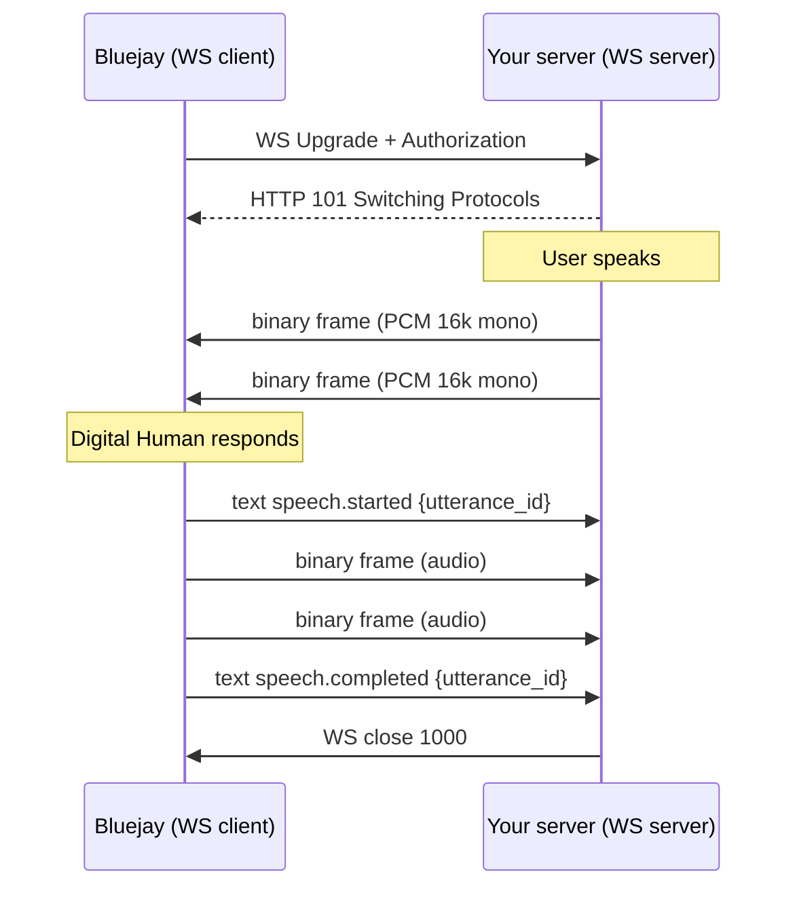
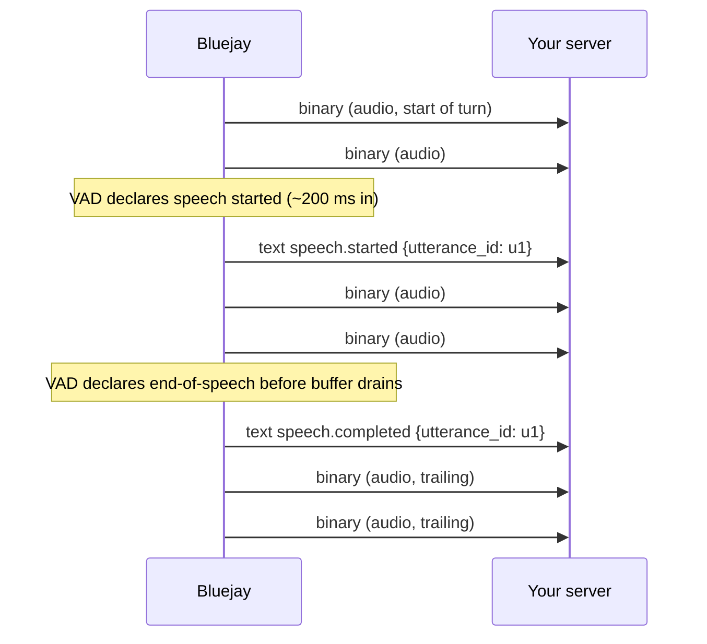
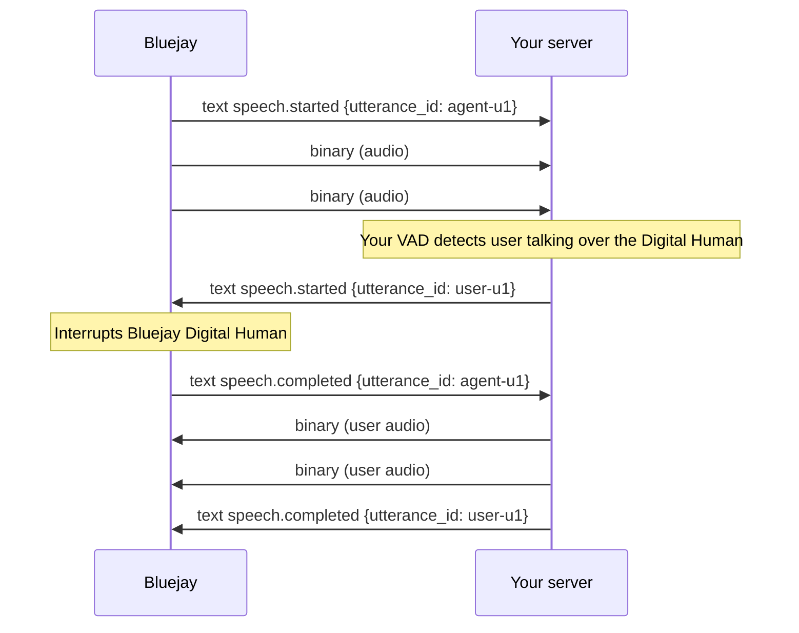

<Note>
`speech.started` and `speech.completed` are optional to ingest, and **not strictly bracketed** around their utterance's binary frames. See [Event ordering](#event-ordering) for details.
</Note>

## Overview

Bluejay supports real-time, bidirectional voice over WebSocket using **CHIRP**, a transport-only protocol for exchanging raw audio and optional control events between Bluejay and your server.

[**CHIRP**](/glossary#c) (Conversational Handoff for Inter‑agent Realtime Protocol) is a novel real-time A2A communication protocol, enabling conversational agents to interact over websockets over a standard medium of communication.

The bare minimum integration is accepting a WebSocket connection, validating auth, and exchanging raw PCM binary frames. The three text event types (`speech.started`, `speech.completed`, `session.error`) are all **optional** from your side. Bluejay sends them automatically, but your server can safely ignore every text frame and still have a fully working integration.

### When to use WebSocket

Use a WebSocket integration when:

- Your agent does not have a phone number.
- You already have a real-time audio pipeline and want to connect it directly to Bluejay.
- You need bidirectional streaming with lower latency than telephony.
- Your system handles raw PCM audio natively.

For other connection types, check out our [other integrations](/simulation-integrations/telephony), or connect via [adding your agent's phone number](/key-concepts/agents/overview).

---

## Quick reference

- **Format**: 16 kHz mono `pcm_s16le` in WebSocket binary frames.
- **Minimum server**: accept WS, validate Basic auth, read binary, write binary.
- **Text events** are optional from your side. Bluejay emits `speech.started` / `speech.completed` around Digital Human utterances — **not strictly bracketed**, see [Event ordering](#event-ordering).
- **Barge-in**: send `speech.started` while the Digital Human is speaking.
- **Hang up**: close the WebSocket with code `1000`.

---

## Sample server implementations

Minimal servers that Bluejay can connect to. Each one accepts the WS upgrade, validates Basic auth, and echoes received audio back. Replace the echo with your actual audio source and sink.

<Tabs>
<Tab title="Basic (audio only)">
The minimum integration. Handles binary audio frames and ignores everything else.

<CodeGroup>

```python Python (websockets)
# pip install websockets
import asyncio, base64, os
from websockets.asyncio.server import serve

USER, PASS = os.environ["CHIRP_USER"], os.environ["CHIRP_PASS"]
EXPECTED = "Basic " + base64.b64encode(f"{USER}:{PASS}".encode()).decode()

async def handler(ws):
    if ws.request.headers.get("Authorization") != EXPECTED:
        await ws.close(1008, "unauthorized"); return

    async for msg in ws:
        if isinstance(msg, bytes):
            await ws.send(msg)

async def main():
    async with serve(handler, "0.0.0.0", 8080):
        await asyncio.Future()

asyncio.run(main())
```

```typescript TypeScript (ws)
// npm i ws
import { createServer } from 'http'
import { WebSocketServer } from 'ws'

const { CHIRP_USER, CHIRP_PASS } = process.env
const expected = 'Basic ' + Buffer.from(`${CHIRP_USER}:${CHIRP_PASS}`).toString('base64')

const server = createServer()
const wss = new WebSocketServer({ noServer: true })

server.on('upgrade', (req, socket, head) => {
  if (req.headers.authorization !== expected) {
    socket.write('HTTP/1.1 401 Unauthorized\r\n\r\n'); socket.destroy(); return
  }
  wss.handleUpgrade(req, socket, head, (ws) => wss.emit('connection', ws, req))
})

wss.on('connection', (ws) => {
  ws.on('message', (data, isBinary) => {
    if (isBinary) ws.send(data, { binary: true })
  })
})

server.listen(8080)
```

```go Go (gorilla/websocket)
// go get github.com/gorilla/websocket
package main

import (
    "crypto/subtle"
    "encoding/base64"
    "net/http"
    "os"

    "github.com/gorilla/websocket"
)

var up = websocket.Upgrader{CheckOrigin: func(r *http.Request) bool { return true }}

func main() {
    expected := "Basic " + base64.StdEncoding.EncodeToString(
        []byte(os.Getenv("CHIRP_USER")+":"+os.Getenv("CHIRP_PASS")))

    http.HandleFunc("/voice", func(w http.ResponseWriter, r *http.Request) {
        if subtle.ConstantTimeCompare([]byte(r.Header.Get("Authorization")), []byte(expected)) != 1 {
            http.Error(w, "unauthorized", 401); return
        }
        c, err := up.Upgrade(w, r, nil)
        if err != nil { return }
        defer c.Close()
        for {
            mt, msg, err := c.ReadMessage()
            if err != nil { return }
            if mt == websocket.BinaryMessage {
                _ = c.WriteMessage(websocket.BinaryMessage, msg)
            }
        }
    })
    http.ListenAndServe(":8080", nil)
}
```

```js Node.js (ws)
// npm i ws
const { createServer } = require('http')
const { WebSocketServer } = require('ws')

const expected = 'Basic ' + Buffer
  .from(`${process.env.CHIRP_USER}:${process.env.CHIRP_PASS}`).toString('base64')

const server = createServer()
const wss = new WebSocketServer({ noServer: true })

server.on('upgrade', (req, socket, head) => {
  if (req.headers.authorization !== expected) {
    socket.write('HTTP/1.1 401 Unauthorized\r\n\r\n'); return socket.destroy()
  }
  wss.handleUpgrade(req, socket, head, (ws) => wss.emit('connection', ws))
})

wss.on('connection', (ws) => {
  ws.on('message', (data, isBinary) => {
    if (isBinary) ws.send(data, { binary: true })
  })
})

server.listen(8080)
```

```ruby Ruby (async-websocket)
# gem install async-websocket async-http falcon
require 'async'
require 'async/http/endpoint'
require 'async/websocket/adapters/rack'
require 'base64'

EXPECTED = "Basic " + Base64.strict_encode64("#{ENV['CHIRP_USER']}:#{ENV['CHIRP_PASS']}")

app = lambda do |env|
  return [401, {}, ['unauthorized']] unless env['HTTP_AUTHORIZATION'] == EXPECTED
  Async::WebSocket::Adapters::Rack.open(env) do |ws|
    while msg = ws.read
      ws.write(msg) if msg.buffer.is_a?(String) && msg.buffer.encoding == Encoding::ASCII_8BIT
    end
  end
end

Async { Async::HTTP::Server.for(Async::HTTP::Endpoint.parse('http://0.0.0.0:8080'), app).run }
```

</CodeGroup>
</Tab>
<Tab title="With text events">
Handles text events alongside audio. Use this when you want to react to `speech.started` / `speech.completed` (e.g. to mute playback on barge-in, drive a UI indicator, or send your own events back).

<Note>
These handlers log speech events but keep forwarding **every** binary frame regardless, because audio may arrive both before `speech.started` and after `speech.completed` for the same `utterance_id`. See [Event ordering](#event-ordering).
</Note>

<CodeGroup>

```python Python (websockets)
# pip install websockets
import asyncio, base64, json, os, uuid, time
from websockets.asyncio.server import serve

USER, PASS = os.environ["CHIRP_USER"], os.environ["CHIRP_PASS"]
EXPECTED = "Basic " + base64.b64encode(f"{USER}:{PASS}".encode()).decode()

def make_event(event_type, data):
    return json.dumps({
        "type": event_type,
        "id": str(uuid.uuid4()),
        "ts_ms": int(time.time() * 1000),
        "data": data,
    })

async def handler(ws):
    if ws.request.headers.get("Authorization") != EXPECTED:
        await ws.close(1008, "unauthorized"); return

    current_utterance = None

    async for msg in ws:
        if isinstance(msg, bytes):
            await ws.send(msg)
        else:
            event = json.loads(msg)
            if event["type"] == "speech.started":
                current_utterance = event["data"]["utterance_id"]
                print(f"Digital Human started speaking: {current_utterance}")
            elif event["type"] == "speech.completed":
                print(f"Digital Human finished: {event['data']['utterance_id']}")
                current_utterance = None
            elif event["type"] == "session.error":
                print(f"Error: {event['data']['code']}: {event['data']['message']}")

async def main():
    async with serve(handler, "0.0.0.0", 8080):
        await asyncio.Future()

asyncio.run(main())
```

```typescript TypeScript (ws)
// npm i ws
import { createServer } from 'http'
import { WebSocketServer, type WebSocket } from 'ws'
import { randomUUID } from 'crypto'

const { CHIRP_USER, CHIRP_PASS } = process.env
const expected = 'Basic ' + Buffer.from(`${CHIRP_USER}:${CHIRP_PASS}`).toString('base64')

function makeEvent(type: string, data: Record<string, unknown>) {
  return JSON.stringify({ type, id: randomUUID(), ts_ms: Date.now(), data })
}

const server = createServer()
const wss = new WebSocketServer({ noServer: true })

server.on('upgrade', (req, socket, head) => {
  if (req.headers.authorization !== expected) {
    socket.write('HTTP/1.1 401 Unauthorized\r\n\r\n'); socket.destroy(); return
  }
  wss.handleUpgrade(req, socket, head, (ws) => wss.emit('connection', ws, req))
})

wss.on('connection', (ws: WebSocket) => {
  let currentUtterance: string | null = null

  ws.on('message', (data, isBinary) => {
    if (isBinary) {
      ws.send(data, { binary: true })
      return
    }

    const event = JSON.parse(data.toString())
    switch (event.type) {
      case 'speech.started':
        currentUtterance = event.data.utterance_id
        console.log(`Digital Human started speaking: ${currentUtterance}`)
        break
      case 'speech.completed':
        console.log(`Digital Human finished: ${event.data.utterance_id}`)
        currentUtterance = null
        break
      case 'session.error':
        console.error(`Error: ${event.data.code}: ${event.data.message}`)
        break
    }
  })
})

server.listen(8080)
```

</CodeGroup>
</Tab>
</Tabs>

---

## Message formats

CHIRP uses two WebSocket frame types: **binary** for audio (required) and **text** for control events (optional). **A minimum integration only needs binary.**

<Tabs>
<Tab title="Binary (audio)">
Each binary frame is raw audio samples. Both sides send and receive them.

| Property    | Value                                              | Notes                              |
| ----------- | -------------------------------------------------- | ---------------------------------- |
| Encoding    | [`pcm_s16le`](/glossary#p)                         | Signed 16-bit little-endian PCM    |
| [Sample rate](/glossary#s) | **16 000 Hz**                       | Industry standard for speech AI    |
| Channels    | **1 ([mono](/glossary#m))**                        | Voice is single-channel            |
| Frame size  | Recommended 20 ms (640 bytes). Any even length OK. | Must be even (samples are 2 bytes) |
</Tab>
<Tab title="speech.started (optional)">
Signals the start of a turn. Sent as a WebSocket text frame (UTF-8 JSON).

```json
{
  "type":  "speech.started",
  "id":    "c0e1a39f-92d1-4f1c-9d8a-2a1b3c4d5e6f",
  "ts_ms": 1729123456789,
  "data":  { "utterance_id": "u_abc123" }
}
```

| Field         | Type    | Required | Notes                                       |
| ------------- | ------- | -------- | ------------------------------------------- |
| `type`        | string  | Yes      | `"speech.started"`                          |
| `id`          | string  | Yes      | UUID (auto-filled by Bluejay if omitted)    |
| `ts_ms`       | integer | Yes      | Unix epoch ms (auto-filled if omitted)      |
| `utterance_id`| string  | Yes      | Unique within the session (UUID or counter) |

**Bluejay sends this** when Bluejay's VAD detects the Digital Human has begun speaking. The event is **not a precise boundary**: the first few binary audio frames of the utterance may arrive before `speech.started`, and the last few may arrive after `speech.completed`. See [Event ordering](#event-ordering).

**You can send this** to signal a new user turn. If the Digital Human is mid-utterance, Bluejay interrupts it and emits `speech.completed` for the canceled utterance.
</Tab>
<Tab title="speech.completed (optional)">
Signals the end of a turn. Sent as a WebSocket text frame (UTF-8 JSON).

```json
{
  "type":  "speech.completed",
  "id":    "a2dbf8e4-0767-4a3d-8a29-3f5b7f2c4d10",
  "ts_ms": 1729123460220,
  "data":  { "utterance_id": "u_abc123" }
}
```

| Field         | Type    | Required | Notes                                    |
| ------------- | ------- | -------- | ---------------------------------------- |
| `type`        | string  | Yes      | `"speech.completed"`                     |
| `id`          | string  | Yes      | UUID (auto-filled by Bluejay if omitted) |
| `ts_ms`       | integer | Yes      | Unix epoch ms (auto-filled if omitted)   |
| `utterance_id`| string  | Yes      | Must match a prior `speech.started` id   |

**Bluejay sends this** when Bluejay's VAD declares end-of-speech for the utterance. Some trailing binary audio frames for the same `utterance_id` may still arrive after this event. Do not use `speech.completed` as a hard cutoff for audio playback — see [Event ordering](#event-ordering).

**You can send this** to tell Bluejay the user is done talking, letting Bluejay respond faster.
</Tab>
<Tab title="session.error (optional)">
Reports a protocol violation or server-side issue. This is part of the CHIRP protocol, sent as a WebSocket text frame (UTF-8 JSON) over the same connection.

```json
{
  "type":  "session.error",
  "id":    "b1-err-0001",
  "ts_ms": 1729123462000,
  "data": {
    "code":    "INVALID_MESSAGE",
    "message": "Unexpected type 'foo'"
  }
}
```

| Field     | Type    | Required | Notes                                    |
| --------- | ------- | -------- | ---------------------------------------- |
| `type`    | string  | Yes      | `"session.error"`                        |
| `id`      | string  | Yes      | UUID (auto-filled by Bluejay if omitted) |
| `ts_ms`   | integer | Yes      | Unix epoch ms (auto-filled if omitted)   |
| `code`    | string  | Yes      | One of the error codes below             |
| `message` | string  | Yes      | Human-readable detail for debugging      |

**Error codes:**

| Code                  | Meaning                                                  |
| --------------------- | -------------------------------------------------------- |
| `INVALID_MESSAGE`     | Malformed JSON or unknown `type`                         |
| `MISSING_FIELD`       | Required field absent                                    |
| `INVALID_AUDIO_FRAME` | Binary frame is empty or has odd byte length             |
| `INTERNAL_ERROR`      | Bug on sender's side; connection closes after this frame |

Recoverable errors (all except `INTERNAL_ERROR`) do not close the connection. The offending frame is dropped and the session continues.
</Tab>
</Tabs>

---

## Error handling

| Scenario                                | Bluejay behavior                                       |
| --------------------------------------- | ------------------------------------------------------ |
| HTTP 401/403 on upgrade                 | `test_result.status = REJECTED`                        |
| Host unreachable / TCP refused / TLS failure | 3 retries with backoff, then `INCOMPLETED`        |
| Upgrade accepted but closed immediately | `INCOMPLETED`, close code logged                       |
| Protocol violation (bad JSON, missing field, odd-length audio) | `session.error` sent, frame dropped, session continues |
| Your server closes gracefully           | Session torn down; status set by call completion       |
| Network drop or crash                   | `INCOMPLETED`, session ended                           |

If you send a `session.error`, Bluejay logs it and surfaces it in `test_result.metadata`. The connection stays open unless you also close it.

| Close code | Meaning                                    |
| ---------- | ------------------------------------------ |
| `1000`     | Normal closure                             |
| `1008`     | Policy violation (typically auth rejected) |
| `1011`     | Internal error on sender's side            |

---

## How it works

### Connection lifecycle

<Steps>
<Step title="Bluejay opens the WebSocket">
Bluejay dials the URL you configured on your Agent (e.g. `wss://your-host/voice`) and sends an HTTP upgrade with an `Authorization: Basic <base64(user:pass)>` header.
</Step>

<Step title="Your server accepts or rejects">
- Valid credentials: respond with `HTTP 101 Switching Protocols` and the WS is live.
- Invalid credentials: respond with `HTTP 401`. Bluejay marks the run as `REJECTED`.
</Step>

<Step title="Exchange audio">
- When you want to send audio, send it as a WebSocket [binary frame](/glossary#b) of raw [`pcm_s16le`](/glossary#p) at **16 kHz** [mono](/glossary#m).
- When you receive a binary frame from Bluejay, play it back as raw `pcm_s16le` at **16 kHz** mono. That is the Digital Human's voice.
</Step>

<Step title="(Optional) React to text events">
Bluejay emits `speech.started` / `speech.completed` text frames around every utterance. You can ignore them or use them to drive UI. They are **not strictly bracketed** around their audio — see [Event ordering](#event-ordering).
</Step>

<Step title="Hang up">
Close with code `1000` for a normal end. Bluejay will also close `1000` when the test run completes.
</Step>
</Steps>

### Event ordering

`speech.started` and `speech.completed` are **derived from voice-activity detection**, which runs on an independent clock from the audio reader. They are **not a precise timestamp** for when an utterance's binary audio starts or ends on the wire.

In practice, you should expect this skew:

| Event              | Can be offset by                    | From                                   |
| ------------------ | ----------------------------------- | -------------------------------------- |
| `speech.started`   | up to **~200 ms late**              | The first binary frame of the turn     |
| `speech.completed` | up to **~200 ms early**             | The last binary frame of the turn      |

Why: VAD needs an analysis window before it can declare that speech has started, and it declares end-of-speech before the underlying audio stream buffer fully drains.



**What this means for your server:**

- **Do not assume** binary frames arrive only between `speech.started` and `speech.completed` for a given `utterance_id`. A few frames on either side are normal.
- **Do not use** `speech.completed` as a hard signal to stop playing audio. Continue playing binary frames as they arrive; end-of-utterance on the wire is when frames stop (or a new `speech.started` with a different `utterance_id` arrives).
- **Do use** `utterance_id` to group audio with its speech events for logging, UI, or analytics, but treat the association as best-effort around the boundaries.
- **Minimum-integration servers** (binary only) are unaffected — they never see these events.

---

## Sample session

```text
# 1. Handshake
[Bluejay  -> Server]  GET /voice HTTP/1.1
                      Authorization: Basic dG9tYXM6dG9tYXM=
                      Upgrade: websocket
[Server   -> Bluejay] HTTP/1.1 101 Switching Protocols

# 2. User speaks
[Server   -> Bluejay] binary <640 B: 20 ms of audio @ 16k mono>
[Server   -> Bluejay] binary <640 B>
[Server   -> Bluejay] binary <640 B>

# 3. Digital Human responds.
#    Note: speech.started arrives AFTER the first few audio frames (VAD analysis window),
#    and speech.completed arrives BEFORE the last few audio frames (VAD end-of-speech
#    declared before the audio buffer drains). See "Event ordering".
[Bluejay  -> Server]  binary <640 B: Digital Human audio>
[Bluejay  -> Server]  binary <640 B>
[Bluejay  -> Server]  text   {"type":"speech.started","data":{"utterance_id":"agent-u1"}, ...}
[Bluejay  -> Server]  binary <640 B>
[Bluejay  -> Server]  binary <640 B>
[Bluejay  -> Server]  text   {"type":"speech.completed","data":{"utterance_id":"agent-u1"}, ...}
[Bluejay  -> Server]  binary <640 B: trailing audio for agent-u1>
[Bluejay  -> Server]  binary <640 B: trailing audio for agent-u1>

# 4. Hang up
[Server   -> Bluejay] WS close 1000 "call ended"
```

---

## Barge-in

If you run your own VAD or push-to-talk, send `speech.started` while the Digital Human is mid-utterance to **interrupt** it. There is no separate interrupt message; `speech.started` _is_ the interrupt.



| You send `speech.started` while...    | Bluejay's behavior                                                                                            |
| ------------------------------------- | ------------------------------------------------------------------------------------------------------------- |
| Digital Human is mid-utterance        | Stops sending audio, interrupts the Digital Human, emits `speech.completed` for the canceled utterance, listens |
| Digital Human is idle                 | Informational. Bluejay picks up user audio from binary frames regardless.                                      |
