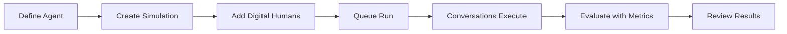

Test is the part of Bluejay that helps teams validate conversational AI before production issues reach customers. It gives you a structured place to run repeatable evaluations, explore scenario coverage, and understand how your agent behaves across realistic conditions.

## What Test Covers

- **Simulations** -- run synthetic conversations against your agent to validate behavior across realistic scenarios
- **Digital Humans** -- configure personas with traits, goals, and scenarios that represent your real customers
- **Custom Metrics** -- evaluate every conversation against the criteria that matter for your use case
- **Regression detection** -- re-run the same simulation over time to catch regressions before they reach production

## How Testing Works

Use Test to create simulation strategies, run Digital Humans against your Agent, and learn where the system succeeds or breaks before launch. It is the foundation for pre-production confidence and regression prevention.

## Next Steps

<CardGroup cols={2}>
  <Card title="Simulations" icon="flask-vial" href="/test/simulations/overview">
    Learn how to create and run simulations.
  </Card>
  <Card title="Simulation Types" icon="shapes" href="/test/simulations/types">
    Explore the different types of simulations available.
  </Card>
  <Card title="Digital Humans" icon="users" href="/key-concepts/digital-humans/overview">
    Understand how to configure synthetic customers.
  </Card>
  <Card title="Custom Metrics" icon="gauge-high" href="/key-concepts/custom-metrics/overview">
    Define the evaluation criteria for your tests.
  </Card>
</CardGroup>
